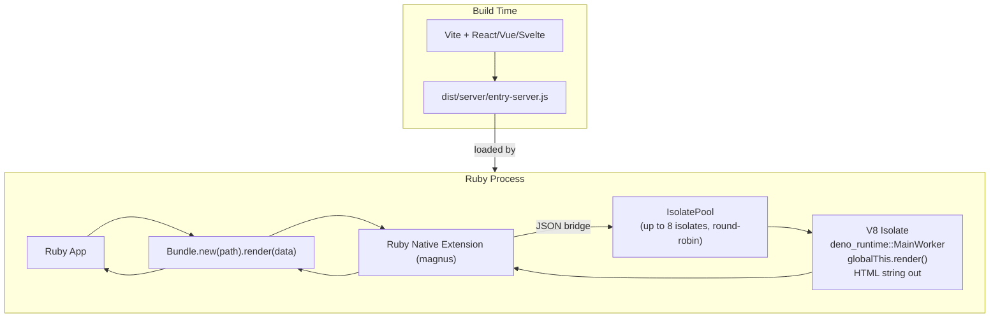
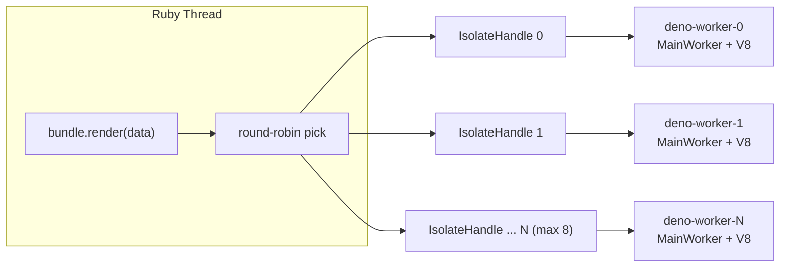
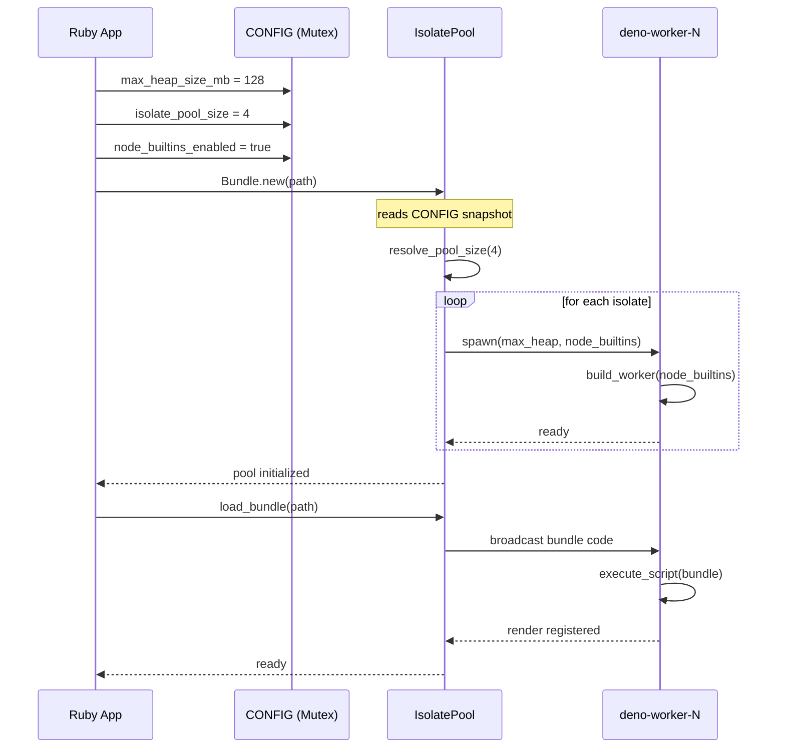

# SSR-Deno Architecture

Server-side rendering for Ruby using an embedded Deno V8 runtime.

---

## Overview



---

## Components

### Ruby API Layer

| File | Purpose |
|------|---------|
| `lib/ssr/deno.rb` | Module `SSR::Deno` — config setters (`max_heap_size_mb=`, `isolate_pool_size=`, `render_timeout_ms=`, `node_builtins_enabled=`) and `heap_stats` / `heap_stats!` |
| `lib/ssr/deno/bundle.rb` | `Bundle.new(path)` → loads bundle into all isolates. `bundle.render(data)` → JSON-serializes data, dispatches to next isolate, parses result |
| `lib/ssr/deno/bundle/registry.rb` | Thread-safe `Registry` for named bundles, used by Rails integration |
| `lib/ssr/deno/instrumenter.rb` | `ActiveSupport::Notifications` wrapper (`render.ssr_deno`, `bundle_load.ssr_deno`) |
| `lib/ssr/deno/rails/railtie.rb` | Railtie — config via `config.ssr_deno`, auto-reload in dev |
| `lib/ssr/deno/rails/helper.rb` | View helper `ssr_render(data)` |

Config setters write to a Rust `Mutex<Config>` and must be called **before** the first `Bundle.new` (which triggers pool init).

### Rust Native Extension (`ext/ssr_deno/`)

| File | Purpose |
|------|---------|
| `src/lib.rs` | magnus entrypoint — registers methods on `SSR::Deno`, owns `POOL: OnceLock<IsolatePool>` and `CONFIG: Mutex<Config>` with double-checked locking |
| `src/deno_runtime_wrapper/mod.rs` | `DenoError` enum, `IsolateHandle` (channel to worker thread), `IsolatePool` (round-robin dispatcher), `build_worker`, `load_bundle_in_worker`, `setup_require` |
| `src/deno_runtime_wrapper/call_render.rs` | `call_render` — V8 scope chain, sync/async render dispatch, promise polling. `collect_heap_stats` |
| `src/sys.rs` | `Sys` type implementing `BaseFsCanonicalize`, `BaseFsMetadata`, `BaseFsRead`, `FsOpen`, `EnvCurrentDir`, etc. for `ExtNodeSys` and `WhichSys` |
| `src/nop_types.rs` | NOP implementations for `InNpmPackageChecker`, `NpmPackageFolderResolver`, `PermissionDescriptorParser` |
| `src/node_builtin_loader.rs` | Custom `ModuleLoader` that allows `node:` scheme URLs (used when `node_builtins_enabled`) |
| `src/require_loader.rs` | Minimal `NodeRequireLoader` — rejects file loading, passes built-in module resolution to Deno |
| `crates/ssr_deno_core/src/lib.rs` | Pure-Rust types: `Config`, `DenoError`, validators (`validate_pool_size`, `validate_render_timeout_ms`, `resolve_pool_size`), `next_index` counter |

### Isolate Pool



- Pool size defaults to `CPU_cores - 1` (capped at 8), reserving one core for Ruby.
- Each isolate has its own V8 heap (configured by `max_heap_size_mb`).
- Bundles are broadcast to all isolates at load time (each isolate calls `execute_script` + namespacing).
- Render requests are dispatched via atomic counter increment + channel send. No locks in the hot path.
- Render timeout is enforced via `SyncSender::recv_timeout` on the Ruby side.

### Worker Thread Lifecycle

1. `IsolateHandle::spawn` creates an OS thread with a `current_thread` Tokio runtime + `LocalSet`.
2. `build_worker` constructs a `MainWorker` via `bootstrap_from_options` with:
   - `Permissions::none_without_prompt()` — all Deno permissions denied.
   - `NoopModuleLoader` (or `NodeBuiltinOnlyModuleLoader` if `node_builtins_enabled`).
   - `NodeExtInitServices` (if `node_builtins_enabled`) — provides `NodeRequireLoader`, `NodeResolver`, `PackageJsonResolver` for the `deno_node` extension.
3. The worker thread runs a message loop processing `LoadBundle`, `Render`, and `HeapStats` messages.
4. Bundles are evaluated via `MainWorker::execute_script` (synchronous V8 script execution, not module loading).

### Bundle Contract

A Vite SSR bundle must expose a `globalThis.render(argsJson: string): string` function:

```ts
function render(argsJson: string): string {
  const data = JSON.parse(argsJson)
  // ... render to HTML ...
  return html
}
globalThis.render = render
```

- `argsJson` is a JSON string passed from Ruby (auto-serialized by `bundle.render`).
- The return value must be an HTML string (or a Promise resolving to one).
- The Rust runtime auto-detects async (`v8::Promise`) returns and polls the microtask queue.

**Key Vite settings:**
- `ssr.noExternal: true` — bundles all dependencies into a single self-contained file.
- `ssr.target: 'webworker'` — produces a bundle using only Web APIs (safe default; not a gem requirement).
- `ssr.resolve.conditions: ['edge-light', 'module', 'browser', 'development']` — prevents packages like `@emotion/cache` from resolving to their browser-specific build.

See `samples/` for 11 complete working examples: barebone (plain JS), deno-native (no Vite), vanilla TS, React 19, Vue 3, Svelte 5, Preact, MUI v9, Emotion CSS, and a full dashboard.

---

## Node.js Builtin Support

**Disabled by default.** Enable with `SSR::Deno.node_builtins_enabled = true` before pool init.

When enabled:
1. `build_worker` uses `NodeBuiltinOnlyModuleLoader` (allows `node:` scheme URLs) instead of `NoopModuleLoader`.
2. `build_worker` initializes `NodeExtInitServices` with a `NodeRequireLoader`, `NodeResolver`, and `PackageJsonResolver`.
3. Before each bundle evaluation, `setup_require` runs an async `import('node:module')` and polls the microtask queue until `globalThis.require` is available via `createRequire`.

This allows CJS bundles that call `require("stream")`, `require("buffer")`, `require("events")`, etc. to work in the embedded V8 context. Packages like `@emotion/server` that depend on Node.js built-in modules via `through2` → `multipipe` → `html-tokenize` can be used without manual CSS extraction.

**Cost:** ~50ms added to worker initialization (one-time per isolate).

---

## Testing

Tests are split into two suites that run in separate Ruby processes, each with its own pool:

| Suite | Command | `node_builtins` | Tests | Covers |
|-------|---------|-----------------|-------|--------|
| `test:main` | `ruby test_runner_main.rb` | `false` (default) | 52 | All non-emotion tests |
| `test:node_builtins` | `ruby test_runner_node.rb` | `true` | 1 | `@emotion/server` integration |

Both suites are run by `bundle exec rake test` (or as part of `bundle exec rake`).

Each suite sets `SimpleCov.command_name` from the `SIMPLECOV_COMMAND_NAME` env var, giving each run a distinct key in `.resultset.json`. The second run merges and validates the combined coverage at **100% line + 100% branch**.

---

## Configuration Flow



---

## Source Files (Quick Reference)

```
ext/ssr_deno/                         # Rust native extension
├── Cargo.toml                         # deno_runtime, magnus dependencies
├── crates/ssr_deno_core/              # Pure-Rust types (no V8 dep)
│   └── src/lib.rs                     # Config, DenoError, validators
└── src/
    ├── lib.rs                         # magnus init, CONFIG, POOL
    ├── deno_runtime_wrapper/
    │   ├── mod.rs                     # IsolatePool, IsolateHandle, build_worker
    │   └── call_render.rs             # call_render, heap_stats
    ├── sys.rs                         # Sys type for Deno traits
    ├── nop_types.rs                   # NOP implementations
    ├── node_builtin_loader.rs         # ModuleLoader for node: scheme
    └── require_loader.rs              # NodeRequireLoader for builtins

lib/ssr/deno/                          # Ruby module
├── deno.rb                            # Core entry point, config setters
├── version.rb                         # VERSION
├── bundle.rb                          # Bundle class
├── bundle/registry.rb                 # Thread-safe bundle storage
├── instrumenter.rb                    # Notifications wrapper
├── rails.rb                           # Rails integration entry point
└── rails/                             # Railtie, helper, generator

sig/ssr/deno.rbs                       # RBS type signatures

test/
├── test_helper.rb                     # SimpleCov, pool config
├── ssr/test_deno*.rb                  # Unit tests (Bundle, errors, etc.)
├── ssr/test_integration_samples.rb    # Integration tests (all samples)
└── ssr/test_integration_node_builtins.rb  # node_builtins integration test

rakelib/
├── cargo.rake                         # cargo:test
├── samples.rake                       # samples:build
└── test.rake                          # test:main, test:node_builtins

samples/
├── barebone-ssr-app/                       # Plain JS, zero deps
├── deno-native-ssr-app/                    # Deno.serve() + template strings, no build
├── deno-native-react-ssr-app/              # Deno.serve() + React 19, no build
├── vite-ssr-app/                           # Plain TS + Vite
├── vite-react-ssr-app/                     # React 19 + Vite
├── vite-react-mui-ssr-app/                 # React 19 + MUI v9 + Vite
├── vite-react-mui-emotion-ssr-app/         # React 19 + MUI v9 + Emotion CSS + Vite
├── vite-react-emotion-mui-dashboard-ssr-app/  # Full dashboard + Vite
├── vite-vue-ssr-app/                       # Vue 3 + Vite
├── vite-svelte-ssr-app/                    # Svelte 5 + Vite
└── vite-preact-ssr-app/                    # Preact + Vite
```
