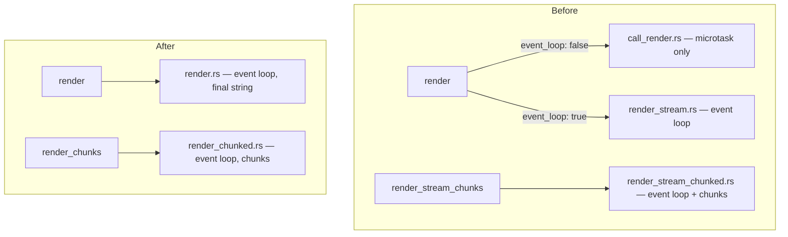

# Refactoring: Always-On Event Loop

Status: Complete (pending final pipeline verification)

## Motivation

The current architecture has two render modes:

- **Sync** (`call_render.rs`): uses raw V8 API + microtask-only polling. `setTimeout`,
  `setInterval`, `MessageChannel` do NOT fire. This is a half-complete JS runtime that
  surprises users.
- **Async** (`render_stream.rs`): uses `execute_script` + full Deno event loop. All
  macrotasks fire normally.

The "sync" mode exists as a micro-optimization: direct `v8::Function::call` avoids
`execute_script` overhead, and `perform_microtask_checkpoint` is cheaper than
`run_up_to_duration`. But `run_up_to_duration` returns immediately when the event loop
has no pending work — so for synchronous renders, the actual latency cost is negligible.

The `event_loop: true` flag in Ruby is a footgun: users must know about this internal
detail to get a working JS runtime. A JS runtime that silently drops macrotasks is a bug,
not a feature.

## Design

Remove the sync-only path entirely. All renders use the full Deno event loop.

### Rust layer

| Before | After |
|--------|-------|
| `call_render.rs` (241 LOC) | Deleted |
| `render_stream.rs` (191 LOC) | `render.rs` — buffered render + shared utils |
| `render_stream_chunked.rs` (169 LOC) | `render_chunked.rs` — chunked render |

`WorkerMsg` enum:
- Remove `Render` (sync path)
- Remove `RenderStream` (was: async buffered)
- Add `Render` (new: async buffered, replaces `RenderStream`)
- Keep `RenderStreamChunked` → rename to `RenderChunked`

`IsolateHandle`:
- Remove `block_on_render` (sync path with `std::sync::mpsc` + `recv_timeout`)
- Rename `block_on_render_stream` → `block_on_render` (uses `tokio::sync::oneshot`)
- Rename `start_render_stream_chunked` → `start_render_chunked`

`IsolatePool`:
- Remove `dispatch_render` (sync)
- Rename `dispatch_render_stream` → `dispatch_render`
- Rename `dispatch_render_stream_chunked` → `dispatch_render_chunked`

Dead code removal:
- `chunk_tx` / `_chunk_rx` in `block_on_render_stream` — the buffered path never
  uses op-based chunks. Remove.
- `op_ssr_push_chunk` OpState registration in `render_streaming` — no receiver.
  Remove. Keep the op registered in the extension (no harm, and the PoC branch uses it).

### Ruby layer

| Before | After |
|--------|-------|
| `render(data, raw_input:, raw_output:, event_loop:)` | `render(data, raw_input:, raw_output:)` |
| `render_stream(data, raw_input:, raw_output:)` | Removed (was alias for `render(event_loop: true)`) |
| `render_stream_chunks(data, raw_input:, &)` | `render_chunks(data, raw_input:, &)` |
| `native_render(bundle_id, json)` | Removed |
| `native_render_stream(bundle_id, json)` | Renamed to `native_render` |
| `native_render_stream_chunks(bundle_id, json, &)` | `native_render_chunks(bundle_id, json, &)` |

### Test changes

- `test_deno_render_stream.rb` — merge relevant tests into `deno_test.rb`, remove file
- `deno_macrotasks_test.rb` — remove "does_not_fire" tests (they tested the sync path).
   Rename remaining tests to use `render()` instead of `render(event_loop: true)`.
- All `render_stream()` calls → `render()`
- All `render(event_loop: true)` → `render()`

### Breaking changes

- `render_stream` method removed
- `event_loop:` parameter removed
- `native_render` now runs the event loop (behavioral change for callers who relied on
  macrotasks NOT firing)

## Implementation checklist

- [x] Rust: delete `call_render.rs`, update `mod.rs` module declarations
- [x] Rust: rename `render_stream.rs` → `render.rs`
  - Remove `chunk_tx` param from `render_streaming`
  - Remove OpState chunk_tx registration
  - Keep `op_ssr_push_chunk`, `RenderState`, `poll_render_state` (shared with chunked)
- [x] Rust: rename `render_stream_chunked.rs` → `render_chunked.rs`
- [x] Rust: simplify `WorkerMsg` enum and worker loop dispatch
- [x] Rust: simplify `IsolateHandle` (one render method, one chunked method)
- [x] Rust: simplify `IsolatePool` dispatch methods
- [x] Rust: update `lib.rs` — remove `native_render_stream`, `native_render` uses event-loop dispatch
- [x] Ruby: update `bundle.rb` — remove `event_loop:`, remove `render_stream`
- [x] Ruby: update `sig/ssr/deno.rbs`
- [x] Tests: update `deno_macrotasks_test.rb`
- [x] Tests: merge `deno_render_stream_test.rb` into `deno_test.rb`, delete file
- [x] Tests: update integration tests (`render_stream` → `render`)
- [x] Docs: update `docs/architecture.md`, `docs/compatibility.md`, `README.md`, `CHANGELOG.md`
- [x] Run `bundle exec rake` — must exit 0

## Follow-up: V8 termination watchdog

✅ **Implemented.** A `Watchdog` struct in `render.rs` spawns a dedicated OS thread
per render call. It uses `std::sync::mpsc::recv_timeout` for precise, non-polling
cancellation. On timeout, it calls `v8::IsolateHandle::terminate_execution()` from
the watchdog thread — the only way to interrupt synchronous V8 computation.

After the watchdog fires, `cancel_terminate_execution()` is called on the isolate
to restore it for future operations. The watchdog is the sole timeout authority
(no redundant `Instant::now() >= deadline` in the event loop).

Tests now passing (previously skipped):
- `test_render_timeout_raises_render_error`
- `test_render_timeout_respects_configured_value`
- `test_oom_produces_out_of_memory_error`

## Dependencies

- None — this is a standalone refactoring with no external blockers.
