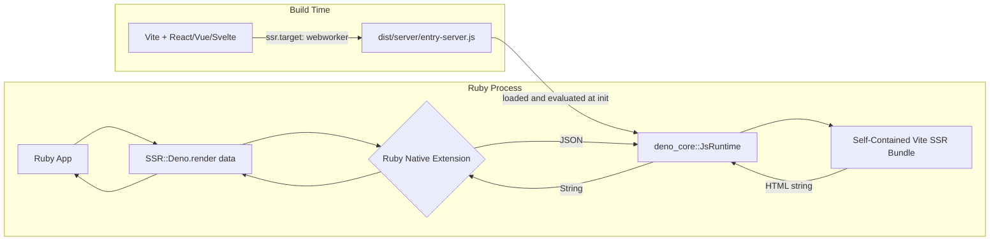
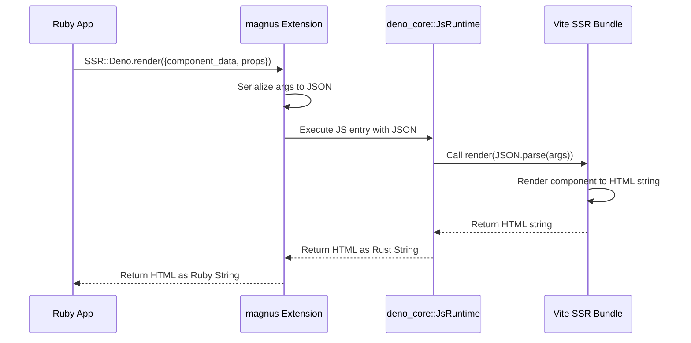
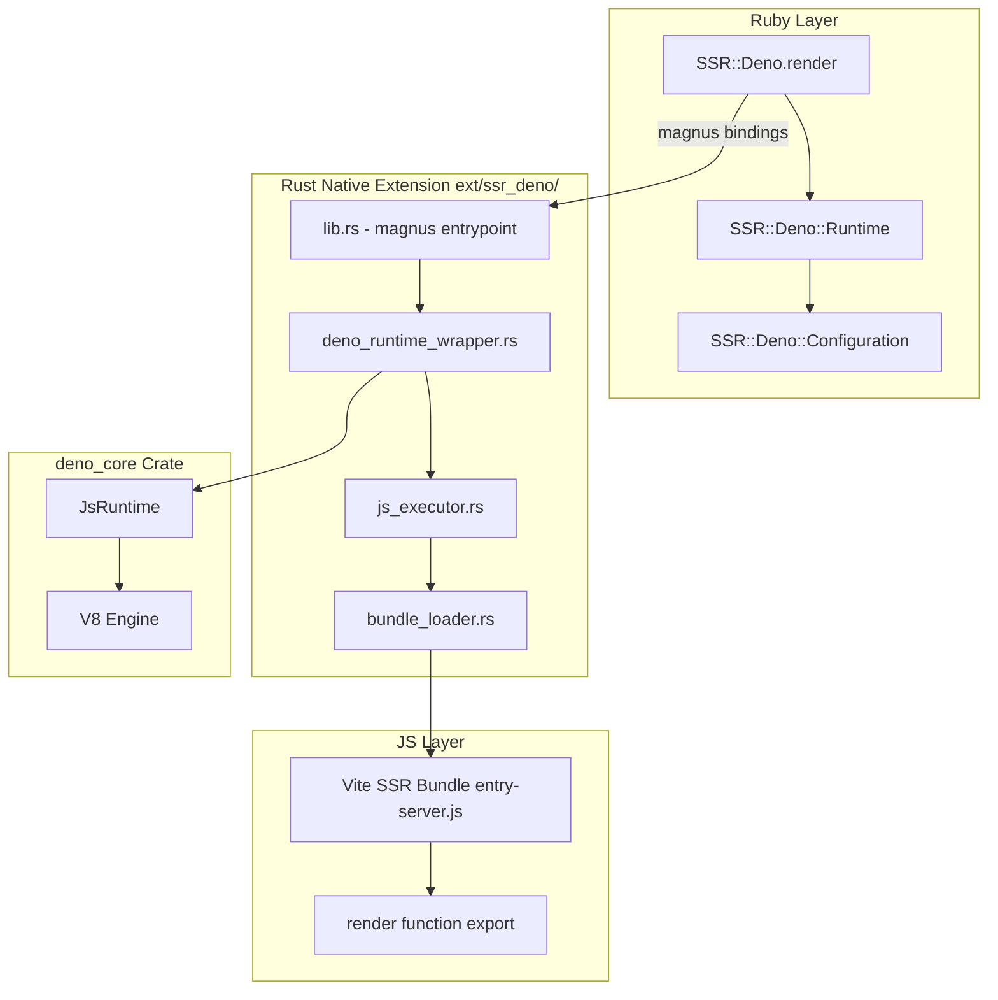
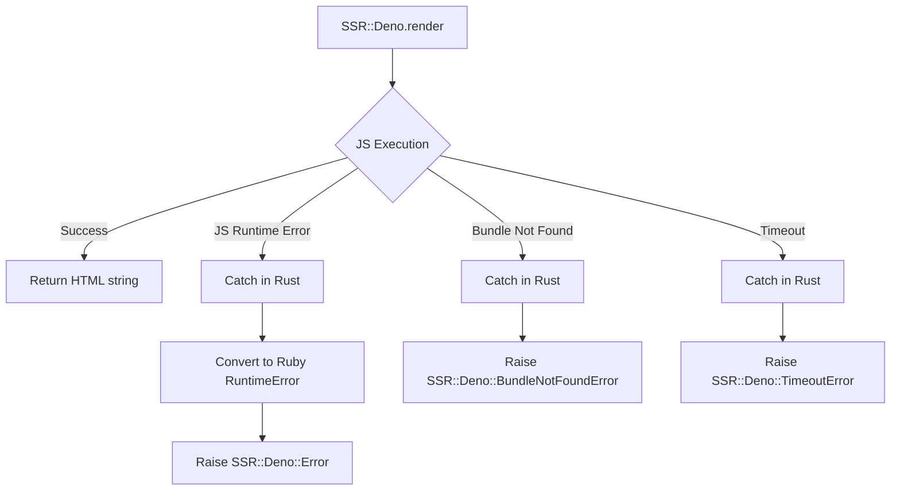

# SSR-Deno Architecture Plan

## Overview

A Ruby gem that embeds the [`deno_core::JsRuntime`](https://docs.rs/deno_core/latest/deno_core/struct.JsRuntime.html) Rust crate via a native extension to provide server-side rendering (SSR) of Vite-built web applications. The gem loads a Vite SSR production bundle (built with `ssr.target: "webworker"`) and executes it within an embedded V8 isolate, passing JSON data from Ruby and receiving rendered HTML back.

## Architecture



## Data Flow



## Component Architecture



## Directory Structure

```
ssr-deno/
├── ext/
│   └── ssr_deno/                    # Rust crate (Cargo.toml, src/)
├── lib/
│   └── ssr/deno/                    # Ruby module (version.rb, runtime.rb, configuration.rb)
├── sig/                             # RBS type signatures
├── test/                            # Minitest suite
├── samples/
│   └── vite-ssr-app/                # Sample Vite SSR project (deno.json, src/, dist/)
├── .vscode/                         # VSCode Deno extension settings
├── Gemfile
├── ssr-deno.gemspec
└── Rakefile
```

## Detailed Component Design

### 1. Rust Native Extension (`ext/ssr_deno/`)

#### `Cargo.toml` Dependencies

```toml
[dependencies]
magnus = { version = "0.8", features = ["embed"] }
serde = { version = "1", features = ["derive"] }
serde_json = "1"
tokio = { version = "1", features = ["full"] }
deno_core = "0.399"
```

#### `lib.rs` — magnus Entrypoint

- Defines the `SSR::Deno` Ruby module
- Registers the `render` class method (takes JSON string, returns HTML string)
- Registers `init_runtime` to initialize the Deno runtime with a bundle path
- Uses `std::sync::OnceLock` for a singleton `DenoRuntimeWrapper`
- The Tokio runtime is embedded inside `DenoRuntimeWrapper`

```rust
use magnus::{function, Error, Module, Object, Ruby};
use std::sync::OnceLock;
use crate::deno_runtime_wrapper::DenoRuntimeWrapper;

static RUNTIME: OnceLock<DenoRuntimeWrapper> = OnceLock::new();

#[magnus::init]
fn init(ruby: &Ruby) -> Result<(), Error> {
    let module = ruby.define_module("SSR")?;
    let deno_module = module.define_module("Deno")?;
    deno_module.define_singleton_method("init_runtime", function!(init_runtime, 1))?;
    deno_module.define_singleton_method("render", function!(render, 1))?;
    Ok(())
}

fn init_runtime(bundle_path: String) -> Result<String, Error> {
    let runtime = DenoRuntimeWrapper::new(&bundle_path)
        .map_err(|e| Error::new(format!("Failed to init runtime: {e}")))?;
    RUNTIME.set(runtime)
        .map_err(|_| Error::new("Runtime already initialized".to_string()))?;
    Ok("Runtime initialized".to_string())
}

fn render(args_json: String) -> Result<String, Error> {
    let runtime = RUNTIME.get()
        .ok_or_else(|| Error::new("Runtime not initialized".to_string()))?;
    runtime.block_on_render(&args_json)
        .map_err(|e| Error::new(format!("Render failed: {e}")))
}
```

#### `deno_runtime_wrapper.rs` — Runtime Lifecycle

This is the core module. It wraps a Tokio `current_thread` runtime and a
`deno_core::JsRuntime` instance.

**Key API: `deno_core::JsRuntime`**

- Created via `JsRuntime::new(RuntimeOptions::default())` — creates a minimal V8 isolate with no Deno-specific extensions.
- `js_runtime.execute_script(name, code)` — synchronously executes a script and returns a `v8::Global<v8::Value>`. Used to evaluate the self-contained SSR bundle.
- `js_runtime.handle_scope()` — creates a V8 handle scope to access the global object and extract the `render` function.
- No module loading, no file system, no permissions — just a bare V8 engine.

**Why `deno_core::JsRuntime` instead of `deno_runtime`:**

The full `deno_runtime` crate pulls in many unnecessary dependencies
(deno_fs, deno_io, deno_web, deno_fetch, deno_node, etc.) that are not
needed for SSR. Since the Vite SSR bundle is self-contained with zero
external imports, we only need a bare V8 isolate.

```rust
use deno_core::{JsRuntime, RuntimeOptions, v8};
use std::sync::Mutex;
use tokio::runtime::Runtime as TokioRuntime;

pub struct DenoRuntimeWrapper {
    tokio_rt: TokioRuntime,
    js_runtime: Mutex<JsRuntime>,
}

impl DenoRuntimeWrapper {
    pub fn new(bundle_path: &str) -> Result<Self, Box<dyn std::error::Error>> {
        let tokio_rt = TokioRuntime::new()?;
        let js_runtime = JsRuntime::new(RuntimeOptions::default());
        let bundle = std::fs::read_to_string(bundle_path)?;

        // Evaluate the self-contained SSR bundle
        let mut rt = js_runtime;
        rt.execute_script("entry-server", bundle.into())?;

        Ok(Self {
            tokio_rt,
            js_runtime: Mutex::new(rt),
        })
    }

    pub fn block_on_render(&self, args_json: &str) -> Result<String, Box<dyn std::error::Error>> {
        let mut js_runtime = self.js_runtime.lock().unwrap();
        let scope = &mut js_runtime.handle_scope();

        // Get the render function from global scope
        let global = scope.get_current_context().global(scope);
        let render_key = v8::String::new(scope, "render").unwrap();
        let render_fn: v8::Local<v8::Function> = global.get(scope, render_key.into()).unwrap().try_into()?;

        // Create JSON string argument
        let json_arg = v8::String::new(scope, args_json).unwrap();
        let undefined = v8::undefined(scope);

        // Call render(undefined, args_json)
        let result = render_fn.call(scope, undefined.into(), &[json_arg.into()])?;
        Ok(result.to_string(scope).unwrap().to_rust_string_lossy(scope))
    }
}
```

> **Note on `deno_core` vs `deno_runtime`**: The full `deno_runtime` crate pulls
> in many dependencies (deno_fs, deno_io, deno_web, deno_fetch, deno_node, etc.)
> that are unnecessary for SSR. Using `deno_core::JsRuntime` directly gives us
> a minimal V8 isolate with just the JavaScript engine. The self-contained Vite
> SSR bundle (with `ssr.noExternal: true`) has zero external imports, so it
> doesn't need module loading, file system access, or any Deno APIs.

#### `js_executor.rs` — JS Execution

*Note: For Phase 2, this logic is embedded directly in `deno_runtime_wrapper.rs`
since the execution path is straightforward: evaluate bundle, call render, return HTML.*

- Evaluates the self-contained Vite SSR bundle via `JsRuntime::execute_script`
- Extracts the `render` function from the V8 global scope
- Calls `render(json_args)` with JSON-serialized component data
- Converts the V8 return value to a Rust String
- Handles JS exceptions and converts them to Ruby exceptions via magnus

#### `bundle_loader.rs` — Bundle Loading

*Note: For Phase 2, this is a simple `std::fs::read_to_string` call. A more
sophisticated loader with hot-reload support will be added in Phase 4.*

- Reads the Vite SSR entry file from a configurable path
- Returns the file contents as a `String` for evaluation
- The bundle path is passed from Ruby via `SSR::Deno.init_runtime(bundle_path)`

### 2. Ruby Layer

#### `SSR::Deno` Module

```ruby
module SSR
  module Deno
    class << self
      def render(component_data: {}, props: {}, url: '/')
        # Delegates to native extension
        # component_data: hash with component identification (e.g. { component_name: "hello_world" })
        # props: hash with component props (e.g. { name: "Maurizio" })
        # url: current request URL (for routing)
        native_render({
          component_data: component_data,
          props: props,
          url: url
        }.to_json)
      end

      def configure
        yield Configuration
      end

      def configuration
        Configuration
      end
    end
  end
end
```

#### `SSR::Deno::Configuration`

```ruby
module SSR
  module Deno
    module Configuration
      mattr_accessor :bundle_path,
                     default: -> { File.join(Dir.pwd, 'dist', 'server', 'entry-server.js') }

      mattr_accessor :deno_permissions,
                     default: ['allow-read']

      mattr_accessor :render_function_name,
                     default: 'render'

      mattr_accessor :runtime_pool_size,
                     default: 1
    end
  end
end
```

### 3. Vite SSR Bundle Contract

The Vite project should be configured with:

```ts
// vite.config.ts
import { defineConfig } from 'vite'
import react from '@vitejs/plugin-react'

export default defineConfig({
  plugins: [react()],
  ssr: {
    target: 'webworker',
    noExternal: true,          // Inline all deps into a single self-contained bundle
  },
  build: {
    ssr: true,
    outDir: 'dist/server',
    rollupOptions: {
      input: 'src/entry-server.ts',
    },
  },
})
```

> **`ssr.noExternal: true`** is critical. Without it, Vite produces a bundle with external `import` statements for dependencies like `react` and `react-dom`. The embedded `deno_core::JsRuntime` cannot resolve these external imports — it has no package manager or `node_modules` access. With `noExternal: true`, Vite (via rolldown) inlines **all** dependencies into a single self-contained ESM file (~448KB for React 19, ~86KB gzipped) with zero `import` statements. The bundle only has the `export { render }` at the end, making it ideal for direct evaluation in the embedded V8 isolate.

The entry file should export a `render` function:

```ts
// src/entry-server.ts
import { renderToString } from 'react-dom/server'
import { createElement } from 'react'
import App from './App.tsx'

export function render(_url: string, context: { component_data: any, props: any }): string {
  const html = renderToString(
    createElement(App, {
      data: context.component_data,
      extra: context.props,
    })
  )
  return html
}
```

> **Note on JSX spread**: Vite 8 uses rolldown as its bundler, which does not support JSX spread syntax (`{...context.props}`). When passing dynamic props, use `createElement()` directly instead of JSX spread.

## Error Handling Strategy



## Configuration

```ruby
SSR::Deno.configure do |config|
  config.bundle_path = Rails.root.join('dist', 'server', 'entry-server.js')
  config.render_function_name = 'render'
  config.deno_permissions = ['allow-read']
end
```

## Implementation Phases

### Phase 1: Project Scaffolding
- Add Rust toolchain setup to the gem
- Create `ext/ssr_deno/` directory with `Cargo.toml`
- Set up `Rakefile` tasks for native extension compilation
- Add `rb-sys` and `magnus` as dependencies
- Create a minimal "hello world" native extension to verify the build pipeline

### Phase 2: Embed `deno_core::JsRuntime`

**Key Decision**: Use [`deno_core::JsRuntime`](https://docs.rs/deno_core/latest/deno_core/struct.JsRuntime.html) directly instead of the full [`deno_runtime`](https://crates.io/crates/deno_runtime) crate. The full `deno_runtime` pulls in many unnecessary dependencies (deno_fs, deno_io, deno_web, deno_fetch, deno_node, etc.) that are not needed for SSR. Since the Vite SSR bundle is self-contained (via `ssr.noExternal: true`) with zero external imports, we only need a bare V8 isolate.

**Steps:**

1. **Update [`ext/ssr_deno/Cargo.toml`](ext/ssr_deno/Cargo.toml)**
   - Add `deno_core = "0.399"` dependency
   - Remove `once_cell = "1"` (use `std::sync::OnceLock` from Rust stdlib instead)
   - Keep `magnus = { version = "0.8", features = ["embed"] }`, `serde`, `serde_json`, `tokio`

2. **Create [`ext/ssr_deno/src/deno_runtime_wrapper.rs`](ext/ssr_deno/src/deno_runtime_wrapper.rs)**
   - Define `DenoRuntimeWrapper` struct with:
     - `tokio_rt: tokio::runtime::Runtime` — Tokio current-thread runtime for async operations
     - `js_runtime: Mutex<JsRuntime>` — The V8 isolate wrapped in a Mutex for safe access
   - Implement `DenoRuntimeWrapper::new(bundle_path: &str) -> Result<Self, Box<dyn std::error::Error>>`:
     - Create a Tokio `current_thread` runtime
     - Create a `JsRuntime` with `RuntimeOptions::default()` (minimal V8 isolate)
     - Read the bundle file via `std::fs::read_to_string`
     - Evaluate the bundle via `js_runtime.execute_script("entry-server", bundle.into())`
     - Return the wrapped runtime
   - Implement `DenoRuntimeWrapper::block_on_render(&self, args_json: &str) -> Result<String, Box<dyn std::error::Error>>`:
     - Lock the `Mutex<JsRuntime>`
     - Create a V8 handle scope via `js_runtime.handle_scope()`
     - Get the V8 global object: `scope.get_current_context().global(scope)`
     - Extract the `render` function: `global.get(scope, render_key.into())`
     - Create a V8 string from `args_json`
     - Call `render_fn.call(scope, undefined.into(), &[json_arg.into()])`
     - Convert the V8 result to a Rust String via `result.to_string(scope).unwrap().to_rust_string_lossy(scope)`

3. **Update [`ext/ssr_deno/src/lib.rs`](ext/ssr_deno/src/lib.rs)**
   - Replace the hello-world implementation with:
     - `use std::sync::OnceLock` for the singleton runtime
     - `static RUNTIME: OnceLock<DenoRuntimeWrapper> = OnceLock::new()`
     - `fn init_runtime(bundle_path: String) -> Result<String, Error>` — creates `DenoRuntimeWrapper::new(&bundle_path)`, stores it in `RUNTIME`
     - `fn render(args_json: String) -> Result<String, Error>` — gets `RUNTIME.get()`, calls `runtime.block_on_render(&args_json)`
     - Register both methods as singleton methods on `SSR::Deno` in the `#[magnus::init]` function
   - Ensure proper error conversion: `map_err(|e| Error::new(format!("...: {e}")))`

4. **Compile and verify**
   - Run `bundle exec rake compile` to build the native extension
   - Verify from Ruby console:
     ```ruby
     require 'ssr/deno'
     bundle_path = File.expand_path('samples/vite-ssr-app/dist/server/entry-server.js')
     SSR::Deno.init_runtime(bundle_path)
     result = SSR::Deno.render({component_data: {component_name: "hello_world"}, props: {name: "World"}, url: "/"}.to_json)
     puts result
     # => <!DOCTYPE html><html>...
     ```
   - Run `bundle exec rake test` to ensure existing tests pass

5. **Handle edge cases**
   - Bundle file not found: return descriptive error
   - `render` function not found in bundle: return descriptive error
   - JS runtime error during evaluation or render: catch and convert to Ruby error
   - Double initialization: `OnceLock::set` returns `Err` if already set — return error message

**Expected Outcome**: The Ruby API `SSR::Deno.init_runtime(path)` + `SSR::Deno.render(json)` works end-to-end, loading the Vite SSR bundle and rendering HTML from a real React component.

### Phase 3: Ruby API
- Implement `SSR::Deno.render` method
- Implement `SSR::Deno::Configuration`
- Add RBS type signatures
- Write Ruby-side tests

### Phase 4: Bundle Loading & Execution
- Implement `BundleLoader` to read Vite SSR output
- Implement `JsExecutor` to call the render function
- Wire up JSON serialization/deserialization
- Handle return values and errors

### Phase 5: Error Handling & Edge Cases
- Implement custom error classes
- Add timeout protection for JS execution
- Handle bundle reload scenarios
- Add logging

### Phase 6: Documentation & Samples
- Create a sample Vite SSR project
- Write comprehensive README
- Add CI configuration for Rust compilation
- Document the Vite SSR bundle contract

## Key Design Decisions

1. **Singleton Deno Runtime**: A single Deno runtime instance is reused across render calls to avoid cold-start overhead. The Vite SSR bundle is loaded once at initialization.

2. **Web Worker Target**: Using `ssr.target: "webworker"` in Vite produces a bundle that only uses Web APIs, which Deno supports natively without Node.js compatibility layers.

3. **Self-Contained Bundle via `ssr.noExternal: true`**: This is the most critical Vite configuration option. Without it, Vite produces a bundle with external `import` statements for dependencies (e.g., `import { renderToString } from 'react-dom/server'`). The embedded Deno runtime cannot resolve these — it has no package manager, no `node_modules`, and no module resolution algorithm. With `ssr.noExternal: true`, Vite's rolldown inlines **all** dependencies into a single self-contained ESM file with zero `import` statements. The resulting bundle (e.g., ~448KB for React 19) is evaluated directly in the Deno runtime as one unit, and only the `render` function is exported. This is the key enabler for the entire approach.

4. **`deno_core::JsRuntime` over `deno_runtime`**: We use [`deno_core::JsRuntime`](https://docs.rs/deno_core/latest/deno_core/struct.JsRuntime.html) directly instead of the full [`deno_runtime`](https://crates.io/crates/deno_runtime) crate. The full `deno_runtime` pulls in many unnecessary dependencies (deno_fs, deno_io, deno_web, deno_fetch, deno_node, etc.) that are not needed for SSR. Since the self-contained Vite SSR bundle has zero external imports, we only need a bare V8 isolate with no module loading, file system access, or Deno API support. This keeps the compiled binary smaller and compilation faster.

5. **JSON Bridge**: Data is serialized to JSON at the Ruby boundary and deserialized in JavaScript. This keeps the interface simple and language-agnostic.

6. **Tokio Runtime — Single-threaded for v1, multi-threaded roadmap**: For the first iteration, we use a Tokio `current_thread` runtime to keep things simple. Since Ruby has a GVL, long-running renders would block the Ruby thread. However, the architecture is designed with future multi-threading in mind — Puma's multi-threaded worker model or Ruby async web servers (Ractor or non-Ractor based) could take advantage of a multi-threaded Tokio runtime with a pool of Deno isolates, allowing concurrent renders without blocking each other.

7. **Configuration via Ruby**: All configuration (bundle path, permissions, etc.) is done from Ruby side, keeping the Rust extension stateless and simple.
