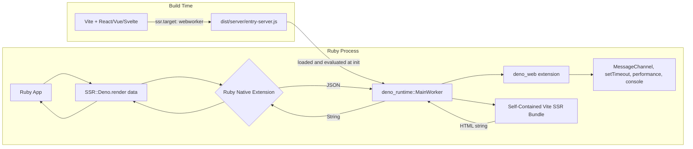
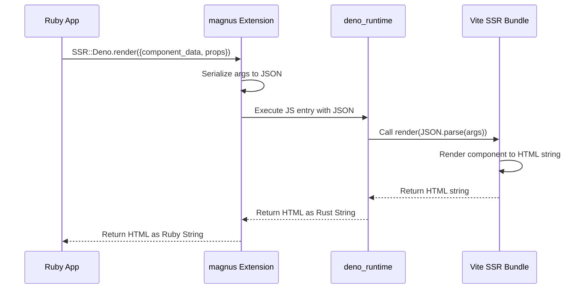
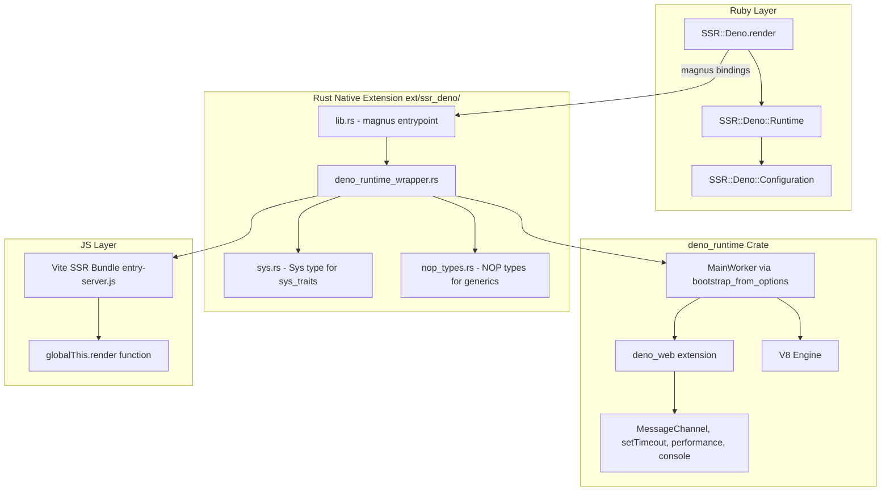
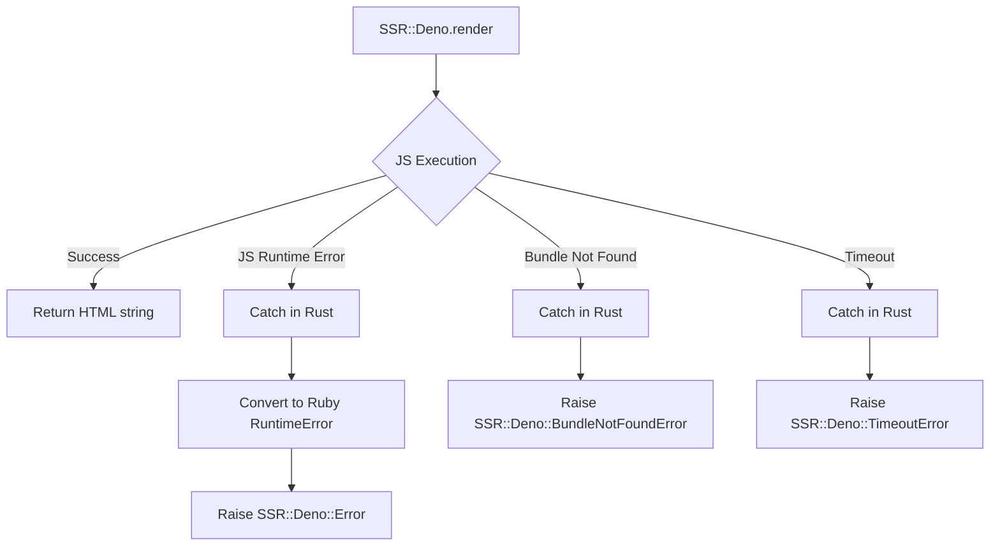

# SSR-Deno Architecture Plan

## Overview

A Ruby gem that embeds the [`deno_runtime`](https://docs.rs/deno_runtime/latest/deno_runtime/) Rust crate via a native extension to provide server-side rendering (SSR) of Vite-built web applications. The gem loads a Vite SSR production bundle (built with `ssr.target: "webworker"`) and executes it within an embedded V8 isolate with full Deno Web API support, passing JSON data from Ruby and receiving rendered HTML back.

## Architecture



## Data Flow



## Component Architecture



## Directory Structure

```
ssr-deno/
├── ext/
│   └── ssr_deno/                    # Rust crate (Cargo.toml, src/)
│       └── src/
│           ├── lib.rs               # magnus entrypoint
│           ├── deno_runtime_wrapper.rs  # DenoRuntimeWrapper (MainWorker-based)
│           ├── sys.rs               # Sys type + sys_traits implementations
│           └── nop_types.rs         # NOP types for generic parameters
├── lib/
│   └── ssr/deno/                    # Ruby module (version.rb, runtime.rb, configuration.rb)
├── sig/                             # RBS type signatures
├── test/                            # Minitest suite
├── samples/
│   └── vite-ssr-app/                # Sample Vite SSR project (deno.json, src/, dist/)
├── .vscode/                         # VSCode settings + recommended extensions
│   ├── settings.json                # Deno + rust-analyzer config
│   └── extensions.json              # Recommended extensions
├── plans/                           # Architecture and migration plans
│   ├── architecture.md
│   └── mainworker-migration.md
├── Gemfile
├── ssr-deno.gemspec
└── Rakefile
```

## Detailed Component Design

### 1. Rust Native Extension (`ext/ssr_deno/`)

#### `Cargo.toml` Dependencies

```toml
[dependencies]
magnus = { version = "0.8", features = ["embed"] }
serde = { version = "1", features = ["derive"] }
serde_json = "1"
tokio = { version = "1", features = ["full"] }
deno_runtime = "0.254.0"
deno_semver = "=0.9.1"
node_resolver = "=0.84.0"
sys_traits = "=0.1.27"
libc = "0.2"
```

#### `lib.rs` — magnus Entrypoint

- Defines the `SSR::Deno` Ruby module
- Registers the `render` class method (takes JSON string, returns HTML string)
- Registers `init_runtime` to initialize the Deno runtime with a bundle path
- Registers `native_version` to return the crate version
- Uses `std::sync::OnceLock` for a singleton `DenoRuntimeWrapper`
- The Tokio runtime is embedded inside `DenoRuntimeWrapper`

```rust
use magnus::{function, Error, Module, Object, Ruby};
use std::sync::OnceLock;
use crate::deno_runtime_wrapper::DenoRuntimeWrapper;

static RUNTIME: OnceLock<DenoRuntimeWrapper> = OnceLock::new();

#[magnus::init]
fn init(ruby: &Ruby) -> Result<(), Error> {
    let module = ruby.define_module("SSR")?;
    let deno_module = module.define_module("Deno")?;
    deno_module.define_singleton_method("init_runtime", function!(init_runtime, 1))?;
    deno_module.define_singleton_method("render", function!(render, 1))?;
    deno_module.define_singleton_method("native_version", function!(native_version, 0))?;
    Ok(())
}
```

#### `deno_runtime_wrapper.rs` — Runtime Lifecycle

This is the core module. It wraps a Tokio `current_thread` runtime and a
`deno_runtime::MainWorker` instance.

**Why `MainWorker` instead of `JsRuntime`:**

The full `deno_runtime::MainWorker` provides all Deno Web API extensions out of the
box — `MessageChannel`, `setTimeout`, `performance.now()`, `console`, etc.
These are required by frontend frameworks like React 19 (whose scheduler uses
`MessageChannel` for async task scheduling). Using `deno_core::JsRuntime` alone would
require manually adding each extension or writing polyfills, effectively
reimplementing `deno_runtime`.

`MainWorker::bootstrap_from_options` is the public constructor that:
1. Creates a `JsRuntime` with all standard Deno extensions
2. Bootstraps the runtime (loads built-in JS modules, initializes ops)
3. Returns a ready-to-use `MainWorker`

```rust
use std::cell::UnsafeCell;
use std::sync::Arc;

use deno_runtime::deno_core::url::Url;
use deno_runtime::deno_core::v8;
use deno_runtime::worker::MainWorker;
use deno_runtime::worker::WorkerOptions;
use deno_runtime::worker::WorkerServiceOptions;
use deno_runtime::BootstrapOptions;
use deno_runtime::FeatureChecker;
use deno_runtime::deno_permissions::PermissionsContainer;

use crate::nop_types::AllowAllPermissionDescriptorParser;
use crate::nop_types::NopInNpmPackageChecker;
use crate::nop_types::NopNpmPackageFolderResolver;
use crate::sys::Sys;

pub struct DenoRuntimeWrapper {
    tokio_rt: tokio::runtime::Runtime,
    worker: UnsafeCell<MainWorker>,
}

// SAFETY: Ruby's GVL serializes all access.
unsafe impl Send for DenoRuntimeWrapper {}
unsafe impl Sync for DenoRuntimeWrapper {}

impl DenoRuntimeWrapper {
    pub fn new(bundle_path: &str) -> Result<Self, Box<dyn std::error::Error>> {
        let tokio_rt = tokio::runtime::Runtime::new()?;
        let main_module = Url::from_file_path(
            std::fs::canonicalize(bundle_path).map_err(...)?,
        ).map_err(...)?;

        // Build WorkerServiceOptions with defaults
        let services = WorkerServiceOptions {
            blob_store: Arc::new(deno_runtime::deno_web::BlobStore::default()),
            broadcast_channel: Default::default(),
            feature_checker: Arc::new(FeatureChecker::default()),
            fs: Arc::new(deno_runtime::deno_fs::RealFs),
            module_loader: Rc::new(deno_runtime::deno_core::FsModuleLoader),
            permissions: PermissionsContainer::allow_all(
                Arc::new(AllowAllPermissionDescriptorParser),
            ),
            // ... other fields set to None/Default
        };

        let options = WorkerOptions {
            bootstrap: BootstrapOptions::default(),
            extensions: vec![],
            create_web_worker_cb: Arc::new(|_| {
                unimplemented!("web workers are not supported")
            }),
            ..Default::default()
        };

        let mut worker = MainWorker::bootstrap_from_options::<
            NopInNpmPackageChecker,
            NopNpmPackageFolderResolver,
            Sys,
        >(&main_module, services, options);

        let bundle_code = std::fs::read_to_string(bundle_path)?;
        worker.execute_script("entry-server.js", bundle_code.into())?;

        Ok(Self { tokio_rt, worker: UnsafeCell::new(worker) })
    }

    pub fn block_on_render(&self, args_json: &str)
        -> Result<String, Box<dyn std::error::Error>>
    {
        self.tokio_rt.block_on(async {
            let worker = self.worker_mut();
            let js_runtime = &mut worker.js_runtime;

            let context = js_runtime.main_context();
            let isolate = js_runtime.v8_isolate();

            // V8 scope: pin!/init()/ContextScope pattern
            let scope_storage = std::pin::pin!(v8::HandleScope::new(isolate));
            let mut scope = scope_storage.init();
            let context_local = v8::Local::new(&mut scope, context);
            let mut context_scope = v8::ContextScope::new(
                &mut scope, context_local
            );

            let global = context_local.global(&mut context_scope);
            let render_key = v8::String::new(
                &mut context_scope, "render"
            ).unwrap();
            let render_val = global.get(
                &mut context_scope, render_key.into()
            );
            let render_fn: v8::Local<v8::Function> = render_val
                .ok_or("render not defined")?.try_into()
                .map_err(|_| "render is not a function")?;

            let args_v8 = v8::String::new(
                &mut context_scope, args_json
            ).unwrap();
            let undefined = v8::undefined(&mut context_scope);

            let result = render_fn
                .call(&mut context_scope, undefined.into(), &[args_v8.into()])
                .ok_or("render threw an exception")?;

            let result_str = result
                .to_string(&mut context_scope)
                .ok_or("Cannot convert result to string")?;
            Ok(result_str.to_rust_string_lossy(&context_scope))
        })
    }
}
```

#### `sys.rs` — System Type for `ExtNodeSys`

Contains the `Sys` type that implements all `sys_traits` required by `ExtNodeSys` (via `#[sys_traits::auto_impl]`):

- `FsCanonicalize`, `FsMetadata`, `FsRead`, `FsReadDir`, `FsOpen` (for `NodeResolverSys`)
- `EnvCurrentDir`, `EnvHomeDir`, `EnvVar` (for `WhichSys`)
- `Clone + 'static`

Also includes wrapper types:
- `RealMetadata` — wraps `std::fs::Metadata`, implements `FsMetadataValue`
- `RealDirEntry` — wraps `std::fs::DirEntry`, implements `FsDirEntry`
- `RealFile` — wraps `std::fs::File`, implements `FsFile` (with all 11 sub-traits)

#### `nop_types.rs` — NOP Types for Generic Parameters

Contains three types required by `MainWorker::bootstrap_from_options`:

- **`NopInNpmPackageChecker`** — always returns `false` (no npm packages)
- **`NopNpmPackageFolderResolver`** — always returns `PackageFolderResolveErrorKind::PackageNotFound`
- **`AllowAllPermissionDescriptorParser`** — implements `PermissionDescriptorParser` with `unreachable!()` bodies (never called since permissions are allow-all)

### 2. Ruby Layer

#### `SSR::Deno` Module

```ruby
module SSR
  module Deno
    class << self
      def render(component_data: {}, props: {}, url: '/')
        native_render({
          component_data: component_data,
          props: props,
          url: url
        }.to_json)
      end

      def configure
        yield Configuration
      end

      def configuration
        Configuration
      end
    end
  end
end
```

#### `SSR::Deno::Configuration`

```ruby
module SSR
  module Deno
    module Configuration
      mattr_accessor :bundle_path,
                     default: -> { File.join(Dir.pwd, 'dist', 'server', 'entry-server.js') }

      mattr_accessor :render_function_name,
                     default: 'render'

      mattr_accessor :runtime_pool_size,
                     default: 1
    end
  end
end
```

### 3. Vite SSR Bundle Contract

The Vite project should be configured with:

```ts
// vite.config.ts
import { defineConfig } from 'vite'
import react from '@vitejs/plugin-react'

export default defineConfig({
  plugins: [react()],
  ssr: {
    target: 'webworker',
    noExternal: true,          // Inline all deps into a single self-contained bundle
  },
  build: {
    ssr: true,
    outDir: 'dist/server',
    rollupOptions: {
      input: 'src/entry-server.ts',
    },
  },
})
```

> **`ssr.noExternal: true`** is critical. Without it, Vite produces a bundle with external `import` statements for dependencies like `react` and `react-dom`. The embedded Deno runtime cannot resolve these external imports — it has no package manager or `node_modules` access. With `noExternal: true`, Vite (via rolldown) inlines **all** dependencies into a single self-contained file (~448KB for React 19) with zero `import` statements. The bundle assigns `render` to `globalThis`, making it ideal for direct evaluation in the embedded V8 isolate.

The entry file should assign a `render` function to `globalThis`:

```ts
// src/entry-server.ts
import { renderToString } from 'react-dom/server'
import { createElement } from 'react'
import App from './App.tsx'

function render(argsJson: string): string {
  const context = JSON.parse(argsJson)
  const html = renderToString(
    createElement(App, {
      data: context.component_data,
      extra: context.props,
    })
  )
  return html
}

// Assign to globalThis for embedded V8 evaluation
globalThis.render = render
```

## Error Handling Strategy



## Configuration

```ruby
SSR::Deno.configure do |config|
  config.bundle_path = Rails.root.join('dist', 'server', 'entry-server.js')
  config.render_function_name = 'render'
end
```

## Implementation Phases

### Phase 1: Project Scaffolding ✅
- Add Rust toolchain setup to the gem
- Create `ext/ssr_deno/` directory with `Cargo.toml`
- Set up `Rakefile` tasks for native extension compilation
- Add `rb-sys` and `magnus` as dependencies
- Create a minimal "hello world" native extension to verify the build pipeline

### Phase 2: Embed `deno_runtime` ✅

**Key Decision**: Use [`deno_runtime`](https://crates.io/crates/deno_runtime) with `MainWorker::bootstrap_from_options` instead of bare `deno_core::JsRuntime`. The full `deno_runtime` provides all Deno Web API extensions (`deno_web`, `deno_webidl`, etc.) that frontend frameworks like React 19 depend on — `MessageChannel`, `setTimeout`, `performance.now()`, `console`, etc. Using `deno_core` alone would require manually adding each extension or writing polyfills, effectively reimplementing `deno_runtime`.

**Completed steps:**

1. ✅ **Updated [`ext/ssr_deno/Cargo.toml`](../ext/ssr_deno/Cargo.toml)**
   - Added `deno_runtime = { version = "0.254.0", features = ["transpile", "hmr"] }`, `deno_semver`, `node_resolver`, `sys_traits`, `libc`

2. ✅ **Rewrote [`ext/ssr_deno/src/deno_runtime_wrapper.rs`](../ext/ssr_deno/src/deno_runtime_wrapper.rs)**
   - Uses `MainWorker::bootstrap_from_options` with three generic type parameters
   - V8 scope access via `pin!/init()/ContextScope` pattern
   - `UnsafeCell<MainWorker>` for interior mutability (safe under Ruby GVL)

3. ✅ **Created [`ext/ssr_deno/src/sys.rs`](../ext/ssr_deno/src/sys.rs)**
   - `Sys` type implementing all `sys_traits` for `ExtNodeSys`
   - Wrapper types: `RealMetadata`, `RealDirEntry`, `RealFile`

4. ✅ **Created [`ext/ssr_deno/src/nop_types.rs`](../ext/ssr_deno/src/nop_types.rs)**
   - `NopInNpmPackageChecker`, `NopNpmPackageFolderResolver`, `AllowAllPermissionDescriptorParser`

5. ✅ **Updated [`ext/ssr_deno/src/lib.rs`](../ext/ssr_deno/src/lib.rs)**
   - Added `mod sys;` and `mod nop_types;` declarations
   - Added `native_version` method

6. ✅ **Refactored into separate modules**
   - [`ext/ssr_deno/src/sys.rs`](../ext/ssr_deno/src/sys.rs) — `Sys` type + all `sys_traits` impls
   - [`ext/ssr_deno/src/nop_types.rs`](../ext/ssr_deno/src/nop_types.rs) — NOP types for generic params
   - [`ext/ssr_deno/src/deno_runtime_wrapper.rs`](../ext/ssr_deno/src/deno_runtime_wrapper.rs) — only `DenoRuntimeWrapper`

7. ✅ **Fixed runtime issues for Vite SSR sample rendering**
   - Added `features = ["transpile"]` to `deno_runtime` — enables TypeScript transpilation for `deno_telemetry` extension sources
   - Added `features = ["hmr"]` to `deno_runtime` — makes `op_snapshot_options` use `try_take` + `unwrap_or_default` instead of panicking
   - Added `let _enter = tokio_rt.enter();` before `MainWorker::bootstrap_from_options` — provides Tokio runtime context for internal `tokio::spawn` calls

8. ✅ **Vite SSR sample renders successfully**
   - `bundle exec ruby -e "require 'ssr/deno'; SSR::Deno.init_runtime('samples/vite-ssr-app/dist/server/entry-server.js'); puts SSR::Deno.render('{\"component_data\":{\"message\":\"Hello World!\"},\"props\":{},\"url\":\"/\"}')"`
   - Returns full HTML with React SSR output

9. ✅ **Added integration test**
   - [`test/ssr/test_deno.rb`](../test/ssr/test_deno.rb) — tests `native_version`, `init_runtime`, and `render` with the Vite SSR sample
   - All tests pass with Rubocop compliance

10. ✅ **Added compile guard**
    - [`Rakefile`](../Rakefile) — checks for `SSR_DENO_DEV_BIN_COMPILE` env var
    - [`bin/compile`](../bin/compile) — sets `SSR_DENO_DEV_BIN_COMPILE=true` plus V8 build env vars
    - Prevents running `rake compile` directly without the proper V8 build environment

11. ✅ **Compiled and verified**
    - `./bin/compile` — builds with 0 warnings, 0 errors
    - `bundle exec ruby -e "require 'ssr/deno'; puts SSR::Deno.native_version"` — returns `0.1.0-alpha.1`
    - `bundle exec rake test` — all tests pass

12. ✅ **Versioned and tagged**
    - Version bumped to `0.1.0-alpha.1` in [`lib/ssr/deno/version.rb`](../lib/ssr/deno/version.rb) and [`ext/ssr_deno/Cargo.toml`](../ext/ssr_deno/Cargo.toml)
    - Gemspec populated with summary, description, and rubygems.org push host
    - README rewritten with usage instructions, development guide, and architecture reference
    - Git tag `v0.1.0-alpha.1` created

### Phase 3: Ruby API
- Implement `SSR::Deno.render` method with keyword arguments
- Implement `SSR::Deno::Configuration`
- Add RBS type signatures
- Write Ruby-side tests

### Phase 4: Bundle Loading & Execution
- Implement `BundleLoader` to read Vite SSR output
- Implement `JsExecutor` to call the render function
- Wire up JSON serialization/deserialization
- Handle return values and errors

### Phase 5: Error Handling & Edge Cases
- Implement custom error classes
- Add timeout protection for JS execution
- Handle bundle reload scenarios
- Add logging

### Phase 6: Documentation & Samples
- Create a sample Vite SSR project
- Write comprehensive README
- Add CI configuration for Rust compilation
- Document the Vite SSR bundle contract

## Key Design Decisions

1. **`MainWorker` over `JsRuntime`**: We use `deno_runtime::MainWorker::bootstrap_from_options` instead of bare `deno_core::JsRuntime`. Frontend frameworks like React 19 depend on Web APIs (`MessageChannel`, `setTimeout`, `performance`, `console`) that are only available through Deno's extension system. `MainWorker` provides all standard Deno extensions automatically.

2. **`bootstrap_from_options` over `bootstrap`**: `MainWorker::from_options` (which does the actual construction) is private. `bootstrap_from_options` is the only public constructor that combines construction + JS bootstrap. The separate `bootstrap` method exists but requires a pre-constructed `MainWorker`.

3. **Generic type parameters**: `bootstrap_from_options` requires three generic types (`TInNpmPackageChecker`, `TNpmPackageFolderResolver`, `TExtNodeSys`). Even though we don't use npm packages, these types must be provided at compile time. We created NOP implementations that satisfy the trait bounds with minimal behavior.

4. **Singleton Deno Runtime**: A single Deno runtime instance is reused across render calls to avoid cold-start overhead. The Vite SSR bundle is loaded once at initialization.

5. **Web Worker Target**: Using `ssr.target: "webworker"` in Vite produces a bundle that only uses Web APIs, which Deno supports natively without Node.js compatibility layers.

6. **Self-Contained Bundle via `ssr.noExternal: true`**: This is the most critical Vite configuration option. Without it, Vite produces a bundle with external `import` statements for dependencies. The embedded Deno runtime cannot resolve these. With `noExternal: true`, Vite's rolldown inlines **all** dependencies into a single self-contained file with zero `import` statements.

7. **JSON Bridge**: Data is serialized to JSON at the Ruby boundary and deserialized in JavaScript. This keeps the interface simple and language-agnostic.

8. **Tokio Runtime**: A Tokio runtime is embedded inside `DenoRuntimeWrapper` for async operations. Ruby's GVL ensures single-threaded access, making `UnsafeCell<MainWorker>` safe.

9. **Configuration via Ruby**: All configuration (bundle path, etc.) is done from Ruby side, keeping the Rust extension stateless and simple.

10. **V8 Scope API**: The `rusty_v8` crate's scope API uses `ScopeStorage<T>` / `PinnedRef<'_, T>` / `ContextScope` pattern. `HandleScope::new(isolate)` returns `ScopeStorage<HandleScope>`, `.init()` returns `PinnedRef<HandleScope>`, and `ContextScope::new(&mut scope, context)` enters the V8 context.
