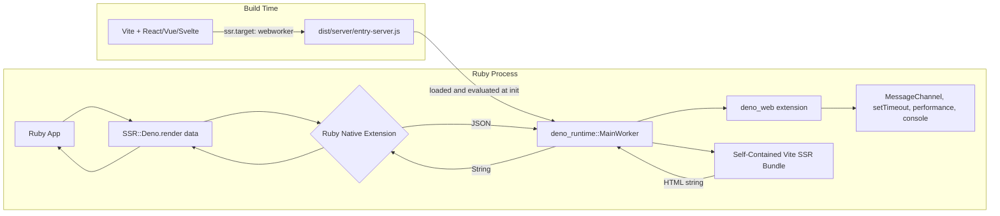
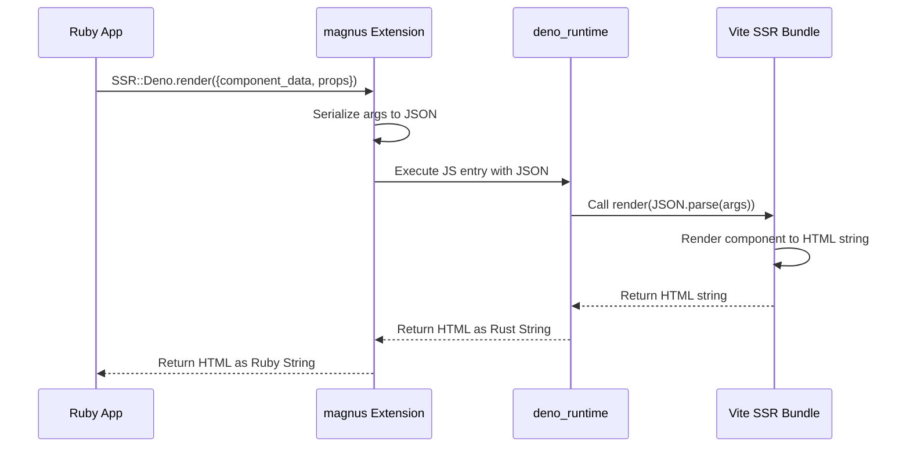
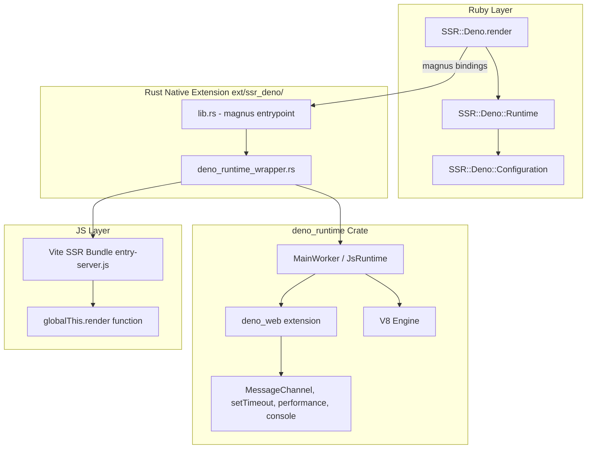
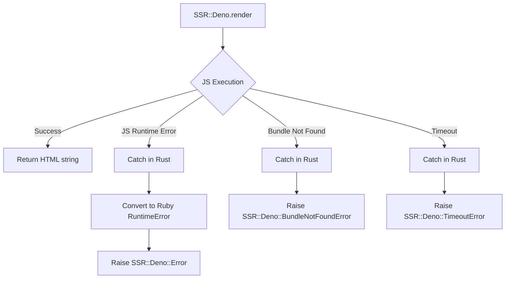

# SSR-Deno Architecture Plan

## Overview

A Ruby gem that embeds the [`deno_runtime`](https://docs.rs/deno_runtime/latest/deno_runtime/) Rust crate via a native extension to provide server-side rendering (SSR) of Vite-built web applications. The gem loads a Vite SSR production bundle (built with `ssr.target: "webworker"`) and executes it within an embedded V8 isolate with full Deno Web API support, passing JSON data from Ruby and receiving rendered HTML back.

## Architecture



## Data Flow



## Component Architecture



## Directory Structure

```
ssr-deno/
├── ext/
│   └── ssr_deno/                    # Rust crate (Cargo.toml, src/)
├── lib/
│   └── ssr/deno/                    # Ruby module (version.rb, runtime.rb, configuration.rb)
├── sig/                             # RBS type signatures
├── test/                            # Minitest suite
├── samples/
│   └── vite-ssr-app/                # Sample Vite SSR project (deno.json, src/, dist/)
├── .vscode/                         # VSCode Deno extension settings
├── Gemfile
├── ssr-deno.gemspec
└── Rakefile
```

## Detailed Component Design

### 1. Rust Native Extension (`ext/ssr_deno/`)

#### `Cargo.toml` Dependencies

```toml
[dependencies]
magnus = { version = "0.8", features = ["embed"] }
serde = { version = "1", features = ["derive"] }
serde_json = "1"
tokio = { version = "1", features = ["full"] }
deno_runtime = "0.254.0"
```

#### `lib.rs` — magnus Entrypoint

- Defines the `SSR::Deno` Ruby module
- Registers the `render` class method (takes JSON string, returns HTML string)
- Registers `init_runtime` to initialize the Deno runtime with a bundle path
- Uses `std::sync::OnceLock` for a singleton `DenoRuntimeWrapper`
- The Tokio runtime is embedded inside `DenoRuntimeWrapper`

```rust
use magnus::{function, Error, Module, Object, Ruby};
use std::sync::OnceLock;
use crate::deno_runtime_wrapper::DenoRuntimeWrapper;

static RUNTIME: OnceLock<DenoRuntimeWrapper> = OnceLock::new();

#[magnus::init]
fn init(ruby: &Ruby) -> Result<(), Error> {
    let module = ruby.define_module("SSR")?;
    let deno_module = module.define_module("Deno")?;
    deno_module.define_singleton_method("init_runtime", function!(init_runtime, 1))?;
    deno_module.define_singleton_method("render", function!(render, 1))?;
    Ok(())
}

fn init_runtime(bundle_path: String) -> Result<String, Error> {
    let runtime = DenoRuntimeWrapper::new(&bundle_path)
        .map_err(|e| Error::new(format!("Failed to init runtime: {e}")))?;
    RUNTIME.set(runtime)
        .map_err(|_| Error::new("Runtime already initialized".to_string()))?;
    Ok("Runtime initialized".to_string())
}

fn render(args_json: String) -> Result<String, Error> {
    let runtime = RUNTIME.get()
        .ok_or_else(|| Error::new("Runtime not initialized".to_string()))?;
    runtime.block_on_render(&args_json)
        .map_err(|e| Error::new(format!("Render failed: {e}")))
}
```

#### `deno_runtime_wrapper.rs` — Runtime Lifecycle

This is the core module. It wraps a Tokio `current_thread` runtime and a
`deno_runtime::MainWorker` instance.

**Why `deno_runtime` instead of `deno_core`:**

The full `deno_runtime` crate provides all Deno Web API extensions out of the
box — `MessageChannel`, `setTimeout`, `performance.now()`, `console`, etc.
These are required by frontend frameworks like React 19 (whose scheduler uses
`MessageChannel` for async task scheduling). Using `deno_core` alone would
require manually adding each extension or writing polyfills, effectively
reimplementing `deno_runtime`.

```rust
use deno_runtime::deno_core::{v8, JsRuntime, RuntimeOptions};
use deno_runtime::deno_core::Extension;
use std::cell::UnsafeCell;
use tokio::runtime::Runtime as TokioRuntime;

pub struct DenoRuntimeWrapper {
    tokio_rt: TokioRuntime,
    js_runtime: UnsafeCell<JsRuntime>,
}

impl DenoRuntimeWrapper {
    pub fn new(bundle_path: &str) -> Result<Self, Box<dyn std::error::Error>> {
        let tokio_rt = TokioRuntime::new()?;

        // Register Deno Web API extensions (MessageChannel, setTimeout, etc.)
        let extensions: Vec<Extension> = vec![
            deno_webidl::deno_webidl::init(),
            deno_web::deno_web::init_ops_and_esm(),
            // Add other extensions as needed
        ];

        let mut js_runtime = JsRuntime::new(RuntimeOptions {
            extensions,
            ..Default::default()
        });

        let bundle = std::fs::read_to_string(bundle_path)?;
        js_runtime.execute_script("entry-server", bundle.into())?;

        Ok(Self {
            tokio_rt,
            js_runtime: UnsafeCell::new(js_runtime),
        })
    }

    pub fn block_on_render(&self, args_json: &str) -> Result<String, Box<dyn std::error::Error>> {
        let js_runtime = unsafe { &mut *self.js_runtime.get() };
        let main_context = js_runtime.main_context();
        let isolate = js_runtime.v8_isolate();

        v8::scope!(let scope, isolate);
        let context = v8::Local::new(&scope, main_context);
        let scope = v8::ContextScope::new(scope, context);

        let global = scope.get_current_context().global(&scope);
        let render_key = v8::String::new(&scope, "render").unwrap();
        let render_value = global.get(&scope, render_key.into());

        let render_fn: v8::Local<v8::Function> = match render_value {
            Some(val) => val.try_into()?,
            None => return Err("render function not found".into()),
        };

        let json_arg = v8::String::new(&scope, args_json).unwrap();
        let undefined = v8::undefined(&scope);

        let result = render_fn
            .call(&scope, undefined.into(), &[json_arg.into()])
            .ok_or_else(|| "JavaScript render function threw an error".to_string())?;

        let html = result
            .to_string(&scope)
            .ok_or_else(|| "Render result could not be converted to a string".to_string())?
            .to_rust_string_lossy(&scope);

        Ok(html)
    }
}
```

### 2. Ruby Layer

#### `SSR::Deno` Module

```ruby
module SSR
  module Deno
    class << self
      def render(component_data: {}, props: {}, url: '/')
        native_render({
          component_data: component_data,
          props: props,
          url: url
        }.to_json)
      end

      def configure
        yield Configuration
      end

      def configuration
        Configuration
      end
    end
  end
end
```

#### `SSR::Deno::Configuration`

```ruby
module SSR
  module Deno
    module Configuration
      mattr_accessor :bundle_path,
                     default: -> { File.join(Dir.pwd, 'dist', 'server', 'entry-server.js') }

      mattr_accessor :render_function_name,
                     default: 'render'

      mattr_accessor :runtime_pool_size,
                     default: 1
    end
  end
end
```

### 3. Vite SSR Bundle Contract

The Vite project should be configured with:

```ts
// vite.config.ts
import { defineConfig } from 'vite'
import react from '@vitejs/plugin-react'

export default defineConfig({
  plugins: [react()],
  ssr: {
    target: 'webworker',
    noExternal: true,          // Inline all deps into a single self-contained bundle
  },
  build: {
    ssr: true,
    outDir: 'dist/server',
    rollupOptions: {
      input: 'src/entry-server.ts',
    },
  },
})
```

> **`ssr.noExternal: true`** is critical. Without it, Vite produces a bundle with external `import` statements for dependencies like `react` and `react-dom`. The embedded Deno runtime cannot resolve these external imports — it has no package manager or `node_modules` access. With `noExternal: true`, Vite (via rolldown) inlines **all** dependencies into a single self-contained file (~448KB for React 19) with zero `import` statements. The bundle assigns `render` to `globalThis`, making it ideal for direct evaluation in the embedded V8 isolate.

The entry file should assign a `render` function to `globalThis`:

```ts
// src/entry-server.ts
import { renderToString } from 'react-dom/server'
import { createElement } from 'react'
import App from './App.tsx'

function render(argsJson: string): string {
  const context = JSON.parse(argsJson)
  const html = renderToString(
    createElement(App, {
      data: context.component_data,
      extra: context.props,
    })
  )
  return html
}

// Assign to globalThis for embedded V8 evaluation
globalThis.render = render
```

## Error Handling Strategy



## Configuration

```ruby
SSR::Deno.configure do |config|
  config.bundle_path = Rails.root.join('dist', 'server', 'entry-server.js')
  config.render_function_name = 'render'
end
```

## Implementation Phases

### Phase 1: Project Scaffolding ✅
- Add Rust toolchain setup to the gem
- Create `ext/ssr_deno/` directory with `Cargo.toml`
- Set up `Rakefile` tasks for native extension compilation
- Add `rb-sys` and `magnus` as dependencies
- Create a minimal "hello world" native extension to verify the build pipeline

### Phase 2: Embed `deno_runtime`

**Key Decision**: Use [`deno_runtime`](https://crates.io/crates/deno_runtime) instead of bare [`deno_core`](https://docs.rs/deno_core/latest/deno_core/). The full `deno_runtime` provides all Deno Web API extensions (`deno_web`, `deno_webidl`, etc.) that frontend frameworks like React 19 depend on — `MessageChannel`, `setTimeout`, `performance.now()`, `console`, etc. Using `deno_core` alone would require manually adding each extension or writing polyfills, effectively reimplementing `deno_runtime`.

**Steps:**

1. **Update [`ext/ssr_deno/Cargo.toml`](../ext/ssr_deno/Cargo.toml)**
   - Replace `deno_core = "0.399"` with `deno_runtime = "0.254.0"`
   - Keep `magnus`, `serde`, `serde_json`, `tokio`

2. **Update [`ext/ssr_deno/src/deno_runtime_wrapper.rs`](../ext/ssr_deno/src/deno_runtime_wrapper.rs)**
   - Import from `deno_runtime::deno_core` instead of `deno_core`
   - Register `deno_webidl` and `deno_web` extensions in `RuntimeOptions`
   - The rest of the logic (evaluate bundle, call render) stays the same

3. **Update [`ext/ssr_deno/src/lib.rs`](../ext/ssr_deno/src/lib.rs)**
   - No changes needed — the magnus API surface stays the same

4. **Compile and verify**
   - Run `./bin/compile` to build the native extension
   - Verify from Ruby console:
     ```ruby
     require 'ssr/deno'
     bundle_path = File.expand_path('samples/vite-ssr-app/dist/server/entry-server.js')
     SSR::Deno.init_runtime(bundle_path)
     result = SSR::Deno.render({component_data: {component_name: "hello_world"}, props: {name: "World"}, url: "/"}.to_json)
     puts result
     # => <!DOCTYPE html><html>...
     ```

5. **Handle edge cases**
   - Bundle file not found: return descriptive error
   - `render` function not found in bundle: return descriptive error
   - JS runtime error during evaluation or render: catch and convert to Ruby error
   - Double initialization: `OnceLock::set` returns `Err` if already set

### Phase 3: Ruby API
- Implement `SSR::Deno.render` method with keyword arguments
- Implement `SSR::Deno::Configuration`
- Add RBS type signatures
- Write Ruby-side tests

### Phase 4: Bundle Loading & Execution
- Implement `BundleLoader` to read Vite SSR output
- Implement `JsExecutor` to call the render function
- Wire up JSON serialization/deserialization
- Handle return values and errors

### Phase 5: Error Handling & Edge Cases
- Implement custom error classes
- Add timeout protection for JS execution
- Handle bundle reload scenarios
- Add logging

### Phase 6: Documentation & Samples
- Create a sample Vite SSR project
- Write comprehensive README
- Add CI configuration for Rust compilation
- Document the Vite SSR bundle contract

## Key Design Decisions

1. **`deno_runtime` over `deno_core`**: We use the full `deno_runtime` crate instead of bare `deno_core`. Frontend frameworks like React 19 depend on Web APIs (`MessageChannel`, `setTimeout`, `performance`, `console`) that are only available through Deno's extension system. Adding extensions incrementally to `deno_core` would effectively reimplement `deno_runtime`.

2. **Singleton Deno Runtime**: A single Deno runtime instance is reused across render calls to avoid cold-start overhead. The Vite SSR bundle is loaded once at initialization.

3. **Web Worker Target**: Using `ssr.target: "webworker"` in Vite produces a bundle that only uses Web APIs, which Deno supports natively without Node.js compatibility layers.

4. **Self-Contained Bundle via `ssr.noExternal: true`**: This is the most critical Vite configuration option. Without it, Vite produces a bundle with external `import` statements for dependencies. The embedded Deno runtime cannot resolve these. With `noExternal: true`, Vite's rolldown inlines **all** dependencies into a single self-contained file with zero `import` statements.

5. **JSON Bridge**: Data is serialized to JSON at the Ruby boundary and deserialized in JavaScript. This keeps the interface simple and language-agnostic.

6. **Tokio Runtime**: A Tokio runtime is embedded inside `DenoRuntimeWrapper` for async operations. Ruby's GVL ensures single-threaded access, making `UnsafeCell<JsRuntime>` safe.

7. **Configuration via Ruby**: All configuration (bundle path, etc.) is done from Ruby side, keeping the Rust extension stateless and simple.
