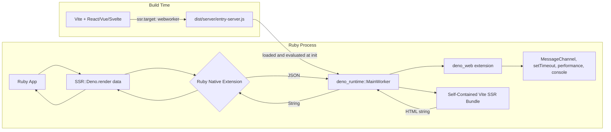
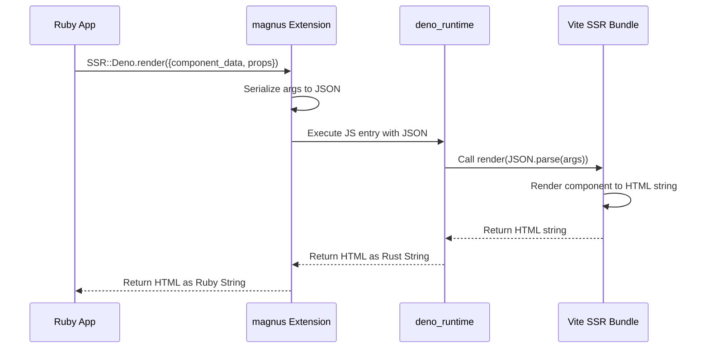
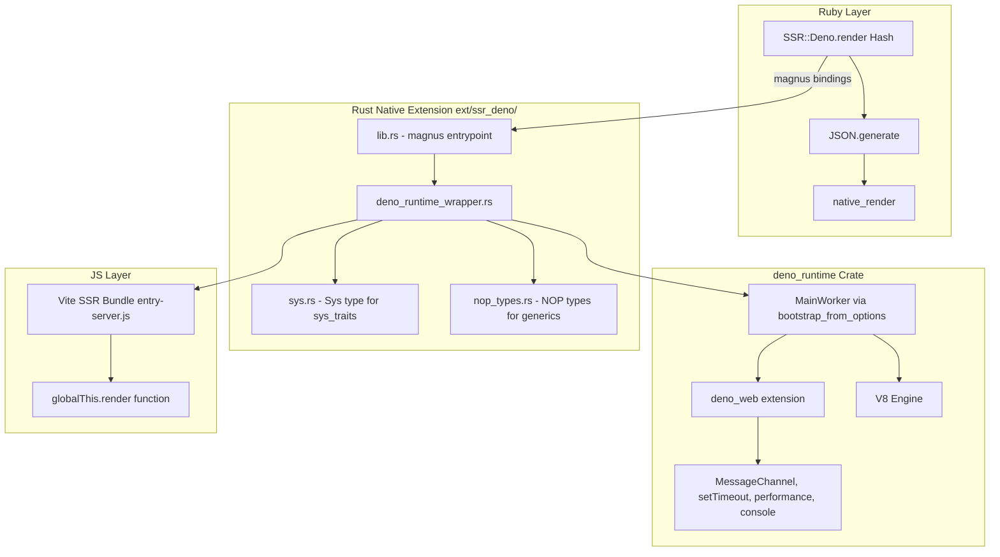

# SSR-Deno Architecture Plan

## Overview

A Ruby gem that embeds the [`deno_runtime`](https://docs.rs/deno_runtime/latest/deno_runtime/) Rust crate via a native extension to provide server-side rendering (SSR) of Vite-built web applications. The gem loads a Vite SSR production bundle (built with `ssr.target: "webworker"`) and executes it within an embedded V8 isolate with full Deno Web API support, passing JSON data from Ruby and receiving rendered HTML back.

## Architecture



## Data Flow



## Component Architecture



## Directory Structure

```
ssr-deno/
├── ext/
│   └── ssr_deno/                    # Rust crate (Cargo.toml, src/)
│       └── src/
│           ├── lib.rs               # magnus entrypoint
│           ├── deno_runtime_wrapper.rs  # DenoRuntimeWrapper (MainWorker-based)
│           ├── sys.rs               # Sys type + sys_traits implementations
│           └── nop_types.rs         # NOP types for generic parameters
├── lib/
│   └── ssr/                         # Ruby module (deno.rb + deno/version.rb)
├── sig/                             # RBS type signatures
├── test/                            # Minitest suite
├── samples/
│   └── vite-ssr-app/                # Sample Vite SSR project (deno.json, src/, dist/)
├── .vscode/                         # VSCode settings + recommended extensions
│   ├── settings.json                # Deno + rust-analyzer config
│   └── extensions.json              # Recommended extensions
├── plans/                           # Architecture and migration plans
│   ├── architecture.md
│   └── v8-tls-issue.md
├── Gemfile
├── ssr-deno.gemspec
└── Rakefile
```

## Detailed Component Design

### 1. Rust Native Extension (`ext/ssr_deno/`)

#### `Cargo.toml` Dependencies

```toml
[dependencies]
magnus = { version = "0.8", features = ["embed"] }
serde = { version = "1", features = ["derive"] }
serde_json = "1"
tokio = { version = "1", features = ["full"] }
deno_runtime = { version = "0.254.0", features = ["transpile", "hmr"] }
deno_semver = "=0.9.1"
node_resolver = "=0.84.0"
sys_traits = "=0.1.27"
libc = "0.2"

[patch.crates-io]
v8 = { path = "../../third_party/rusty_v8" }
```

The `transpile` feature enables TypeScript transpilation for `deno_telemetry`
extension sources. The `hmr` feature swaps `op_snapshot_options` to a
non-panicking `try_take + unwrap_or_default` path. The `[patch.crates-io]`
entry pins `v8` to a local checkout built with the TLS fix from
[`plans/v8-tls-issue.md`](v8-tls-issue.md).

#### `lib.rs` — magnus Entrypoint

- Defines the `SSR::Deno` Ruby module
- Registers the `render` class method (takes JSON string, returns HTML string)
- Registers `init_runtime` to initialize the Deno runtime with a bundle path
- Registers `native_version` to return the crate version
- Uses `std::sync::OnceLock` for a singleton `DenoRuntimeWrapper`
- The Tokio runtime + `MainWorker` live on a dedicated background thread
  owned by `DenoRuntimeWrapper`

```rust
use magnus::{function, Error, Module, Object, Ruby};
use std::sync::OnceLock;
use crate::deno_runtime_wrapper::DenoRuntimeWrapper;

static RUNTIME: OnceLock<DenoRuntimeWrapper> = OnceLock::new();

#[magnus::init]
fn init(ruby: &Ruby) -> Result<(), Error> {
    let module = ruby.define_module("SSR")?;
    let deno_module = module.define_module("Deno")?;
    deno_module.define_singleton_method("init_runtime", function!(init_runtime, 1))?;
    deno_module.define_singleton_method("render", function!(render, 1))?;
    deno_module.define_singleton_method("native_version", function!(native_version, 0))?;
    Ok(())
}
```

#### `deno_runtime_wrapper.rs` — Runtime Lifecycle

This is the core module. The Ruby thread holds only an mpsc `Sender`; the
`deno_runtime::MainWorker` lives on a dedicated background thread
(`"deno-worker"`) along with its own `current_thread` Tokio runtime and a
`LocalSet`. Render calls are sent across the channel and the result is
returned via a `oneshot`.

**Why a dedicated worker thread instead of `UnsafeCell` + GVL:**

`MainWorker` is `!Send + !Sync` (it owns a `v8::OwnedIsolate` and a
`!Send` Tokio context). Earlier versions of this code wrapped it in
`UnsafeCell` and forced `Send + Sync` via `unsafe impl`, relying on Ruby's
GVL to serialize access. That is fragile: Ruby may release the GVL during
blocking operations, and any future move to Ractors or a thread pool
breaks the assumption silently. Pinning the worker to one OS thread and
talking to it via channels removes all `unsafe` from the wrapper while
keeping the public API blocking-friendly for Ruby.

**Why `MainWorker` instead of `JsRuntime`:**

The full `deno_runtime::MainWorker` provides all Deno Web API extensions
out of the box — `MessageChannel`, `setTimeout`, `performance.now()`,
`console`, etc. These are required by frontend frameworks like React 19
(whose scheduler uses `MessageChannel` for async task scheduling). Using
`deno_core::JsRuntime` alone would require manually adding each extension
or writing polyfills, effectively reimplementing `deno_runtime`.

`MainWorker::bootstrap_from_options` is the public constructor that:
1. Creates a `JsRuntime` with all standard Deno extensions
2. Bootstraps the runtime (loads built-in JS modules, initializes ops)
3. Returns a ready-to-use `MainWorker`

**Why `current_thread` Tokio + `LocalSet`:**

Deno's Web API extensions (e.g. `MessagePort` used by React 19's
scheduler) call `deno_unsync::spawn_local` internally, which requires a
`LocalSet` to be active. A multi-threaded runtime is unnecessary —
`MainWorker` is single-threaded — and would also conflict with
`deno_unsync`'s assumptions.

```rust
use std::sync::mpsc;
use std::sync::Arc;

use deno_runtime::deno_core::url::Url;
use deno_runtime::deno_core::v8;
use deno_runtime::deno_permissions::PermissionsContainer;
use deno_runtime::worker::MainWorker;
use deno_runtime::worker::WorkerOptions;
use deno_runtime::worker::WorkerServiceOptions;
use deno_runtime::BootstrapOptions;
use deno_runtime::FeatureChecker;

use crate::nop_types::AllowAllPermissionDescriptorParser;
use crate::nop_types::NopInNpmPackageChecker;
use crate::nop_types::NopNpmPackageFolderResolver;
use crate::sys::Sys;

enum WorkerMsg {
    Render {
        args_json: String,
        reply: tokio::sync::oneshot::Sender<Result<String, String>>,
    },
}

pub struct DenoRuntimeWrapper {
    tx: tokio::sync::mpsc::Sender<WorkerMsg>,
}

impl DenoRuntimeWrapper {
    pub fn new(bundle_path: &str) -> Result<Self, Box<dyn std::error::Error>> {
        let canonical = std::fs::canonicalize(bundle_path)?;
        let bundle_code = std::fs::read_to_string(bundle_path)?;
        let script_name: &'static str = canonical
            .file_name()
            .and_then(|s| s.to_str())
            .map(|s| Box::leak(s.to_owned().into_boxed_str()) as &'static str)
            .unwrap_or("main.js");

        let (tx, rx) = tokio::sync::mpsc::channel::<WorkerMsg>(1);
        let (init_tx, init_rx) = mpsc::sync_channel::<Result<(), String>>(1);

        std::thread::Builder::new()
            .name("deno-worker".into())
            .spawn(move || worker_thread_main(canonical, bundle_code, script_name, rx, init_tx))?;

        init_rx.recv()??; // wait for bundle eval to finish
        Ok(Self { tx })
    }

    pub fn block_on_render(&self, args_json: &str)
        -> Result<String, Box<dyn std::error::Error>>
    {
        let (reply_tx, reply_rx) = tokio::sync::oneshot::channel();
        self.tx.blocking_send(WorkerMsg::Render {
            args_json: args_json.to_string(),
            reply: reply_tx,
        })?;
        reply_rx.blocking_recv()?.map_err(Into::into)
    }
}

fn worker_thread_main(
    main_module_path: std::path::PathBuf,
    bundle_code: String,
    script_name: &'static str,
    mut rx: tokio::sync::mpsc::Receiver<WorkerMsg>,
    init_tx: mpsc::SyncSender<Result<(), String>>,
) {
    let rt = tokio::runtime::Builder::new_current_thread()
        .enable_all()
        .build()
        .unwrap();

    tokio::task::LocalSet::new().block_on(&rt, async move {
        let url = Url::from_file_path(&main_module_path).unwrap();
        let mut worker = build_worker(&url);
        worker.execute_script(script_name, bundle_code.into()).unwrap();
        let _ = init_tx.send(Ok(()));

        while let Some(WorkerMsg::Render { args_json, reply }) = rx.recv().await {
            let result = call_render(&mut worker, &args_json).map_err(|e| e.to_string());
            let _ = reply.send(result);
        }
    });
}
```

`build_worker` constructs `WorkerServiceOptions` + `WorkerOptions` and
returns a `MainWorker` via `bootstrap_from_options`. `call_render` enters
the V8 `HandleScope` / `ContextScope`, looks up `globalThis.render`, and
invokes it with the JSON string argument. See the source for the full
boilerplate.

#### `sys.rs` — System Type for `ExtNodeSys`

Contains the `Sys` type that implements all `sys_traits` required by `ExtNodeSys` (via `#[sys_traits::auto_impl]`):

- `FsCanonicalize`, `FsMetadata`, `FsRead`, `FsReadDir`, `FsOpen` (for `NodeResolverSys`)
- `EnvCurrentDir`, `EnvHomeDir`, `EnvVar` (for `WhichSys`)
- `Clone + 'static`

Also includes wrapper types:
- `RealMetadata` — wraps `std::fs::Metadata`, implements `FsMetadataValue`
- `RealDirEntry` — wraps `std::fs::DirEntry`, implements `FsDirEntry`
- `RealFile` — wraps `std::fs::File`, implements `FsFile` (with all 11 sub-traits)

#### `nop_types.rs` — NOP Types for Generic Parameters

Contains three types required by `MainWorker::bootstrap_from_options`:

- **`NopInNpmPackageChecker`** — always returns `false` (no npm packages)
- **`NopNpmPackageFolderResolver`** — always returns `PackageFolderResolveErrorKind::PackageNotFound`
- **`AllowAllPermissionDescriptorParser`** — implements `PermissionDescriptorParser` with `unreachable!()` bodies (never called since permissions are allow-all)

### 2. Ruby Layer

#### `SSR::Deno` Module

The Ruby API provides a thin wrapper over the native Rust extension:

```ruby
module SSR
  module Deno
    class Error < StandardError; end

    class << self
      # Accepts a Hash with arbitrary data, serializes to JSON automatically,
      # and delegates to the native render method.
      def render(data)
        native_render(JSON.generate(data))
      end
    end
  end
end
```

The native extension registers three methods:
- `init_runtime(bundle_path)` — initializes the singleton Deno runtime
- `native_render(json_string)` — calls the JS `render` function with a JSON string
- `native_version` — returns the crate version

The Ruby `render` wrapper handles JSON serialization, keeping the native interface simple and the Ruby API ergonomic.

### 3. Vite SSR Bundle Contract

The Vite project should be configured with:

```ts
// vite.config.ts
import { defineConfig } from 'vite'
import react from '@vitejs/plugin-react'

export default defineConfig({
  plugins: [react()],
  ssr: {
    target: 'webworker',
    noExternal: true,          // Inline all deps into a single self-contained bundle
  },
  build: {
    ssr: true,
    outDir: 'dist/server',
    rollupOptions: {
      input: 'src/entry-server.ts',
    },
  },
})
```

> **`ssr.noExternal: true`** is critical. Without it, Vite produces a bundle with external `import` statements for dependencies like `react` and `react-dom`. The embedded Deno runtime cannot resolve these external imports — it has no package manager or `node_modules` access. With `noExternal: true`, Vite (via rolldown) inlines **all** dependencies into a single self-contained file (~448KB for React 19) with zero `import` statements. The bundle assigns `render` to `globalThis`, making it ideal for direct evaluation in the embedded V8 isolate.

The entry file should assign a `render` function to `globalThis`:

```ts
// src/entry-server.ts
import { renderToString } from 'react-dom/server'
import { createElement } from 'react'
import App from './App.tsx'

function render(argsJson: string): string {
  const context = JSON.parse(argsJson)
  const html = renderToString(
    createElement(App, {
      data: context.component_data,
      extra: context.props,
    })
  )
  return html
}

// Assign to globalThis for embedded V8 evaluation
globalThis.render = render
```

## Error Handling Strategy

All Rust-side failures (bundle path resolution, V8 evaluation, missing or
non-callable `render`, JS exception, worker thread death) are converted
to a `RuntimeError` at the magnus boundary in
[`ext/ssr_deno/src/lib.rs`](../ext/ssr_deno/src/lib.rs) via
`runtime_error(...)`. The Ruby layer exposes `SSR::Deno::Error` for
callers to rescue. No timeout, retry, or bundle-reload behavior is
implemented yet.

## Implementation Phases

### Phase 1: Project Scaffolding ✅
- Add Rust toolchain setup to the gem
- Create `ext/ssr_deno/` directory with `Cargo.toml`
- Set up `Rakefile` tasks for native extension compilation
- Add `rb-sys` and `magnus` as dependencies
- Create a minimal "hello world" native extension to verify the build pipeline

### Phase 2: Embed `deno_runtime` ✅

**Key Decision**: Use [`deno_runtime`](https://crates.io/crates/deno_runtime) with `MainWorker::bootstrap_from_options` instead of bare `deno_core::JsRuntime`. The full `deno_runtime` provides all Deno Web API extensions (`deno_web`, `deno_webidl`, etc.) that frontend frameworks like React 19 depend on — `MessageChannel`, `setTimeout`, `performance.now()`, `console`, etc. Using `deno_core` alone would require manually adding each extension or writing polyfills, effectively reimplementing `deno_runtime`.

**Completed steps:**

1. ✅ **Updated [`ext/ssr_deno/Cargo.toml`](../ext/ssr_deno/Cargo.toml)**
   - Added `deno_runtime = { version = "0.254.0", features = ["transpile", "hmr"] }`, `deno_semver`, `node_resolver`, `sys_traits`, `libc`

2. ✅ **Rewrote [`ext/ssr_deno/src/deno_runtime_wrapper.rs`](../ext/ssr_deno/src/deno_runtime_wrapper.rs)**
   - Uses `MainWorker::bootstrap_from_options` with three generic type parameters
   - V8 scope access via `pin!/init()/ContextScope` pattern
   - `MainWorker` pinned to a dedicated `"deno-worker"` thread with a
     `current_thread` Tokio runtime + `LocalSet`; Ruby thread holds an
     mpsc `Sender` and round-trips render calls via `oneshot`. No
     `unsafe` and no `UnsafeCell` in the wrapper.

3. ✅ **Created [`ext/ssr_deno/src/sys.rs`](../ext/ssr_deno/src/sys.rs)**
   - `Sys` type implementing all `sys_traits` for `ExtNodeSys`
   - Wrapper types: `RealMetadata`, `RealDirEntry`, `RealFile`

4. ✅ **Created [`ext/ssr_deno/src/nop_types.rs`](../ext/ssr_deno/src/nop_types.rs)**
   - `NopInNpmPackageChecker`, `NopNpmPackageFolderResolver`, `AllowAllPermissionDescriptorParser`

5. ✅ **Updated [`ext/ssr_deno/src/lib.rs`](../ext/ssr_deno/src/lib.rs)**
   - Added `mod sys;` and `mod nop_types;` declarations
   - Added `native_version` method

6. ✅ **Refactored into separate modules**
   - [`ext/ssr_deno/src/sys.rs`](../ext/ssr_deno/src/sys.rs) — `Sys` type + all `sys_traits` impls
   - [`ext/ssr_deno/src/nop_types.rs`](../ext/ssr_deno/src/nop_types.rs) — NOP types for generic params
   - [`ext/ssr_deno/src/deno_runtime_wrapper.rs`](../ext/ssr_deno/src/deno_runtime_wrapper.rs) — only `DenoRuntimeWrapper`

7. ✅ **Fixed runtime issues for Vite SSR sample rendering**
   - Added `features = ["transpile"]` to `deno_runtime` — enables TypeScript transpilation for `deno_telemetry` extension sources
   - Added `features = ["hmr"]` to `deno_runtime` — makes `op_snapshot_options` use `try_take` + `unwrap_or_default` instead of panicking
   - Added `let _enter = tokio_rt.enter();` before `MainWorker::bootstrap_from_options` — provides Tokio runtime context for internal `tokio::spawn` calls

8. ✅ **Vite SSR sample renders successfully**
   - `bundle exec ruby -e "require 'ssr/deno'; SSR::Deno.init_runtime('samples/vite-ssr-app/dist/server/entry-server.js'); puts SSR::Deno.render('{\"component_data\":{\"message\":\"Hello World!\"},\"props\":{},\"url\":\"/\"}')"`
   - Returns full HTML with React SSR output

9. ✅ **Added integration test**
   - [`test/ssr/test_deno.rb`](../test/ssr/test_deno.rb) — tests `native_version`, `init_runtime`, and `render` with the Vite SSR sample
   - All tests pass with Rubocop compliance

10. ✅ **Dotenv-based environment configuration**
    - V8 build env vars moved from [`bin/compile`](../bin/compile) to [`.env`](../.env) (gitignored)
    - [`.env.example`](../.env.example) committed as template
    - [`dotenv`](https://rubygems.org/gems/dotenv) gem loads `.env` in [`Rakefile`](../Rakefile)
    - [`bin/compile`](../bin/compile) removed — just run `bundle exec rake compile`

11. ✅ **Compiled and verified**
    - `bundle exec rake compile` — builds with 0 warnings, 0 errors
    - `bundle exec ruby -e "require 'ssr/deno'; puts SSR::Deno.native_version"` — returns `0.1.0-alpha.1`
    - `bundle exec rake test` — all tests pass

12. ✅ **Versioned and tagged**
    - Version bumped to `0.1.0-alpha.1` in [`lib/ssr/deno/version.rb`](../lib/ssr/deno/version.rb) and [`ext/ssr_deno/Cargo.toml`](../ext/ssr_deno/Cargo.toml)
    - Gemspec populated with summary, description, and rubygems.org push host
    - README rewritten with usage instructions, development guide, and architecture reference
    - Git tag `v0.1.0-alpha.1` created

### Phase 3: Threaded Worker ✅
- Moved `MainWorker` to a dedicated `"deno-worker"` thread (commit
  `4bdf1f5`). Removed all `unsafe` impls and `UnsafeCell`.
- Switched the Tokio runtime to `current_thread` + `LocalSet` to satisfy
  `deno_unsync::spawn_local` (commit `a8478e8`).
- Pass the bundle file name to `execute_script` so V8 stack traces point
  at the right script (commit `27df88b`).
- Per-package `opt-level` overrides for fast dev builds without breaking
  V8 / `deno_core` / `deno_runtime` (commit `d76ab6f`).

### Phase 4: Future work
- Custom error classes (`BundleNotFoundError`, `TimeoutError`, …) once
  the use cases justify them. Today everything raises
  `SSR::Deno::Error`.
- Timeout / cancellation for runaway JS renders.
- Bundle reload (re-evaluate `entry-server.js` without restarting the
  process).
- Optional `SSR::Deno.configure` block if/when more knobs appear.
- CI for Rust compilation (Linux is the only currently supported
  platform).

## Key Design Decisions

1. **`MainWorker` over `JsRuntime`**: We use `deno_runtime::MainWorker::bootstrap_from_options` instead of bare `deno_core::JsRuntime`. Frontend frameworks like React 19 depend on Web APIs (`MessageChannel`, `setTimeout`, `performance`, `console`) that are only available through Deno's extension system. `MainWorker` provides all standard Deno extensions automatically.

2. **`bootstrap_from_options` over `bootstrap`**: `MainWorker::from_options` (which does the actual construction) is private. `bootstrap_from_options` is the only public constructor that combines construction + JS bootstrap. The separate `bootstrap` method exists but requires a pre-constructed `MainWorker`.

3. **Generic type parameters**: `bootstrap_from_options` requires three generic types (`TInNpmPackageChecker`, `TNpmPackageFolderResolver`, `TExtNodeSys`). Even though we don't use npm packages, these types must be provided at compile time. We created NOP implementations that satisfy the trait bounds with minimal behavior.

4. **Singleton Deno Runtime**: A single Deno runtime instance is reused across render calls to avoid cold-start overhead. The Vite SSR bundle is loaded once at initialization.

5. **Web Worker Target**: Using `ssr.target: "webworker"` in Vite produces a bundle that only uses Web APIs, which Deno supports natively without Node.js compatibility layers.

6. **Self-Contained Bundle via `ssr.noExternal: true`**: This is the most critical Vite configuration option. Without it, Vite produces a bundle with external `import` statements for dependencies. The embedded Deno runtime cannot resolve these. With `noExternal: true`, Vite's rolldown inlines **all** dependencies into a single self-contained file with zero `import` statements.

7. **JSON Bridge**: Data is serialized to JSON at the Ruby boundary and deserialized in JavaScript. This keeps the interface simple and language-agnostic.

8. **Dedicated worker thread**: `MainWorker` (and its
   `current_thread` Tokio runtime + `LocalSet`) live on a dedicated
   `"deno-worker"` OS thread. The Ruby thread only holds an
   `mpsc::Sender<WorkerMsg>` and uses `oneshot` channels for replies. This
   removes the need for `unsafe impl Send/Sync` and `UnsafeCell`, and makes
   the design robust against future Ractor or thread-pool usage from Ruby.

9. **Configuration via Ruby**: All configuration (bundle path, etc.) is done from Ruby side, keeping the Rust extension stateless and simple.

10. **V8 Scope API**: The `rusty_v8` crate's scope API uses `ScopeStorage<T>` / `PinnedRef<'_, T>` / `ContextScope` pattern. `HandleScope::new(isolate)` returns `ScopeStorage<HandleScope>`, `.init()` returns `PinnedRef<HandleScope>`, and `ContextScope::new(&mut scope, context)` enters the V8 context.
