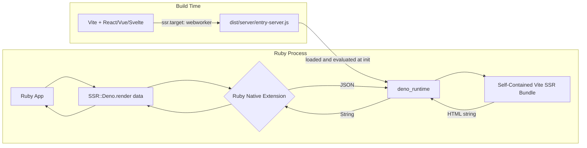
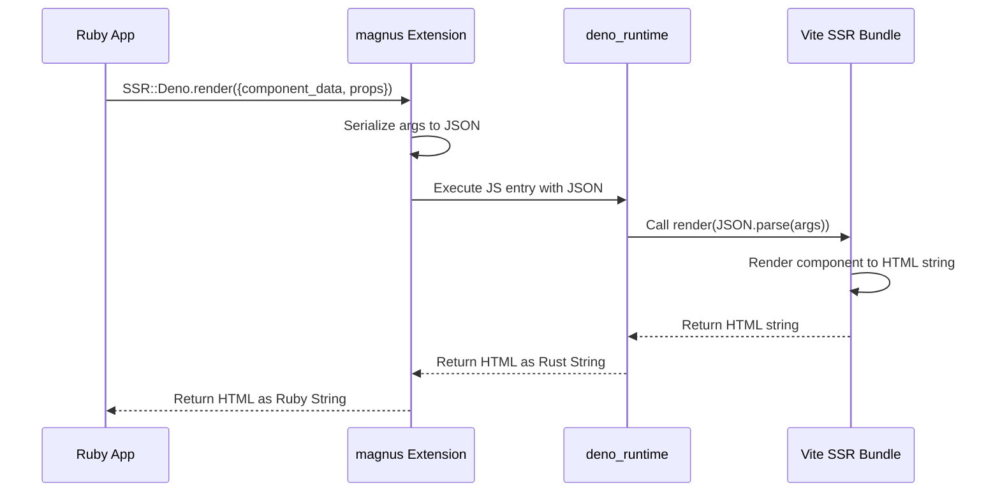
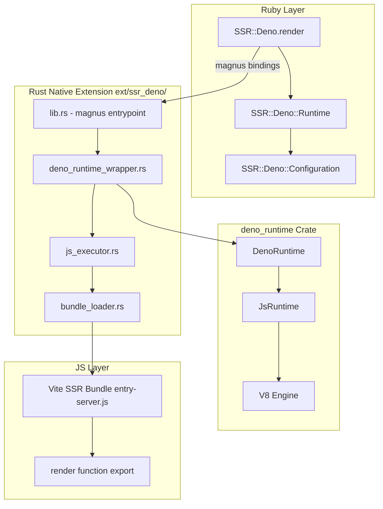
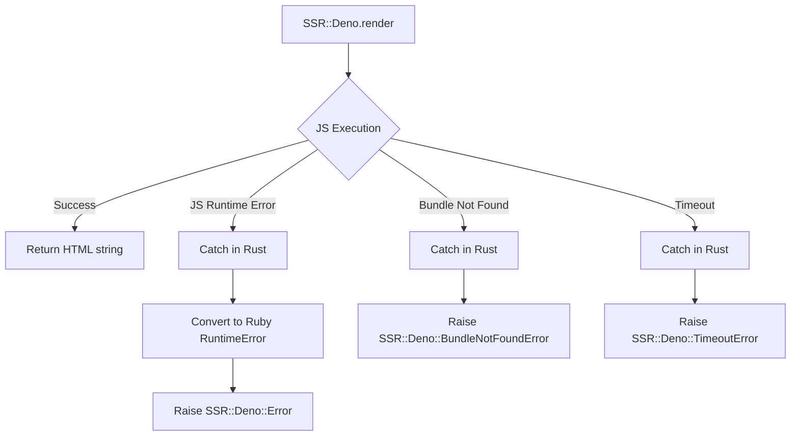

# SSR-Deno Architecture Plan

## Overview

A Ruby gem that embeds the [`deno_runtime`](https://crates.io/crates/deno_runtime) Rust crate via a native extension to provide server-side rendering (SSR) of Vite-built web applications. The gem loads a Vite SSR production bundle (built with `ssr.target: "webworker"`) and executes it within an embedded Deno runtime, passing JSON data from Ruby and receiving rendered HTML back.

## Architecture



## Data Flow



## Component Architecture



## Directory Structure

```
ssr-deno/
├── ext/
│   └── ssr_deno/                    # Rust crate (Cargo.toml, src/)
├── lib/
│   └── ssr/deno/                    # Ruby module (version.rb, runtime.rb, configuration.rb)
├── sig/                             # RBS type signatures
├── test/                            # Minitest suite
├── samples/
│   └── vite-ssr-app/                # Sample Vite SSR project (deno.json, src/, dist/)
├── .vscode/                         # VSCode Deno extension settings
├── Gemfile
├── ssr-deno.gemspec
└── Rakefile
```

## Detailed Component Design

### 1. Rust Native Extension (`ext/ssr_deno/`)

#### `Cargo.toml` Dependencies

```toml
[dependencies]
magnus = { version = "0.7", features = ["user-value"] }
rb-sys = "0.9"
deno_runtime = "0.150"  # exact version TBD
deno_core = "0.280"     # exact version TBD
serde = { version = "1", features = ["derive"] }
serde_json = "1"
tokio = { version = "1", features = ["full"] }
once_cell = "1"
```

#### `lib.rs` — magnus Entrypoint

- Defines the `SSR::Deno` Ruby module
- Registers the `render` class method
- Initializes the Tokio runtime (needed by `deno_runtime`)
- Manages a singleton `DenoRuntimeWrapper` using `once_cell`

```rust
// Pseudocode
#[magnus::init]
fn init() -> Result<(), Error> {
    let module = define_module("SSR")?;
    let deno_module = module.define_module("Deno")?;
    deno_module.define_singleton_method("render", function!(render, 1))?;
    Ok(())
}

fn render(args: String) -> Result<String, Error> {
    RUNTIME_WRAPPER.with(|rt| {
        rt.block_on(async {
            let result = rt.execute_render(&args).await?;
            Ok(result)
        })
    })
}
```

#### `deno_runtime_wrapper.rs` — Runtime Lifecycle

- Initializes a single `deno_runtime::Deno` instance (singleton pattern)
- Configures the runtime with:
  - Web Worker extensions (no Node compat layer)
  - `allow_read` permission for the bundle directory
  - Custom extension for the `render` bridge function
- Maintains a Tokio `current_thread` runtime for async execution
- Handles graceful shutdown

#### `js_executor.rs` — JS Execution

- Loads the Vite SSR bundle from disk at initialization
- Evaluates the bundle in the Deno runtime
- Calls the exported `render` function with JSON-serialized args
- Returns the HTML string result back to Ruby
- Handles JS exceptions and converts them to Ruby exceptions

#### `bundle_loader.rs` — Bundle Loading

- Reads the Vite SSR entry file from a configurable path
- Supports hot-reload in development (file watcher, optional)
- Caches the module in the Deno runtime's module map

### 2. Ruby Layer

#### `SSR::Deno` Module

```ruby
module SSR
  module Deno
    class << self
      def render(component_data: {}, props: {}, url: '/')
        # Delegates to native extension
        # component_data: hash with component identification (e.g. { component_name: "hello_world" })
        # props: hash with component props (e.g. { name: "Maurizio" })
        # url: current request URL (for routing)
        native_render({
          component_data: component_data,
          props: props,
          url: url
        }.to_json)
      end

      def configure
        yield Configuration
      end

      def configuration
        Configuration
      end
    end
  end
end
```

#### `SSR::Deno::Configuration`

```ruby
module SSR
  module Deno
    module Configuration
      mattr_accessor :bundle_path,
                     default: -> { File.join(Dir.pwd, 'dist', 'server', 'entry-server.js') }

      mattr_accessor :deno_permissions,
                     default: ['allow-read']

      mattr_accessor :render_function_name,
                     default: 'render'

      mattr_accessor :runtime_pool_size,
                     default: 1
    end
  end
end
```

### 3. Vite SSR Bundle Contract

The Vite project should be configured with:

```ts
// vite.config.ts
import { defineConfig } from 'vite'
import react from '@vitejs/plugin-react'

export default defineConfig({
  plugins: [react()],
  ssr: {
    target: 'webworker',
    noExternal: true,          // Inline all deps into a single self-contained bundle
  },
  build: {
    ssr: true,
    outDir: 'dist/server',
    rollupOptions: {
      input: 'src/entry-server.ts',
    },
  },
})
```

> **`ssr.noExternal: true`** is critical. Without it, Vite produces a bundle with external `import` statements for dependencies like `react` and `react-dom`. The embedded `deno_runtime` cannot resolve these external imports — it has no package manager or `node_modules` access. With `noExternal: true`, Vite (via rolldown) inlines **all** dependencies into a single self-contained ESM file (~448KB for React 19, ~86KB gzipped) with zero `import` statements. The bundle only has the `export { render }` at the end, making it ideal for direct evaluation in the embedded Deno runtime.

The entry file should export a `render` function:

```ts
// src/entry-server.ts
import { renderToString } from 'react-dom/server'
import { createElement } from 'react'
import App from './App.tsx'

export function render(_url: string, context: { component_data: any, props: any }): string {
  const html = renderToString(
    createElement(App, {
      data: context.component_data,
      extra: context.props,
    })
  )
  return html
}
```

> **Note on JSX spread**: Vite 8 uses rolldown as its bundler, which does not support JSX spread syntax (`{...context.props}`). When passing dynamic props, use `createElement()` directly instead of JSX spread.

## Error Handling Strategy



## Configuration

```ruby
SSR::Deno.configure do |config|
  config.bundle_path = Rails.root.join('dist', 'server', 'entry-server.js')
  config.render_function_name = 'render'
  config.deno_permissions = ['allow-read']
end
```

## Implementation Phases

### Phase 1: Project Scaffolding
- Add Rust toolchain setup to the gem
- Create `ext/ssr_deno/` directory with `Cargo.toml`
- Set up `Rakefile` tasks for native extension compilation
- Add `rb-sys` and `magnus` as dependencies
- Create a minimal "hello world" native extension to verify the build pipeline

### Phase 2: Embed deno_runtime
- Add `deno_runtime` and `deno_core` to `Cargo.toml`
- Implement `DenoRuntimeWrapper` with singleton lifecycle
- Configure runtime for web-worker mode (no Node compat)
- Set up Tokio runtime for async execution
- Verify the runtime initializes correctly from Ruby

### Phase 3: Ruby API
- Implement `SSR::Deno.render` method
- Implement `SSR::Deno::Configuration`
- Add RBS type signatures
- Write Ruby-side tests

### Phase 4: Bundle Loading & Execution
- Implement `BundleLoader` to read Vite SSR output
- Implement `JsExecutor` to call the render function
- Wire up JSON serialization/deserialization
- Handle return values and errors

### Phase 5: Error Handling & Edge Cases
- Implement custom error classes
- Add timeout protection for JS execution
- Handle bundle reload scenarios
- Add logging

### Phase 6: Documentation & Samples
- Create a sample Vite SSR project
- Write comprehensive README
- Add CI configuration for Rust compilation
- Document the Vite SSR bundle contract

## Key Design Decisions

1. **Singleton Deno Runtime**: A single Deno runtime instance is reused across render calls to avoid cold-start overhead. The Vite SSR bundle is loaded once at initialization.

2. **Web Worker Target**: Using `ssr.target: "webworker"` in Vite produces a bundle that only uses Web APIs, which Deno supports natively without Node.js compatibility layers.

3. **Self-Contained Bundle via `ssr.noExternal: true`**: This is the most critical Vite configuration option. Without it, Vite produces a bundle with external `import` statements for dependencies (e.g., `import { renderToString } from 'react-dom/server'`). The embedded `deno_runtime` cannot resolve these — it has no package manager, no `node_modules`, and no module resolution algorithm. With `ssr.noExternal: true`, Vite's rolldown inlines **all** dependencies into a single self-contained ESM file with zero `import` statements. The resulting bundle (e.g., ~448KB for React 19) is evaluated directly in the Deno runtime as one unit, and only the `render` function is exported. This is the key enabler for the entire approach.

4. **JSON Bridge**: Data is serialized to JSON at the Ruby boundary and deserialized in JavaScript. This keeps the interface simple and language-agnostic.

5. **Tokio Runtime — Single-threaded for v1, multi-threaded roadmap**: For the first iteration, we use a Tokio `current_thread` runtime to keep things simple. Since Ruby has a GVL, long-running renders would block the Ruby thread. However, the architecture is designed with future multi-threading in mind — Puma's multi-threaded worker model or Ruby async web servers (Ractor or non-Ractor based) could take advantage of a multi-threaded Tokio runtime with a pool of Deno isolates, allowing concurrent renders without blocking each other.

6. **Configuration via Ruby**: All configuration (bundle path, permissions, etc.) is done from Ruby side, keeping the Rust extension stateless and simple.
