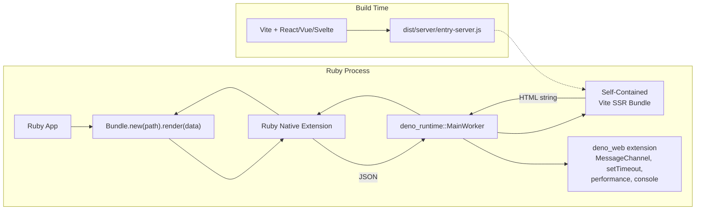
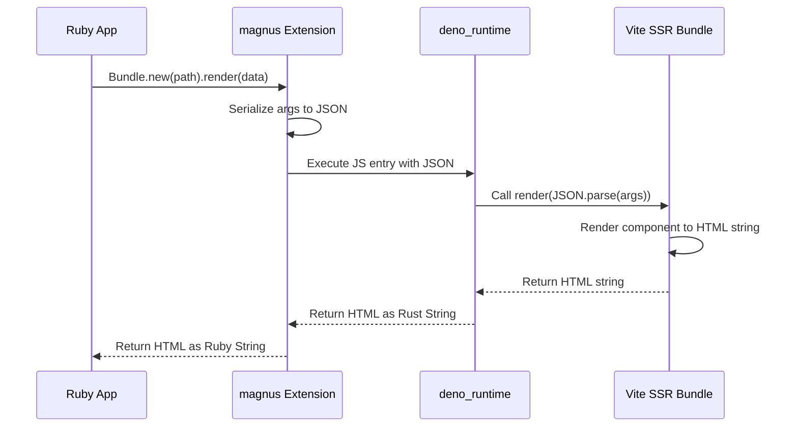
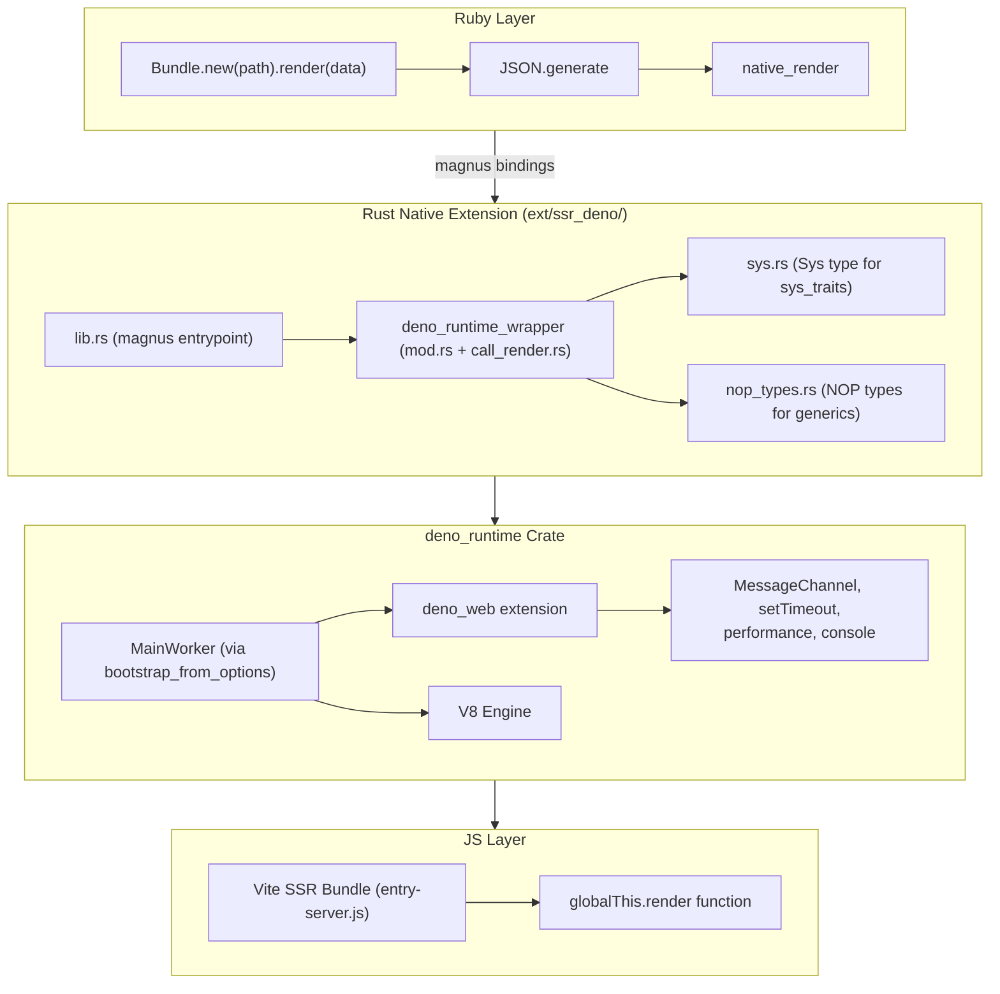

# SSR-Deno Architecture Plan

## Overview

A Ruby gem that embeds the [`deno_runtime`](https://docs.rs/deno_runtime/latest/deno_runtime/) Rust crate via a native extension to provide server-side rendering (SSR) of Vite-built web applications. The gem loads a Vite SSR production bundle (`dist/server/entry-server.js`) and executes it within an embedded V8 isolate with full Deno Web API support, passing JSON data from Ruby and receiving rendered HTML back.

## Architecture



## Data Flow



## Component Architecture



## Directory Structure

```
ssr-deno/
├── ext/
│   └── ssr_deno/                    # Rust crate (Cargo.toml, src/)
│       ├── crates/ssr_deno_core/    # Pure-Rust types (Config, DenoError, validators)
│       └── src/
│           ├── lib.rs               # magnus entrypoint
│           ├── deno_runtime_wrapper/
│           │   ├── mod.rs           # IsolateHandle, IsolatePool, worker thread
│           │   └── call_render.rs   # call_render, collect_heap_stats
│           ├── sys.rs               # Sys type for sys_traits
│           ├── nop_types.rs         # NOP types for generic parameters
│           ├── node_builtin_loader.rs  # ModuleLoader for node: scheme
│           └── require_loader.rs    # NodeRequireLoader for built-in modules
├── lib/
│   └── ssr/
│       └── deno/                    # Ruby module
│           ├── deno.rb              # Core entry point (config setters)
│           ├── version.rb           # VERSION constant
│           ├── bundle.rb            # Bundle class (multi-bundle support)
│           ├── bundle/
│           │   └── registry.rb      # Thread-safe Bundle::Registry
│           ├── instrumenter.rb      # ActiveSupport::Notifications wrapper
│           ├── rails.rb             # Rails integration entry point (opt-in)
│           └── rails/
│               ├── railtie.rb       # Railtie (config, init bundles)
│               ├── helper.rb        # View helper (ssr_render)
│               └── generators/
│                   └── ssr/deno/
│                       ├── install_generator.rb
│                       └── templates/ssr_deno.rb
├── sig/                             # RBS type signatures
│   └── ssr/deno.rbs
├── test/                            # Minitest suite
├── docs/                            # Project documentation
│   └── architecture.md              # This document
├── rakelib/                         # Rake task files
│   ├── cargo.rake                   # cargo:test
│   ├── samples.rake                 # samples:build
│   └── test.rake                    # test:main, test:node_builtins
├── samples/
│   ├── vanilla-ssr-app/             # Sample vanilla TS SSR
│   ├── vue-ssr-app/                 # Sample Vue 3 SSR
│   ├── svelte-ssr-app/              # Sample Svelte 5 SSR
│   ├── react-ssr-app/               # Sample React 19 SSR
│   ├── react-mui-ssr-app/           # Sample React 19 + MUI v9 (plain HTML)
│   └── react-mui-emotion-ssr-app/   # Sample React 19 + MUI v9 + Emotion CSS
├── plans/                           # Active plans (pending steps)
│   ├── streaming-ssr.md
│   ├── memory-performance-analysis.md
│   ├── v8-tls-issue.md
│   └── archived/                    # Fully completed plans
│       ├── new-samples.md
├── .github/workflows/
│   └── ci.yml                       # CI pipeline
├── AGENTS.md                        # Project conventions (OpenCode)
├── Gemfile
├── ssr-deno.gemspec
├── Rakefile
├── .env.example
└── .rubocop.yml
```

## Detailed Component Design

### 1. Rust Native Extension (`ext/ssr_deno/`)

#### `Cargo.toml` Dependencies

```toml
[dependencies]
ssr_deno_core = { path = "crates/ssr_deno_core" }
magnus = { version = "0.8", features = ["embed"] }
serde = { version = "1", features = ["derive"] }
serde_json = "1"
tokio = { version = "1", features = ["full"] }
deno_runtime = { version = "0.255.0", features = ["transpile", "hmr"] }
deno_semver = "=0.9.1"
deno_error = "=0.7.1"
node_resolver = "=0.85.0"
sys_traits = "=0.1.27"
libc = "0.2"

[patch.crates-io]
v8 = { path = "../../vendor/rusty_v8" }
```

The `transpile` feature enables TypeScript transpilation for `deno_telemetry`
extension sources. The `hmr` feature swaps `op_snapshot_options` to a
non-panicking `try_take + unwrap_or_default` path. The `[patch.crates-io]`
entry pins `v8` to a local checkout built with the TLS fix from
[`plans/v8-tls-issue.md`](v8-tls-issue.md).

#### `lib.rs` — magnus Entrypoint

- Defines the `SSR::Deno` Ruby module with a full error hierarchy
- Registers `native_load_bundle(bundle_id, bundle_path)` to evaluate a bundle
- Registers `native_render(bundle_id, json_string)` to call a bundle's render function
- Registers `native_version` to return the crate version
- Registers config setters: `native_set_max_heap_size_mb`, `native_set_isolate_pool_size`, `native_set_render_timeout_ms`, `native_set_node_builtins_enabled`
- Registers `native_heap_stats` for V8 memory metrics
- Uses `POOL: OnceLock<IsolatePool>` for the isolate pool
- Double-checked locking via `POOL_INIT_LOCK: Mutex<()>` prevents TOCTOU races
- Config stored in `CONFIG: Mutex<Config>` with `INITIALIZED: OnceLock<()>` guard
  (Mutex allows multiple fields to be set independently; the guard prevents mutation after init)
- Each `IsolateHandle` holds a Tokio runtime + `MainWorker` on its own `deno-worker-{index}` thread

```rust
static POOL: OnceLock<IsolatePool> = OnceLock::new();
static POOL_INIT_LOCK: Mutex<()> = Mutex::new(());
static INITIALIZED: OnceLock<()> = OnceLock::new();
static CONFIG: Mutex<Config> = Mutex::new(Config::default());

#[magnus::init]
fn init(ruby: &Ruby) -> Result<(), Error> {
    // ... error hierarchy, methods ...
    deno_module.define_singleton_method(
        "native_set_max_heap_size_mb", function!(native_set_max_heap_size_mb, 1))?;
    deno_module.define_singleton_method(
        "native_set_node_builtins_enabled", function!(native_set_node_builtins_enabled, 1))?;
    // ... more methods ...
    Ok(())
}
```

Config setters update `CONFIG` at the Mutex, and the pool reads the full config snapshot
at init time via `get_or_init_pool()`:

```rust
fn get_or_init_pool() -> Result<&'static IsolatePool, Error> {
    let config = *CONFIG.lock().unwrap();
    // ... passes config fields to IsolatePool::new(...)
}
```

#### `deno_runtime_wrapper/` — Runtime Lifecycle

This is the core module. The Ruby thread holds only an mpsc `Sender`; the
`deno_runtime::MainWorker` lives on a dedicated background thread
(`"deno-worker"`) along with its own `current_thread` Tokio runtime and a
`LocalSet`. Render calls are sent across the channel and the result is
returned via a `oneshot`.

**Why a dedicated worker thread instead of `UnsafeCell` + GVL:**

`MainWorker` is `!Send + !Sync` (it owns a `v8::OwnedIsolate` and a
`!Send` Tokio context). Earlier versions of this code wrapped it in
`UnsafeCell` and forced `Send + Sync` via `unsafe impl`, relying on Ruby's
GVL to serialize access. That is fragile: Ruby may release the GVL during
blocking operations, and any future move to Ractors or a thread pool
breaks the assumption silently. Pinning the worker to one OS thread and
talking to it via channels removes all `unsafe` from the wrapper while
keeping the public API blocking-friendly for Ruby.

**Why `MainWorker` instead of `JsRuntime`:**

The full `deno_runtime::MainWorker` provides all Deno Web API extensions
out of the box — `MessageChannel`, `setTimeout`, `performance.now()`,
`console`, etc. These are required by frontend frameworks like React 19
(whose scheduler uses `MessageChannel` for async task scheduling). Using
`deno_core::JsRuntime` alone would require manually adding each extension
or writing polyfills, effectively reimplementing `deno_runtime`.

`MainWorker::bootstrap_from_options` is the public constructor that:
1. Creates a `JsRuntime` with all standard Deno extensions
2. Bootstraps the runtime (loads built-in JS modules, initializes ops)
3. Returns a ready-to-use `MainWorker`

**Why `current_thread` Tokio + `LocalSet`:**

Deno's Web API extensions (e.g. `MessagePort` used by React 19's
scheduler) call `deno_unsync::spawn_local` internally, which requires a
`LocalSet` to be active. A multi-threaded runtime is unnecessary —
`MainWorker` is single-threaded — and would also conflict with
`deno_unsync`'s assumptions.

```rust
enum WorkerMsg {
    LoadBundle { bundle_id, bundle_code, script_name, reply },
    Render { bundle_id, args_json, reply },
    HeapStats { reply },
}

pub struct DenoRuntimeWrapper {
    tx: tokio::sync::mpsc::Sender<WorkerMsg>,
    render_timeout_ms: u64,
}
```

The actual architecture uses an **`IsolatePool`** of up to 8 `IsolateHandle`s:

```rust
pub struct IsolatePool {
    handles: Vec<IsolateHandle>,
    counter: AtomicUsize, // Round-robin
}

impl IsolatePool {
    pub fn new(size: usize, max_heap_size_mb: usize,
               render_timeout_ms: u64, node_builtins: bool) -> Result<Self, DenoError> {
        let mut handles = Vec::with_capacity(size);
        for i in 0..size {
            let handle = IsolateHandle::spawn(i, max_heap_size_mb, render_timeout_ms, node_builtins)?;
            handles.push(handle);
        }
        Ok(Self { handles, counter: AtomicUsize::new(0) })
    }
}
```

Each `IsolateHandle::spawn` creates a dedicated OS thread running a Tokio
`current_thread` runtime + `LocalSet` with a single `MainWorker`:

```rust
fn worker_thread_main(
    mut rx: tokio::sync::mpsc::Receiver<WorkerMsg>,
    init_tx: mpsc::SyncSender<Result<(), String>>,
    max_heap_size_mb: usize,
    node_builtins: bool,
) {
    let rt = tokio::runtime::Builder::new_current_thread()
        .enable_all().build().unwrap();

    tokio::task::LocalSet::new().block_on(&rt, async move {
        let mut worker = build_worker(&main_module_url, max_heap_size_mb, node_builtins).unwrap();
        // message loop ...
    });
}
```

When `node_builtins` is enabled, `build_worker` replaces the default
`NoopModuleLoader` with a `NodeBuiltinOnlyModuleLoader` and injects a
`globalThis.require` function via `createRequire` from Deno's built-in
`node:module`. This allows CJS bundles that use `require("stream")`,
`require("buffer")`, etc. to work in the embedded V8 context.

`build_worker` constructs `WorkerServiceOptions` + `WorkerOptions` and
returns a `MainWorker` via `bootstrap_from_options`. `call_render` enters
the V8 `HandleScope` / `ContextScope`, looks up `globalThis.render`, and
invokes it with the JSON string argument. See the source for the full
boilerplate.

#### `sys.rs` — System Type for `ExtNodeSys`

Contains the `Sys` type that implements all `sys_traits` required by `ExtNodeSys` (via `#[sys_traits::auto_impl]`):

- `FsCanonicalize`, `FsMetadata`, `FsRead`, `FsReadDir`, `FsOpen` (for `NodeResolverSys`)
- `EnvCurrentDir`, `EnvHomeDir`, `EnvVar` (for `WhichSys`)
- `Clone + 'static`

Also includes wrapper types:
- `RealMetadata` — wraps `std::fs::Metadata`, implements `FsMetadataValue`
- `RealDirEntry` — wraps `std::fs::DirEntry`, implements `FsDirEntry`
- `RealFile` — wraps `std::fs::File`, implements `FsFile` (with all 11 sub-traits)

#### Supporting Modules

**`nop_types.rs`** — NOP implementations for generic parameters required by `bootstrap_from_options`:

- **`NopInNpmPackageChecker`** — always returns `false` (no npm packages)
- **`NopNpmPackageFolderResolver`** — always returns `PackageFolderResolveErrorKind::PackageNotFound`
- **`NopPermissionDescriptorParser`** — implements `PermissionDescriptorParser` (never called since permissions are `none_without_prompt`)

**`node_builtin_loader.rs`** — Custom `ModuleLoader` that allows `node:` scheme URLs.
When `node_builtins_enabled` is set, this replaces `NoopModuleLoader` so that
Deno's built-in Node.js polyfills (e.g. `node:module` → `01_require.js`) can load.

**`require_loader.rs`** — Minimal `NodeRequireLoader` for use with `noExternal: true` bundles.
All npm deps are bundled by Vite, so `require()` is only called for Node.js
built-in modules. File-system-based loading is rejected.

### 2. Ruby Layer

#### `SSR::Deno::Bundle` Class

The Ruby API is built around the `Bundle` class, which wraps a single Vite SSR bundle and manages its lifecycle:

```ruby
module SSR
  module Deno
    class Bundle
      def initialize(bundle_path)
        @bundle_path = bundle_path.to_s
        @bundle_id = object_id.to_s
        @mtime = File.mtime(@bundle_path)
        @auto_reload = false
        instrument 'bundle_load.ssr_deno', bundle_name: @bundle_id, path: @bundle_path do
          load
        end
      end

      def render(data = nil, raw_input: false, raw_output: false)
        reload_if_changed if @auto_reload
        json_input = raw_input ? data : JSON.generate(data)
        instrument 'render.ssr_deno', bundle_name: @bundle_id do
          result = SSR::Deno.native_render(@bundle_id, json_input)
          raw_output ? result : JSON.parse(result)
        end
      end
    end
  end
end
```

The native extension registers:
- `native_load_bundle(bundle_id, bundle_path)` — evaluates a bundle and registers its render function under `globalThis.__ssr_bundles[bundle_id]`
- `native_render(bundle_id, json_string)` — calls the JS `render` function for a specific bundle
- `native_version` — returns the crate version
- `native_set_max_heap_size_mb`, `native_set_isolate_pool_size`, `native_set_render_timeout_ms`, `native_set_node_builtins_enabled` — config setters
- `native_heap_stats` — V8 memory counters

The Ruby `Bundle` class handles JSON serialization, mtime-based auto-reload, and `ActiveSupport::Notifications` instrumentation, keeping the native interface simple and the Ruby API ergonomic.

#### `SSR::Deno::Bundle::Registry`

A thread-safe registry for named bundles, used primarily by the Rails integration:

```ruby
registry = SSR::Deno::Bundle::Registry.new
registry.register(:application, bundle)
registry[:application]  # => bundle
registry.bundle(:application)  # => bundle
```

### 3. Vite SSR Bundle Contract

The Vite project should be configured with:

```ts
// vite.config.ts
import { defineConfig } from 'vite'
import react from '@vitejs/plugin-react'

export default defineConfig({
  plugins: [react()],
  ssr: {
    target: 'webworker',
    noExternal: true,
    resolve: {
      conditions: ['edge-light', 'module', 'browser', 'development'],
    },
  },
  build: {
    ssr: true,
    outDir: 'dist/server',
    rollupOptions: {
      input: 'src/entry-server.ts',
    },
  },
})
```

**`ssr.noExternal: true`** is critical. Without it, Vite produces a bundle with external `import` statements for dependencies like `react` and `react-dom`. The embedded Deno runtime cannot resolve these external imports — it has no package manager or `node_modules` access. With `noExternal: true`, Vite (via rolndown) inlines **all** dependencies into a single self-contained file with zero `import` statements. The bundle assigns `render` to `globalThis`, making it ideal for direct evaluation in the embedded V8 isolate.

**`ssr.target: 'webworker'`** ensures the bundle only uses Web APIs, avoiding Node.js-specific references that would fail in the embedded V8 context. Note however that the gem's native extension can evaluate bundles with any SSR target — `webworker` is a safe default.

**`ssr.resolve.conditions`** with `'edge-light'` before `'browser'` prevents packages like `@emotion/cache` from resolving to their browser-specific build (which assumes `document` exists) when targeting `webworker`. See [`plans/archived/edge-light-resolution.md`](plans/archived/edge-light-resolution.md).

The entry file should assign a `render` function to `globalThis`:

```ts
// src/entry-server.ts
import { renderToString } from 'react-dom/server'
import { createElement } from 'react'
import App from './App.tsx'

function render(argsJson: string): string {
  const context = JSON.parse(argsJson)
  const html = renderToString(
    createElement(App, {
      data: context.component_data,
      extra: context.props,
    })
  )
  return html
}

// Assign to globalThis for embedded V8 evaluation
globalThis.render = render
```

## Error Handling Strategy

All Rust-side failures (bundle path resolution, V8 evaluation, missing or
non-callable `render`, JS exception, worker thread death) are converted
to a `RuntimeError` at the magnus boundary in
[`ext/ssr_deno/src/lib.rs`](../ext/ssr_deno/src/lib.rs) via
`runtime_error(...)`. The Ruby layer exposes `SSR::Deno::Error` for
callers to rescue.

Render timeout is configurable via `SSR::Deno.render_timeout_ms=` (default 500ms).
Auto-reload is available per-bundle via `bundle.auto_reload = true` (mtime checks).

## Implementation Phases

### Phase 1: Project Scaffolding ✅
- Add Rust toolchain setup to the gem
- Create `ext/ssr_deno/` directory with `Cargo.toml`
- Set up `Rakefile` tasks for native extension compilation
- Add `rb-sys` and `magnus` as dependencies
- Create a minimal "hello world" native extension to verify the build pipeline

### Phase 2: Embed `deno_runtime` ✅

**Key Decision**: Use [`deno_runtime`](https://crates.io/crates/deno_runtime) with `MainWorker::bootstrap_from_options` instead of bare `deno_core::JsRuntime`. The full `deno_runtime` provides all Deno Web API extensions (`deno_web`, `deno_webidl`, etc.) that frontend frameworks like React 19 depend on — `MessageChannel`, `setTimeout`, `performance.now()`, `console`, etc. Using `deno_core` alone would require manually adding each extension or writing polyfills, effectively reimplementing `deno_runtime`.

**Completed steps:**

1. ✅ **Updated [`ext/ssr_deno/Cargo.toml`](../ext/ssr_deno/Cargo.toml)**
   - Added `deno_runtime`, `deno_semver`, `node_resolver`, `sys_traits`, `libc`

2. ✅ **Rewrote [`ext/ssr_deno/src/deno_runtime_wrapper/`](../ext/ssr_deno/src/deno_runtime_wrapper/mod.rs)**
   - Uses `MainWorker::bootstrap_from_options` with three generic type parameters
   - V8 scope access via `pin!/init()/ContextScope` pattern
   - `MainWorker` pinned to a dedicated `"deno-worker"` thread with a
     `current_thread` Tokio runtime + `LocalSet`; Ruby thread holds an
     mpsc `Sender` and round-trips render calls via `oneshot`. No
     `unsafe` and no `UnsafeCell` in the wrapper.

3. ✅ **Created [`ext/ssr_deno/src/sys.rs`](../ext/ssr_deno/src/sys.rs)**
   - `Sys` type implementing all `sys_traits` for `ExtNodeSys`
   - Wrapper types: `RealMetadata`, `RealDirEntry`, `RealFile`

4. ✅ **Created [`ext/ssr_deno/src/nop_types.rs`](../ext/ssr_deno/src/nop_types.rs)**
   - `NopInNpmPackageChecker`, `NopNpmPackageFolderResolver`, `NopPermissionDescriptorParser`

5. ✅ **Updated [`ext/ssr_deno/src/lib.rs`](../ext/ssr_deno/src/lib.rs)**
   - Added `mod sys;` and `mod nop_types;` declarations
   - Added `native_version` method

6. ✅ **Refactored into separate modules**
   - [`ext/ssr_deno/src/sys.rs`](../ext/ssr_deno/src/sys.rs) — `Sys` type + all `sys_traits` impls
   - [`ext/ssr_deno/src/nop_types.rs`](../ext/ssr_deno/src/nop_types.rs) — NOP types for generic params
   - [`ext/ssr_deno/src/deno_runtime_wrapper/mod.rs`](../ext/ssr_deno/src/deno_runtime_wrapper/mod.rs) — `IsolateHandle`, `IsolatePool`, worker thread
   - [`ext/ssr_deno/src/deno_runtime_wrapper/call_render.rs`](../ext/ssr_deno/src/deno_runtime_wrapper/call_render.rs) — `call_render`, `collect_heap_stats`

7. ✅ **Fixed runtime issues for Vite SSR sample rendering**
   - Added `features = ["transpile"]` to `deno_runtime` — enables TypeScript transpilation for `deno_telemetry` extension sources
   - Added `features = ["hmr"]` to `deno_runtime` — makes `op_snapshot_options` use `try_take` + `unwrap_or_default` instead of panicking

8. ✅ **Vite SSR sample renders successfully**
   - `bundle exec ruby -e "require 'ssr/deno'; bundle = SSR::Deno::Bundle.new('samples/react-ssr-app/dist/server/entry-server.js'); puts bundle.render({data: {message: 'Hello World!'}})"`
   - Returns full HTML with React SSR output

9. ✅ **Added integration tests**
   - [`test/ssr/test_deno_bundle.rb`](../test/ssr/test_deno_bundle.rb) — tests `Bundle.new`, `render`, `reload`, auto-reload, raw I/O modes
   - [`test/ssr/test_integration_samples.rb`](../test/ssr/test_integration_samples.rb) — full end-to-end SSR tests for all sample apps

10. ✅ **Dotenv-based environment configuration**
    - V8 build env vars moved from [`bin/compile`](../bin/compile) to [`.env`](../.env) (gitignored)
    - [`.env.example`](../.env.example) committed as template
    - [`dotenv`](https://rubygems.org/gems/dotenv) gem loads `.env` in [`Rakefile`](../Rakefile)
    - [`bin/compile`](../bin/compile) removed — just run `bundle exec rake compile`

11. ✅ **Compiled and verified**
    - `bundle exec rake compile` — builds with 0 warnings, 0 errors
    - `bundle exec rake` — full pipeline passes (Rust tests, sample builds, Ruby tests, RuboCop, RBS signatures)

### Phase 3: Multi-Bundle & Rails Integration ✅
- Refactored from single `init_runtime`/`render` to `SSR::Deno::Bundle` class with per-bundle IDs
- Added `Bundle::Registry` for thread-safe named bundle storage
- Added `native_load_bundle(bundle_id, bundle_path)` for dynamic bundle loading
- Added `DenoError` typed error enum in Rust, mapped to Ruby exception hierarchy
- Added `ActiveSupport::Notifications` instrumentation (`render.ssr_deno`, `bundle_load.ssr_deno`, `bundle_miss.ssr_deno`)
- Added Rails integration: `Railtie`, `Helper` (`ssr_render`), `InstallGenerator`
- Added security hardening: `Permissions::none_without_prompt()`, `NoopModuleLoader`, symlink-escape check, TOCTOU fix, path redaction in errors
- Added `test/ssr/test_deno_bundle.rb`, `test/ssr/test_deno_registry.rb`, `test/ssr/test_deno_errors.rb`, `test/ssr/test_deno_concurrency.rb`, `test/ssr/test_deno_install_generator.rb`, `test/ssr/integration_deno_rails.rb`

### Phase 4: Future work
- Content-Security-Policy nonce support for inline `<script>` tags in SSR output
- Document deployment considerations (V8 binary size, memory)
- Streaming SSR via `renderToPipeableStream` + `ActionController::Live`
- Template handler (`.ssr` files with YAML frontmatter)
- Linux is the only currently supported platform (V8 compilation)

## Key Design Decisions

1. **`MainWorker` over `JsRuntime`**: We use `deno_runtime::MainWorker::bootstrap_from_options` instead of bare `deno_core::JsRuntime`. Frontend frameworks like React 19 depend on Web APIs (`MessageChannel`, `setTimeout`, `performance`, `console`) that are only available through Deno's extension system. `MainWorker` provides all standard Deno extensions automatically.

2. **`bootstrap_from_options` over `bootstrap`**: `MainWorker::from_options` (which does the actual construction) is private. `bootstrap_from_options` is the only public constructor that combines construction + JS bootstrap. The separate `bootstrap` method exists but requires a pre-constructed `MainWorker`.

3. **Generic type parameters**: `bootstrap_from_options` requires three generic types (`TInNpmPackageChecker`, `TNpmPackageFolderResolver`, `TExtNodeSys`). For bundles without Node.js builtin requirements, NOP implementations satisfy the trait bounds. When `node_builtins_enabled` is set, the full `NodeExtInitServices` with `NodeRequireLoader`, `NodeResolver`, and `PackageJsonResolver` are provided to the `deno_node` extension.

4. **Isolate Pool**: An `IsolatePool` of up to 8 `IsolateHandle`s (one per V8 isolate) dispatches render requests round-robin. Each handle has its own Tokio runtime + `MainWorker` on a dedicated `deno-worker-{index}` thread. Bundles are broadcast to all isolates at load time.

5. **Web Worker Target**: Using `ssr.target: "webworker"` in Vite produces a bundle that only uses Web APIs, which Deno supports natively without Node.js compatibility layers.

6. **Self-Contained Bundle via `ssr.noExternal: true`**: This is the most critical Vite configuration option. Without it, Vite produces a bundle with external `import` statements for dependencies. The embedded Deno runtime cannot resolve these. With `noExternal: true`, Vite's rolldown inlines **all** dependencies into a single self-contained file with zero `import` statements.

7. **JSON Bridge**: Data is serialized to JSON at the Ruby boundary and deserialized in JavaScript. This keeps the interface simple and language-agnostic.

8. **Dedicated worker threads**: Each `IsolateHandle` runs a `MainWorker`
   (and its `current_thread` Tokio runtime + `LocalSet`) on a dedicated
   `"deno-worker-{index}"` OS thread. The Ruby thread only holds
   an `mpsc::Sender<WorkerMsg>` and uses `oneshot` channels for replies.
   This removes the need for `unsafe impl Send/Sync` and `UnsafeCell`, and
   makes the design robust against Ractor usage.

9. **Configuration via Ruby**: All configuration (heap limit, pool size, bundle path) is done from Ruby side, keeping the Rust extension stateless and simple. The `Mutex<Config>` pattern allows multiple configuration fields to be set independently before initialization.

10. **V8 Scope API**: The `rusty_v8` crate's scope API uses `ScopeStorage<T>` / `PinnedRef<'_, T>` / `ContextScope` pattern. `HandleScope::new(isolate)` returns `ScopeStorage<HandleScope>`, `.init()` returns `PinnedRef<HandleScope>`, and `ContextScope::new(&mut scope, context)` enters the V8 context.
