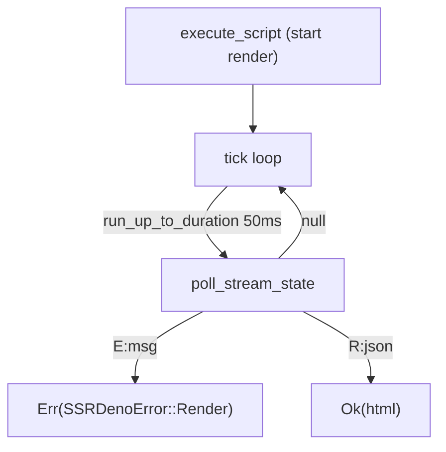

# Event Loop Render — Approach C Phase 1

Status: ✅ Complete

## Summary

Added event-loop-driven render path (`render_stream` / `event_loop: true`)
to enable macrotask support (setTimeout, setInterval, MessagePort) during
SSR. Uses `run_up_to_duration` tick loop with tagged-string poll protocol.

## Architecture

## Implementation

| File | Change |
|---|---|
| `ext/ssr_deno/src/deno_runtime_wrapper/mod.rs` | `RenderStream` variant in `WorkerMsg`, handler, Extension registration |
| `ext/ssr_deno/src/deno_runtime_wrapper/render_stream.rs` | `render_streaming` + `op_ssr_push_chunk` + `poll_stream_state` |
| `ext/ssr_deno/src/lib.rs` | `native_render_stream` Ruby method |
| `lib/ssr/deno/bundle.rb` | `Bundle#render_stream` + `event_loop:` param on `#render` |
| `sig/ssr/deno.rbs` | `render_stream`, `native_render_stream` signatures |
| `test/ssr/test_deno_render_stream.rb` | Streaming render + promise rejection tests |
| `test/ssr/test_deno_macrotasks.rb` | setTimeout, setInterval, MessagePort tests |

## Key decisions

- Tick-by-tick loop (not `run_event_loop` to completion) — gives us timeout + OOM checks per tick
- Tagged-string protocol (`E:`, `R:`, null) — single `execute_script` per tick instead of two
- `op_ssr_push_chunk` registered but chunks silently dropped — only final result matters for Phase 1
- `chunk_tx` capacity 64 — bounded channel prevents unbounded memory growth
