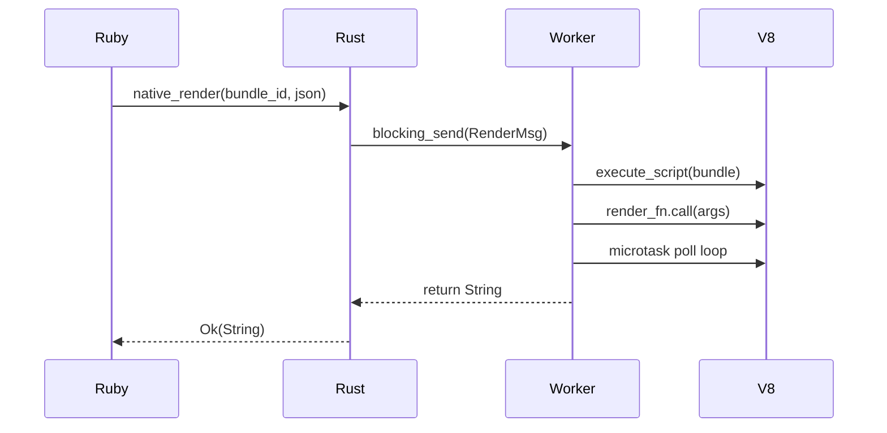
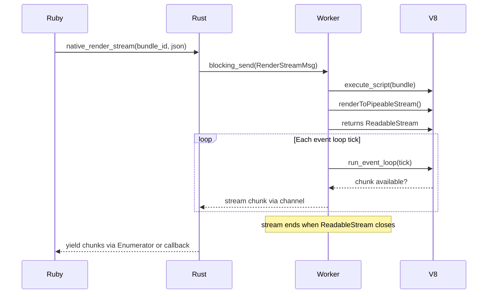

# Event Loop Integration for Macrotask Support

> **Decision:** Approach C (Deno-native event loop) selected for implementation.
> See [`event-loop-approach-c.md`](event-loop-approach-c.md) for the detailed plan.

## Problem

The current SSR pipeline uses `execute_script` + `perform_microtask_checkpoint`,
which only dispatches microtasks (Promises). Macrotasks (`setTimeout`,
`MessagePort`, `fetch`) are silently queued and never fire. This blocks
React 19 streaming SSR (`renderToPipeableStream`, `renderToReadableStream`)
which uses `MessagePort.postMessage` internally to schedule chunk emission.

## How Deno's event loop works

```
execute_main_module → run_event_loop:
  Phase 1: Timers          ← SetTimeout, setInterval callbacks
    └─ user_timer.poll_ready() → dispatch_event_loop_tick(timerNow)
    └─ JS: processTimers(now) → fire expired callbacks
  Phase 2: Pending work     ← MessagePort, async ops, nextTick
    └─ __eventLoopTick(..., promiseId, result, ...)
    └─ drain_next_tick_and_macrotasks()
  Phase 3: Idle / Prepare   ← libuv idle callbacks
  Phase 4: I/O              ← TCP, file, fetch
  Phase 5: Check            ← setImmediate
  Phase 6: Close            ← cleanup callbacks

  Microtask checkpoint runs between phases.
```

## What needs to change

### Current architecture (blocking, no event loop)



### Target architecture (event loop, chunked streaming)



## Implementation approaches

### Approach A: Event loop per render (one-shot)

Start a temporary event loop that runs until the render completes.
React 19's `renderToPipeableStream` returns a Promise that resolves when
all chunks have been emitted. We can run the event loop until that Promise
resolves, collecting chunks into a Ruby-side Enumerator.

```rust
fn render_streaming(
    worker: &mut MainWorker,
    bundle_id: &str,
    args_json: &str,
    chunk_tx: tokio::sync::mpsc::Sender<String>,
) -> Result<(), DenoError> {
    // 1. Execute bundle (synchronous)
    worker.execute_script("bundle.js", bundle_code.into())?;

    // 2. Set up chunk callback in V8:
    //    globalThis.__ssr_on_chunk = (chunk) => { ... op_push_chunk ... }
    //    renderToPipeableStream(element).pipe(writableStream)

    // 3. Run event loop until stream completes
    let mut result: Result<(), DenoError> = Ok(());
    loop {
        match worker.js_runtime.poll_event_loop(...) {
            Poll::Ready(Ok(())) => { /* check if stream done */ },
            Poll::Ready(Err(e)) => { result = Err(e); break; },
            Poll::Pending => {
                if stream_completed { break; }
                // Sleep briefly, then poll again
            }
        }
    }
    result
}
```

**Challenges:**
- `poll_event_loop` is designed for async contexts (needs `futures::Context` + `Waker`)
- Need an async runtime context to call it
- Chunk delivery requires an op or shared buffer between V8 and Rust

### Approach B: Dedicated streaming isolate

Instead of modifying the existing synchronous `call_render`, add a new
parallel code path for streaming that runs its own tokio runtime:

```
Ruby
├─ Bundle#render       → sync path (current) → returns String
└─ Bundle#render_stream → streaming path      → yields chunks via Enumerator
```

The streaming path creates a temporary isolate with its own tokio runtime
and event loop. The V8 isolate runs `renderToPipeableStream` and delivers
chunks through an mpsc channel back to Ruby.

**Challenges:**
- Managing isolate lifecycle (create, run event loop, teardown)
- Chunk serialization across the Ruby↔Rust boundary
- Rails `ActionController::Live` integration for SSE

### Approach C: Pause/resume event loop with coroutine

Use Rust async to interleave event loop ticks with chunk delivery:

```rust
async fn render_stream(
    mut worker: MainWorker,
    chunk_tx: tokio::sync::mpsc::Sender<String>,
) -> Result<(), DenoError> {
    // Run the event loop asynchronously
    worker.js_runtime.run_event_loop(/* wait_for_inspector */ false).await
}
```

This is the cleanest approach but requires `MainWorker::run_event_loop` to
cooperate with our chunk-collection scheme. Deno's `MainWorker::run` does
exactly this for normal module execution.

## React 19 streaming integration

React 19's `renderToPipeableStream` signature:

```js
const { pipe, abort } = renderToPipeableStream(element, {
    onShellReady() {
        const writable = new Writable({
            write(chunk, encoding, callback) {
                __ssr_push_chunk(chunk);  // send to Ruby
                callback();
            },
            final(callback) {
                __ssr_push_chunk(null);    // signal end
                callback();
            },
        });
        pipe(writable);
    },
    onShellError(err) { /* ... */ },
    onAllReady() { /* ... */ },
    onError(err) { /* ... */ },
});
```

The `pipe(writable)` call attaches the React stream to a `Writable` Node.js
stream. Each chunk written to the writable is a piece of HTML. The writable's
`write` method can call a Rust op (`op_push_chunk`) to forward the chunk to
Ruby.

## What the Ruby side looks like

```ruby
# With ActionController::Live
def show
  response.headers['Content-Type'] = 'text/html'
  response.headers['Transfer-Encoding'] = 'chunked'

  bundle.render_stream({ data: @page }) do |chunk|
    response.stream.write chunk
  end
ensure
  response.stream.close
end
```

Or with an Enumerator:

```ruby
def index
  render_stream = bundle.render_stream({ data: @page })
  self.response_body = render_stream.each
end
```

## Dependencies

| Dependency | Needed for |
|---|---|
| `tokio::runtime::Runtime` | Running the event loop on the worker thread |
| `ActionController::Live` (Rails) | Streaming HTTP response |
| `Writable` Node.js API | Writing React stream chunks to Rust |
| `op_push_chunk` | Forwarding V8-side strings to Rust/Ruby |

## Files that would change

| File | Change |
|---|---|
| `ext/ssr_deno/src/deno_runtime_wrapper/mod.rs` | Add streaming render variant to `WorkerMsg`, add `IsolateHandle::block_on_render_stream` |
| `ext/ssr_deno/src/deno_runtime_wrapper/call_render.rs` | Add `render_streaming` function with event loop + chunk collection |
| `ext/ssr_deno/src/lib.rs` | Add `native_render_stream` Ruby-callable method |
| `lib/ssr/deno/bundle.rb` | Add `Bundle#render_stream` method |
| `lib/ssr/deno/rails/helper.rb` | Add `ssr_render_stream` helper |
| `lib/ssr/deno.rb` | No API changes needed |

## Not planned (too invasive)

- Running the event loop for sync renders (adds latency, no benefit)
- Full `Deno.serve` API integration (network permissions denied anyway)
- `fetch` support in SSR (I/O during render is an anti-pattern)

## Next steps

1. Explore if `MainWorker::run_event_loop` can be called with a stop signal
   (`AbortSignal` or `Promise` completion) instead of running forever
2. Determine if `poll_event_loop` can be driven from a sync context without
   `futures::Context` (e.g., via `tokio::runtime::Handle::block_on`)
3. Prototype a minimal example: `execute_script` + 1 event loop tick + check
   for macrotask completion

Status: Exploratory plan. No implementation steps yet.
