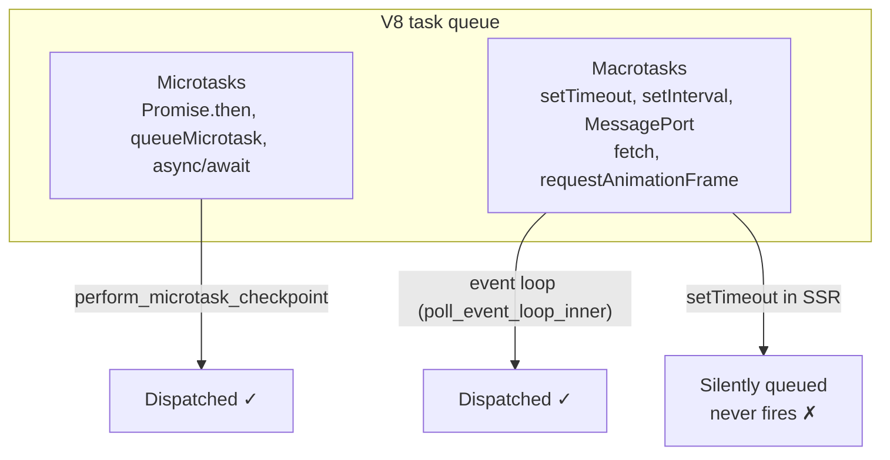

# Macrotasks and Timers in SSR

## Problem

The Deno runtime provides Web API implementations for `setTimeout`, `setInterval`,
`fetch`, `MessagePort`, and other macrotask-based APIs. These APIs are registered
and available in the V8 isolate, but they rely on the **event loop** to dispatch
their callbacks. Our SSR pipeline never runs the event loop — it uses
`execute_script` (synchronous) + `perform_microtask_checkpoint` (microtasks only).

## Task type taxonomy



### Microtasks (work in our SSR)

| API | Type | Dispatch mechanism | Works? |
|---|---|---|---|
| `Promise.resolve().then(fn)` | Microtask | `perform_microtask_checkpoint` | Yes |
| `await asyncFn()` | Microtask | `perform_microtask_checkpoint` | Yes |
| `queueMicrotask(fn)` | Microtask | `perform_microtask_checkpoint` | Yes |
| `async function render()` | Microtask (on await) | `perform_microtask_checkpoint` | Yes |

### Macrotasks (DO NOT work in our SSR)

| API | Type | Dispatch mechanism | Works? |
|---|---|---|---|
| `setTimeout(fn, N)` | Macrotask | Event loop Phase 1 | **No** |
| `setInterval(fn, N)` | Macrotask | Event loop Phase 1 | **No** |
| `MessagePort.postMessage` | Macrotask | Event loop Phase 2 | **No** |
| `fetch(url)` | I/O op | Event loop Phase 4 | **No** |
| `requestAnimationFrame(fn)` | Macrotask | Event loop Phase 5 | **No** |

## How it works at the Rust level

The timer callback dispatch chain:

```
setTimeout(fn, 100)
→ createTimer(fn, 100)        (deno_core 02_timers.js — binary heap priority queue)
→ op_timer_schedule(100)      (deno_core ops_builtin_v8.rs)
→ UserTimer::schedule(100ms)  (deno_core web_timeout.rs — tokio::time::Sleep)
→ tokio::time::Sleep armed

Event loop iteration (poll_event_loop_inner):
→ Phase 1: UserTimer::poll_ready() → Ready
→ Phase 2: __eventLoopTick(timerNow, ...)
→ __timers.processTimers(timerNow)
→ Walk priority queue, fire expired callbacks
```

Our code path:

```
call_render:
  execute_script(bundle)       ← registers timer via op_timer_schedule
  render_fn.call(args)         ← sync renderToString runs
  → callback registered but NEVER dispatched
  perform_microtask_checkpoint ← only dispatches microtasks
  return result
```

The `tokio::time::Sleep` is scheduled but NEVER polled. The timer callback sits
in the JS priority queue forever. No error, no warning — just silent non-execution.

## Impact on SSR workflows

### Framework compatibility

| Framework | SSR method | Task type | Works? |
|---|---|---|---|
| React 19 | `renderToString` | Sync | Yes |
| React 19 | `renderToPipeableStream` | Async + MessagePort | **No** |
| React 19 | `renderToReadableStream` | Async + MessagePort | **No** |
| Vue 3 | `renderToString` | Async (Promise) | Yes |
| Preact | `renderToString` | Sync | Yes |
| Svelte 5 | `renderToString` | Sync | Yes |

### Why React 19 streaming doesn't work (and won't without the event loop)

`renderToPipeableStream` and `renderToReadableStream` use React's internal
scheduler, which relies on `MessagePort.postMessage` (a macrotask) to yield
control back to the event loop between chunk emissions. This pattern:

1. Renders one chunk synchronously
2. Calls `MessagePort.postMessage` to schedule the next chunk
3. Event loop picks up the MessagePort message
4. Renders the next chunk
5. Repeats

Without the event loop running, step 2 posts the message, but steps 3-5 never
happen. The render produces one chunk and then hangs indefinitely.

### What users should know

- Don't use `setTimeout`, `setInterval`, `fetch`, or `MessagePort` inside SSR
  bundles. The callbacks will never fire.
- Async SSR that relies on Promises only (Vue 3, async components) works because
  Promise continuations are microtasks.
- React 19 streaming SSR requires the event loop and cannot work in the current
  architecture. Streaming SSR is documented in
  [`plans/streaming-ssr.md`](streaming-ssr.md).

## Design implications

If we ever need event-loop support (for React 19 streaming), we'd need to run
the tokio event loop during rendering instead of just `execute_script`. This
would mean:

1. Switching from `execute_script` to module-based evaluation with a running
   event loop
2. Implementing chunk-based streaming from V8 back to Ruby
3. Managing a "render session" that persists across multiple event loop
   iterations

This is a significant architectural change. The current microtask-based approach
is simpler and sufficient for all sync + Promise-based async SSR frameworks.

## Implementation steps (documentation only)

### [ ] Step 1: Add task-type table to architecture docs

**File:** `docs/architecture.md`

Add a section under "Bundle Contract" that documents which JS APIs work in SSR
and which don't. Include the taxonomy table (microtasks = yes, macrotasks = no).

### [ ] Step 2: Update streaming SSR plan

**File:** `plans/streaming-ssr.md`

Add the macrotask dependency. `renderToPipeableStream` requires the event loop
to dispatch MessagePort messages between chunks. This must be called out as a
prerequisite for any streaming implementation.

### [ ] Step 3: Verify

`bundle exec rake` passes.

## Files Changed

| File | Change |
|---|---|
| `docs/architecture.md` | Add macrotask limitation section under Bundle Contract |
| `plans/streaming-ssr.md` | Note event loop dependency for RenderToPipeableStream |

## Files NOT Changed

| File | Reason |
|---|---|
| `ext/ssr_deno/src/` | No Rust changes — documentation only |
| `lib/ssr/deno/` | No Ruby API changes |
