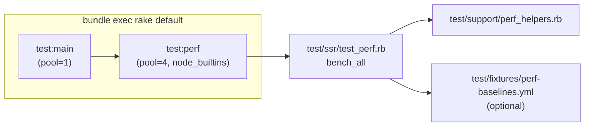

# Refactor: Minitest-based Performance Regression Tests

Replace `bench/perf-check.rb` with `Minitest::Benchmark`-based test in the
standard test suite. Custom assertions for our domain (ractor parallelism,
baseline comparison, thread serialization).

---

## New files

### `test/support/perf_helpers.rb`

Two modules + standalone functions:

**Standalone helpers** — `percentile(sorted, pct)`, `fmt_ops(count, elapsed_s)`, `fmt_ms(secs)`

**`PerfHelpers`** — measurement functions:

```ruby
module PerfHelpers
  REACT_BUNDLE = expand_path('../../samples/vite-react-ssr-app/dist/server/entry-server.js')
  MUI_EMOTION_BUNDLE = expand_path('../../samples/vite-react-mui-emotion-ssr-app/dist/server/entry-server.js')

  def benchmark_single(bundle_path, iterations:, warmup:)
    # Returns { ops:, p50_ms:, p99_ms: }
  end

  def benchmark_parallel(bundle_path, mode:, iterations:, count: 4)
    # mode: :threads or :ractors
    # Returns { ops:, total_renders:, elapsed_ms: }
  end
end
```

**`PerfAssertions`** — custom Minitest assertions:

```ruby
module PerfAssertions
  def assert_ractor_faster(single_ops, ractor_ops, factor: 1.5)
  def assert_thread_not_parallel(single_ops, thread_ops, tolerance: 0.3)
  def assert_no_crash(ops, label)
  def assert_within_baseline(ops, key, pct: 70)
end
```

**Baseline I/O** — class methods on PerfHelpers:
- `PerfHelpers.load_baselines` — reads `test/fixtures/perf-baselines.yml`
- `PerfHelpers.write_baselines(results, path)` — writes YAML with meta + thresholds

### `test/ssr/test_perf.rb`

Single `bench_all` method (one `bench_*` to avoid pool-state variance across
multiple methods):

```ruby
class PerfRegression < Minitest::Benchmark
  include PerfHelpers, PerfAssertions, TestFixturePaths

  def bench_all
    # Minimal: single, ractor, threads
    # React SSR: single, ractor
    # MUI emotion: single (with node_builtins)
    #
    # Invariants:
    #   ractor > single × 1.5  (parallelism works)
    #   thread ≈ single (within 30%)  (GVL serializes)
    #   no crashes on any bundle
    #
    # Baselines (optional, pct: 50 for React/MUI due to variance):
    #   minimal_single, react_single, mui_emotion_single
  end
end
```

Key differences from earlier iterations of the plan:
- Single `bench_all` method instead of 6 separate `bench_*`. Avoids pool
  state changing between methods (MUI bundle loaded by one method could
  interfere with the next).
- Complexity order check (`assert_bundle_heavier`) removed — too noisy with
  small samples.
- React/MUI baseline thresholds at 50% (not 70%) — higher variance for
  small-sample benchmarks on real bundles.

## Moved files

| From | To |
|------|----|
| `config/perf-baselines.yml` | `test/fixtures/perf-baselines.yml` |

## Deleted files

- `bench/perf-check.rb` — superseded by `test_perf.rb` + `perf_helpers.rb`

## Modified files

### `rakelib/test.rake`

- Add `test:perf` task. Separate Ruby process, pool_size=4, node_builtins,
  no coverage (SSR_DENO_SKIP_COVERAGE), no Minitest profiling (ARGV delete).
- Refactor `test:main` file exclusion pattern from 7 chained `.reject` to
  single `grep_v` regex.
- Wire `test:perf` into combined `test` task.

### `rakelib/perf.rake`

- `perf:check` delegates to `test:perf` (dependency task).
- `perf:baseline:update` uses inline Ruby runner that loads test_helper,
  uses PerfHelpers to measure bundles, writes fixture YAML.

### `test/test_helper.rb`

- Wrap simplecov in `unless ENV['SSR_DENO_SKIP_COVERAGE']` — perf suite
  skips coverage entirely.
- `Warning[:experimental] = false` — globally suppress Ractor API warnings.

### `.rubocop.yml`

- Exclude `test/**/*` and `rakelib/**/*` from structural cops: MethodLength,
  AbcSize, CyclomaticComplexity, PerceivedComplexity, NewThread.

## Key design decisions

| Decision | Rationale |
|----------|-----------|
| Single `bench_all` method | Avoid pool-state variance from interleaved bundle loading |
| Separate Ruby process for perf | Pool init conflict (main uses pool=1, perf needs pool=4) |
| Minitest::Benchmark base class | `bench_` prefix convention. Parameterless method (no `n`) |
| No `assert_performance_linear` | Doesn't fit throughput comparison model |
| Baselines in `test/fixtures/` | They're test data, not application config |
| `bench/performance.rb` untouched | Manual exploration stays human-friendly |
| No coverage for perf | Avoids corrupting main suite's coverage merge |
| Suppress experimental warnings globally | Ractor API warning is noise in all suites |
| No complexity order assertion | Too noisy with small samples |
| Lower baseline thresholds (50%) for React/MUI | High variance on small-sample real-bundle benchmarks |

## Flow


