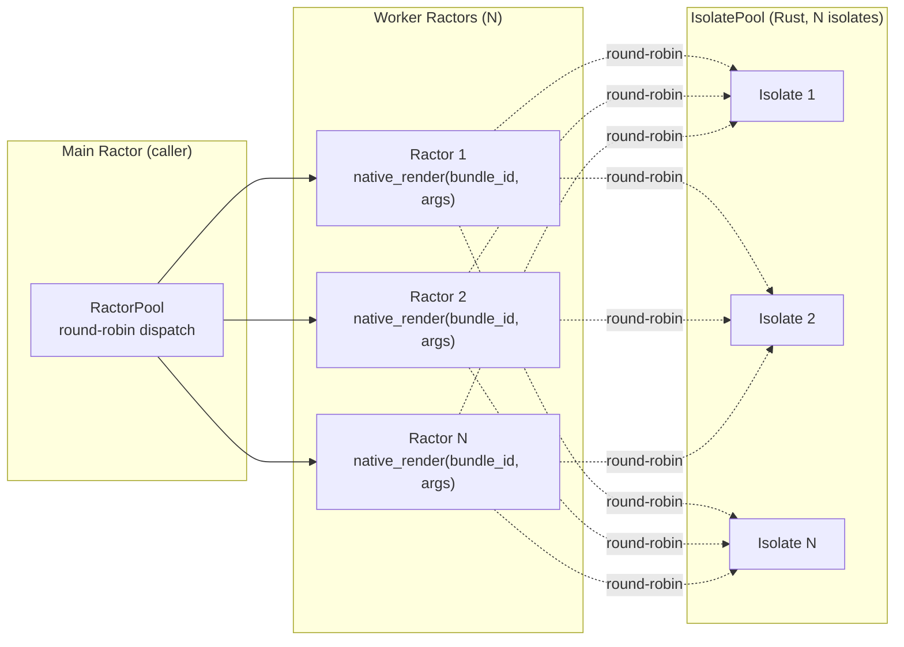

# RactorPool — Parallel SSR via Ractors

Puma threads serialize on GVL (Ruby mutex around FFI). Ractors give true
parallelism — each Ractor has its own GVL, native FFI calls run concurrently.

Adds `SSR::Deno::RactorPool` — managed Ractors for SSR, no Ractor API exposure.

---

## Design



Key: workers NOT pinned to isolates. `IsolatePool` round-robins across all.
Ractor + native_release from GVL → true parallelism. Each `native_render` call
holds its isolate's tokio runtime exclusively, but other Ractors dispatch to
other isolates concurrently.

## Implementation

### RactorPool class

```ruby
pool = SSR::Deno::RactorPool.new(
  bundle_path: 'dist/server/ssr.js',
  size: 4,
  auto_reload: true,
)

html = pool.render({ name: 'World' })

pool.render_chunks(data) { |chunk| response.stream.write(chunk) }
pool.reload
pool.shutdown
```

Config set BEFORE construction via `SSR::Deno` setters:

```ruby
SSR::Deno.isolate_pool_size = 4
SSR::Deno.node_builtins_enabled = true
SSR::Deno.render_timeout_ms = 500
SSR::Deno.max_heap_size_mb = 128
pool = SSR::Deno::RactorPool.new(bundle_path: 'dist/server/ssr.js')
```

Constructor does NOT set config (pool may already be initialized from prior
call). This differs from the original plan.

### Ruby 4.0 Ractor API

Ruby 4.0 removed `Ractor.yield` / `Ractor#take` / `Ractor#kill`. Uses:

| Operation | Ruby 4.0 API |
|-----------|-------------|
| Send message | `worker.send(msg)` |
| Receive message | `Ractor.receive` |
| Return value | `Ractor.new { Ractor.receive }` then `reply.value` |
| Graceful exit | Send `:shutdown` message, worker `break`s |
| Close port | Only Ractor itself can close its port |

`Ractor#close` from outside raises `Ractor::Error`. `Ractor#kill` does not
exist. Shutdown is cooperative via message.

### Worker Ractor inner loop

```ruby
Ractor.new(bundle_path, auto_reload) do |path, auto|
  bundle_id = path
  mtime = auto ? File.mtime(path) : nil

  loop do
    # auto_reload checked BEFORE receiving (minimize stale render window)
    cur = File.mtime(path) if auto
    if cur > mtime
      mtime = cur
      SSR::Deno.native_load_bundle(bundle_id, path)
    end

    msg = Ractor.receive

    case msg
    when Hash
      case msg[:type]
      when :render
        json_input = msg[:raw_input] ? msg[:data] : JSON.generate(msg[:data])
        result = SSR::Deno.native_render(bundle_id, json_input)
        msg[:reply].send(msg[:raw_output] ? result : JSON.parse(result))
      when :render_chunks
        json_input = msg[:raw_input] ? msg[:data] : JSON.generate(msg[:data])
        chunks = []
        SSR::Deno.native_render_chunks(bundle_id, json_input) { |c| chunks << c }
        msg[:reply].send(chunks)
      when :reload
        mtime = File.mtime(path)
        SSR::Deno.native_load_bundle(bundle_id, path)
        msg[:reply].send(:ok)
      end
    when :shutdown
      break
    end
  end
end
```

### Reply-Ractor pattern

Each call creates a one-shot reply Ractor:

```ruby
def render(data, raw_input: false, raw_output: false)
  reply = Ractor.new { Ractor.receive }
  worker.send({ type: :render, data:, raw_input:, raw_output:, reply: })
  reply.value  # blocks until worker sends to reply Ractor
end
```

Creating a Ractor per call costs ~100µs. Acceptable vs SSR render time (~10ms).

### Chunked render

Ractors can't yield blocks across boundaries. `render_chunks` buffered:
inside worker, collect chunks into array, send back as single reply.
Caller yields each chunk to block locally.

Tradeoff: loses streaming while Ractor is gathering all chunks. Acceptable
for MVP — chunked SSR (React streaming) is rare.

### Reload

Explicit `pool.reload` broadcasts to all workers serially (each calls
`native_load_bundle` which broadcasts to all isolates). Auto_reload works
per-worker mtime check: first worker to detect change broadcasts, subsequent
workers detect same mtime and broadcast redundantly (idempotent, ~O(eval) waste).

### Config

Set via `SSR::Deno` setters before first `RactorPool.new`. Constructor calls
`native_load_bundle` which triggers `get_or_init_pool()` with whatever config
is active. If pool is already initialized, `native_load_bundle` uses existing
pool (idempotent). `isolate_pool_size` should match Ractor count for fair
scheduling.

## Differences from Bundle API

| Aspect | `Bundle` | `RactorPool` |
|--------|----------|--------------|
| Instrumentation | Full `ActiveSupport::Notifications` | Skipped (Ractor-unsafe) |
| Auto-reload | Per-instance mtime | Per-Ractor mtime (N redundant broadcasts) |
| Chunked render | Live streaming via yield | Buffered array, then yield |
| Crash handling | Exception | `Ractor::RemoteError` (no auto-restart) |
| Config in constructor | No config needed | Set via `SSR::Deno` setters first |

## Open items

- **Ractor crash supervision** — detect dead Ractor via `Ractor#inspect`,
  spawn replacement, re-load bundle. Deferred: v1 raises to caller.
- **Streaming chunked render across Ractors** — pipe chunks through
  Ractor channel instead of buffering. Deferred: v2 via shared pipe.
- **Coordinator Ractor for reload** — single reload authority, eliminates
  redundant broadcasts. Deferred: v2.

## Tasks

- [x] Remove MAX_ISOLATES cap — see archived/remove-max-isolates-cap.md
- [x] Implement `SSR::Deno::RactorPool` in `lib/ssr/deno/ractor_pool.rb`
- [x] Wire `require_relative 'deno/ractor_pool'` in `lib/ssr/deno.rb`
- [x] Update `sig/ssr/deno.rbs` with RactorPool signatures
- [x] Add tests in `test/ssr/test_ractor_pool.rb`
- [x] Run `bundle exec rake` — all pass
- [ ] Archive this plan
