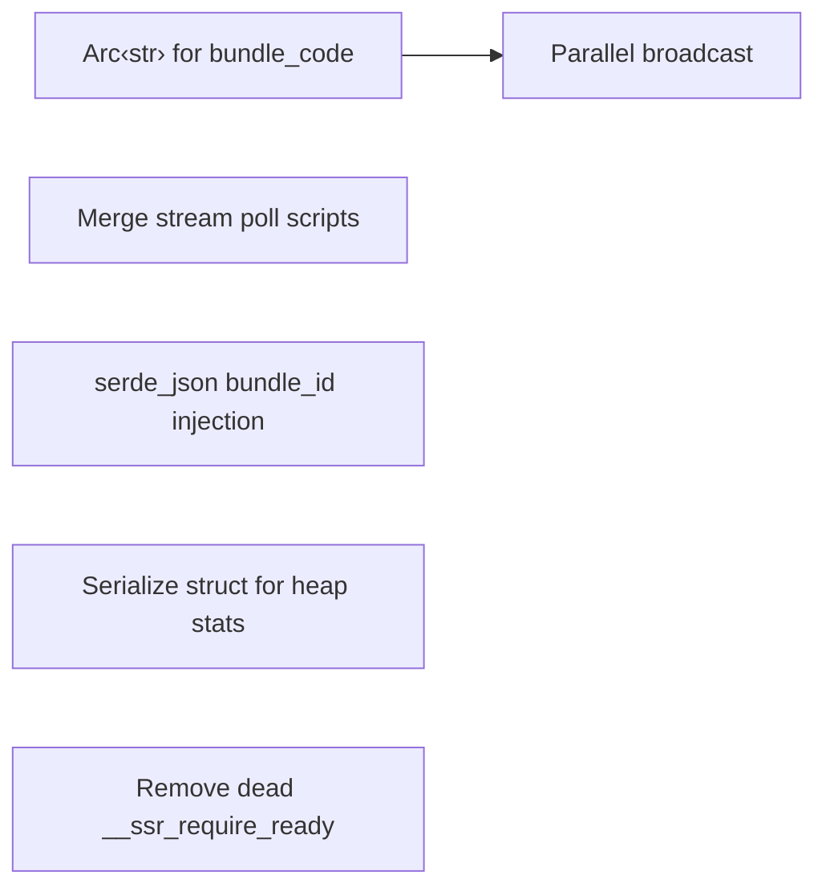

# Rust Performance & Hardening

Findings from a focused audit of `ext/ssr_deno/src/`. Prioritized by
reliability impact first, then performance gains.

## Implementation Checklist

### HIGH — Reliability

- [x] **render_stream.rs — merge per-tick `execute_script` calls into one**
  `read_stream_error` + `read_stream_result` each call `execute_script` per
  event-loop tick. That's two V8 script compilations + scope entries per 50ms
  tick. For renders that take many ticks (large React trees with suspense
  boundaries), this adds measurable overhead and doubles the chance of a
  transient V8 error causing a spurious failure.

  Fix: combined into a single `poll_stream_state` function with one JS expression
  returning either error (prefixed `E:`), result (prefixed `R:`), or null (pending).

- [x] **render_stream.rs — use `serde_json::to_string` for bundle_id injection**
  Currently uses Rust `{:?}` (Debug formatting) to inject `bundle_id` into a JS
  string literal. Rust Debug and JS string escaping rules differ on edge cases
  (`\0` → Rust emits `\0`, JS doesn't recognize; `\u{1f}` → Rust curly braces,
  JS needs 4-digit `\u001f`). bundle_id format is `"filename#object_id"` so risk
  is low in practice, but `serde_json::to_string` produces a guaranteed-valid JS
  string literal with zero edge-case risk.

  Also applied to `load_bundle_in_worker` namespace script.

### MEDIUM — Performance

- [x] **mod.rs `load_bundle` — parallel broadcast to all isolates**
  Current code sends `LoadBundle` to each isolate sequentially, blocking on each
  reply before sending the next. With 8 isolates and ~5ms eval per isolate, load
  takes ~40ms.

  Fix: send all messages first, collect all replies after. Workers process
  independently in parallel. Cuts broadcast from `O(n × eval_time)` to
  `O(eval_time)`.

- [x] **mod.rs `load_bundle` — use `Arc<str>` for bundle_code in broadcast**
  Each isolate currently receives its own `String` clone of the entire bundle
  source (500KB–2MB for React apps). With 8 isolates, that's 8 heap allocations
  of multi-MB strings during load.

  Fix: changed `WorkerMsg::LoadBundle { bundle_code: String }` to
  `bundle_code: Arc<str>`. One allocation, 8 reference-counted borrows.

### LOW — Cleanup

- [x] **call_render.rs — use `#[derive(Serialize)]` for heap stats**
  `collect_heap_stats` builds a `serde_json::Value` tree (13 fields) then
  serializes to string. A `#[derive(Serialize)]` struct avoids the intermediate
  `Value` allocation.

- [x] **mod.rs `setup_require` — remove dead `__ssr_require_ready` JS flag**
  The JS sets `globalThis.__ssr_require_ready = true` on completion, but Rust
  never reads it — only the verify `execute_script` checks
  `typeof globalThis.require`. Dead code on the JS side.

## Ordering & Dependencies

- Items C and D are independent (different parts of render_stream.rs).
- A must precede B (parallel broadcast sends the same Arc to all channels).
- E and F are standalone cleanups with no dependencies.

Suggested implementation order:
- Start with the HIGH items (stream poll merge + serde_json injection) — they
  touch the same file and are independent of the MEDIUM items.
- Then Arc‹str› + parallel broadcast (mod.rs changes, test together).
- Finally the LOW cleanups.

## What was NOT included (and why)

- **`deadline - Instant::now()` in render_stream.rs** — On Rust 1.60+,
  `Instant` subtraction saturates to `Duration::ZERO` rather than panicking.
  Verified on the project's toolchain (Rust 1.95). The worst case is one extra
  no-op tick before the deadline check fires, which is harmless.

- **Per-render `bundle_id.to_string()` allocation** — Unavoidable without
  changing the channel protocol to use lifetimes or `Arc<str>`. The allocation
  is ~30 bytes and occurs once per render; not worth the complexity.

- **`native_version()` String allocation** — Called once on gem load. Not
  worth optimizing.
