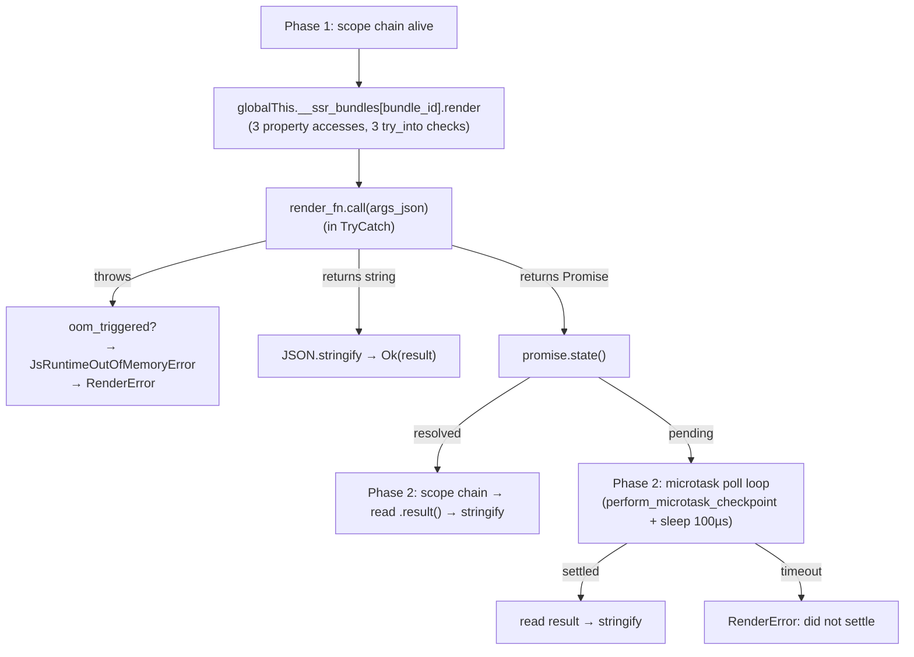

# call_render Optimization & Refactoring

## Architecture (as-is)

`call_render` at `ext/ssr_deno/src/deno_runtime_wrapper/call_render.rs:17` has two
phases:



The hot path (sync `renderToString` → string) is optimal. The dominant cost is
`renderToString` itself (~5-50ms); everything else is sub-microsecond noise.

## Issues found

### Issue A: OOM check missing in Phase 2 error exits (correctness)

The `oom_triggered` guard only exists in Phase 1 at `call_render.rs:82`. Three
Phase 2 error exits never check it:

| Line | Current error | Should be if oom_triggered |
|---|---|---|
| 138 | `RenderError("did not settle...")` | `JsRuntimeOutOfMemoryError` |
| 160 | `RenderError("Cannot serialize...")` | `JsRuntimeOutOfMemoryError` |
| 175 | `RenderError("Promise rejected...")` | `JsRuntimeOutOfMemoryError` |

If `terminate_execution` fires during microtask polling, the promise might
settle with a termination exception. The async error path reports a generic
message instead of the dedicated OOM error class.

**Status:** Regression from Step 2 implementation — we forgot to add OOM checks
outside the sync path.

### Issue B: Resolved Promise re-enters scope chain unnecessarily (performance)

When a render returns an already-resolved Promise (e.g.,
`Promise.resolve("<h1>ok</h1>")`), the code:

1. Detects it's a Promise at Phase 1 line 95
2. Reads `promise.state() == Pending` → `false`, `was_pending = false`
3. Loads into `v8::Global` at line 98
4. Exits Phase 1 scope chain
5. Re-enters scope chain in Phase 2 (line 145)
6. Reads `global_promise.open(isolate).result(&context_scope)`
7. Stringifies

Steps 4 and 5 are wasted work. The promise result is available in Phase 1
via `v8::Local<v8::Promise>::result(&context_scope)`. We can read it directly
and return without entering Phase 2.

**Impact:** ~1µs saved per resolved-Promise render. Only affects test fixtures
and async frameworks that return pre-resolved promises.

### Issue C: `to_rust_string_lossy` vs `to_rust_string` (micro-opt)

Line 107: `to_rust_string_lossy(&try_catch)` — the sync result stringifier.
Since we control the JS output, UTF-8 validity is guaranteed. `to_rust_string`
skips the lossy fallback, saving a branch.

**Impact:** ~1µs per render.

## Not worth changing

| Idea | Why not |
|---|---|
| Cache `v8::Global<v8::Function>` across renders | ~1µs saved vs ~5-50ms render — ROI zero. Adds cache invalidation on reload. |
| `get_prop` pre-creates V8 String keys | Called 3× per render, each ~100ns. Micro-optimization of noise. |
| Replace `std::thread::sleep(100µs)` with `park_timeout` | Same order of magnitude. V8 needs time between checkpoints. |

## Implementation steps

### [ ] Step 1: Add OOM check to Phase 2 error exits

**File:** `ext/ssr_deno/src/deno_runtime_wrapper/call_render.rs`

Before each `DenoError::Render(...)` return in Phase 2 (lines 138, 160, 175),
insert:

```rust
if oom_triggered.load(Ordering::SeqCst) {
    return Err(DenoError::OutOfMemory(
        "JS heap out of memory — the isolate reached its configured heap limit".into(),
    ));
}
```

### [ ] Step 2: Flatten resolved-Promise path in Phase 1

**File:** `ext/ssr_deno/src/deno_runtime_wrapper/call_render.rs`

Replace the Phase 1 promise branch (lines 95-102) with:

```rust
if let Ok(promise) = v8::Local::<v8::Promise>::try_from(result) {
    match promise.state() {
        v8::PromiseState::Fulfilled => {
            let resolved = promise.result(&context_scope);
            let json_str = v8::json::stringify(&mut context_scope, resolved)
                .ok_or_else(|| DenoError::Render(
                    "Cannot serialize render result to JSON".to_string()
                ))?;
            return Ok(json_str.to_rust_string_lossy(&mut context_scope));
        }
        v8::PromiseState::Rejected => {
            // Fall through to Phase 2 for consistent error extraction
            let global_promise = v8::Global::new(unsafe { &*isolate_raw }, promise);
            Some(AsyncHandle { global_promise, was_pending: false })
        }
        v8::PromiseState::Pending => {
            let global_promise = v8::Global::new(unsafe { &*isolate_raw }, promise);
            Some(AsyncHandle { global_promise, was_pending: true })
        }
    }
}
```

The `Fulfilled` arm reads the result immediately and returns. The `Rejected` arm
falls through to Phase 2 (it's an error path, not latency-sensitive). The
`Pending` arm poll as before.

### [ ] Step 3: Replace `to_rust_string_lossy` with `to_rust_string`

**File:** `ext/ssr_deno/src/deno_runtime_wrapper/call_render.rs`

At line 107:

```rust
return Ok(json_str.to_rust_string(&try_catch));
```

Also update Phase 2 line 162:
```rust
Ok(json_str.to_rust_string(&mut context_scope))
```

### [ ] Step 4: Verify

`bundle exec rake` passes — compile, cargo test, sample builds, all Ruby suites,
RuboCop, 100% coverage, RBS valid.

## Files Changed

| File | Change |
|---|---|
| `ext/ssr_deno/src/deno_runtime_wrapper/call_render.rs` | OOM checks in Phase 2, remove Phase 2 for resolved promises, `to_rust_string` |

## Files NOT Changed

| File | Reason |
|---|---|
| All other files | No API changes, no new config, no new types, no Ruby changes |

## Risk

- The resolved-Promise flatten (Step 2) changes the return path: instead of
  creating a Global, exiting scope chain, re-entering scope chain, the result
  is read in the current scope chain. The `json::stringify` call uses
  `&mut context_scope` instead of `&mut scope` — both are valid handles.
- The `Rejected` arm still uses `was_pending: false` and falls through to Phase
  2. In Phase 2, the code re-enters the scope chain and reads the promise
  result. This is the same behavior as before for rejected promises.
- All three changes are exercised by existing tests (async fixture bundles,
  OOM subprocess test, sync integration tests).
