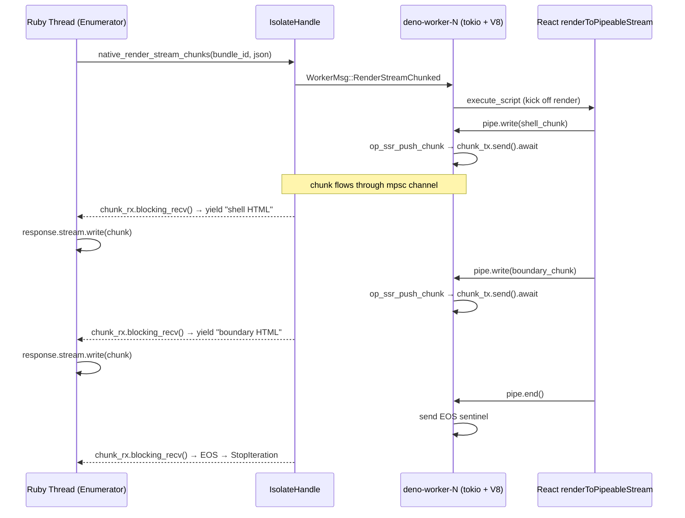

# Chunked HTTP Streaming SSR (Approach C — Phase 2)

Status: Pending

## Goal

Wire `op_ssr_push_chunk` through to Ruby as a real streaming enumerator so
HTML chunks are flushed to the HTTP response as they arrive, rather than
buffering the full render in memory.

## Prerequisites

- [x] Phase 1: event-loop render with final result (archived)

## Current state

`op_ssr_push_chunk` exists and receives chunks from JS, but `try_send` is
fire-and-forget — chunks are silently dropped. The `mpsc::Receiver` is
created but immediately discarded (`_chunk_rx`). Only the final
`__ssr_stream_result` is returned to Ruby.

## Required changes

### Rust side

- [ ] Change `op_ssr_push_chunk` from `try_send` to `send().await` for backpressure
- [ ] Expose `mpsc::Receiver<String>` to the Ruby caller (via a new native method or wrapped object)
- [ ] Add end-of-stream signal handling (empty chunk or explicit sentinel)
- [ ] Consider timeout per-chunk (not just total render timeout)

### Ruby side

- [ ] New `Bundle#render_stream_chunks` method returning an `Enumerator`
- [ ] `Enumerator` blocks on channel recv per iteration, yields frozen String chunks
- [ ] Error mid-stream raises `SSR::Deno::RenderError` from within the enumerator
- [ ] End-of-stream sentinel terminates iteration (enumerator returns)
- [ ] Document Rack 3 and `ActionController::Live` usage patterns in README

### Testing

- [ ] Test that chunks arrive incrementally (not all at once)
- [ ] Test backpressure (slow consumer doesn't cause OOM)
- [ ] Test timeout mid-stream
- [ ] Test error propagation during streaming

## Design decisions

### Q1: Should `render_stream_chunks` coexist with `render_stream`, or replace it?

**Answer: Coexist — as a fully separate method, not another `render` keyword flag.**

`render_stream` (Phase 1) is syntactic sugar for `render(event_loop: true)`. That works because nothing changes for the caller — you call a method, get a string, use it in your template. The event loop is an internal implementation detail.

`render_stream_chunks` (Phase 2) changes the caller's entire control flow — they need `ActionController::Live`, a streaming response, an `ensure` block to close the stream, and mid-iteration error handling. That's a different programming model, not a configuration flag.

Why it can't be a `render` keyword arg:

| Aspect | `render` / `render_stream` | `render_stream_chunks` |
|--------|---------------------------|------------------------|
| Return type | Single value (String/Hash) | Lazy `Enumerator` yielding N strings |
| Blocking | Blocks until complete | Returns immediately; blocks during iteration |
| Error timing | Before any bytes sent → can set HTTP 500 | Mid-stream → bytes already flushed, status committed |
| Resource hold | Isolate held for method duration | Isolate held for *iteration* duration (caller controls) |
| `raw_output` / `raw_input` | Meaningful (JSON wrapping) | `raw_output` meaningless — chunks are always raw HTML |
| Instrumentation | Single `render.ssr_deno` event | Needs `stream_start` + `stream_chunk` + `stream_end` events |

A method whose return type changes based on a boolean arg violates least surprise and breaks type checking. The caller must know "which mode" to write correct code around it.

**Design: separate method, shared prep.**

Common work (auto_reload check, input serialization) lives in private helpers. Both methods call them, then diverge:

```ruby
def render_stream_chunks(data = nil, raw_input: false)
  reload_if_changed if @auto_reload

  json_input = raw_input ? data : JSON.generate(data)

  Enumerator.new do |yielder|
    instrument 'stream_start.ssr_deno', bundle_name: @bundle_id do
      SSR::Deno.native_render_stream_chunks(@bundle_id, json_input) do |chunk|
        yielder << chunk
      end
    end
  end
end
```

No `raw_output` param (chunks are always raw HTML fragments). No `event_loop` flag (always true by definition). Clean separate method with its own docs, RBS signature, and error semantics.

Full method hierarchy:

| Method | Returns | Sugar for | Use case |
|--------|---------|-----------|----------|
| `render` | String/Hash | — | Sync render, no event loop |
| `render_stream` | String | `render(event_loop: true)` | Async render (Suspense), buffered result |
| `render_stream_chunks` | `Enumerator` | — (standalone) | Chunked HTTP streaming, minimal TTFB |

### Q2: What's the chunk granularity?

**Answer: Whatever React emits — the gem doesn't control it.**

React's `renderToPipeableStream` determines chunk boundaries:
- **Shell chunk**: everything outside `<Suspense>` boundaries (emitted on `onShellReady`)
- **Boundary chunks**: each resolved `<Suspense>` fallback replacement (inline `<script>` tags that swap content)
- **Final flush**: the closing tags after all boundaries resolve

The gem's role is purely pass-through: each `pipe.write(chunk)` call in JS → `Deno.core.ops.op_ssr_push_chunk(chunk)` → `mpsc::Sender` → Ruby enumerator yields chunk. No aggregation, no splitting, no reframing.

The JS entry-server controls when `pipe()` is called (e.g., `onShellReady` vs `onAllReady`). If the user calls `pipe()` on `onAllReady`, they get a single large chunk (equivalent to `render_stream`). If they call it on `onShellReady`, they get progressive chunks. This is a user-side decision baked into their entry-server code — the gem stays agnostic.

### Q3: Should we support Rack 3 streaming directly?

**Answer: Yes — `Enumerator` is the primary return type.**

Rack 3 defines response body as any object responding to `#each` that yields strings. An `Enumerator` satisfies this directly. The method returns an `Enumerator::Lazy` (or plain `Enumerator`) that:
- Blocks on `chunk_rx.recv()` each iteration
- Yields each chunk as a frozen String
- Raises `SSR::Deno::RenderError` mid-iteration if the stream errors
- Returns (stops iteration) on end-of-stream signal

This works with:
- **Rack 3** directly (response body = enumerator)
- **ActionController::Live** (iterate + `stream.write`)
- **Rack `hijack`** (iterate + socket write)
- **Plain Rack 2** with chunked transfer-encoding middleware

No separate Rails-specific adapter needed. The API sketch in the plan is correct — just iterate the enumerator.

```ruby
# Rack 3 — response body is the enumerator directly
class SSRStreamingApp
  def call(env)
    body = @bundle.render_stream_chunks({ data: page_data })
    [200, { 'content-type' => 'text/html' }, body]
  end
end

# Rails — ActionController::Live
def show
  response.headers['Content-Type'] = 'text/html; charset=utf-8'
  response.headers['Transfer-Encoding'] = 'chunked'

  @bundle.render_stream_chunks({ data: @page }).each do |chunk|
    response.stream.write(chunk)
  end
ensure
  response.stream.close
end
```

## Architecture: Rust→Ruby channel crossing

The core challenge: the V8 event loop runs on a dedicated OS thread (the isolate's
worker thread). Chunks arrive asynchronously from JS. Ruby needs to block on each
chunk synchronously (inside an `Enumerator` block that yields).



### Key design points

- **`op_ssr_push_chunk` becomes async**: change from `try_send` to `send().await`.
  This provides backpressure — if the Ruby side is slow consuming chunks, the
  channel fills up (buffer=64) and V8's event loop blocks on `send().await` until
  Ruby drains. This prevents OOM from fast-producing React + slow-consuming client.

- **`chunk_rx` exposed to Ruby via blocking recv loop**: The native method
  `native_render_stream_chunks` does NOT wait for the full render. It sends
  `WorkerMsg::RenderStreamChunked`, then immediately enters a loop:
  `chunk_rx.blocking_recv()` → yield to Ruby → repeat until EOS or error.

- **End-of-stream protocol**: After the render promise resolves (or rejects), the
  worker sends a sentinel through `chunk_tx` before replying on `reply_tx`:
  - Success: send empty string `""` as EOS, then reply `Ok(())`
  - Error: send `"E:error message"` as error signal, then reply `Err(...)`
  The Ruby side checks for the sentinel and either stops iteration or raises.

- **Timeout**: The total `render_timeout_ms` still applies to the whole render.
  Additionally, a per-chunk recv timeout (e.g., `render_timeout_ms + 100ms`) on
  `blocking_recv` prevents the Ruby thread from hanging if the worker dies
  mid-stream without sending EOS.

- **GVL release**: `chunk_rx.blocking_recv()` should release the Ruby GVL while
  waiting (via `rb_sys::without_gvl` or magnus equivalent). This allows other Ruby
  threads to proceed while this one waits for the next chunk.

- **Isolate occupancy**: The isolate is occupied for the entire streaming render
  duration (not just per-chunk). This is the same as `render_stream` Phase 1 — the
  round-robin pool mitigates this. A slow consumer holds an isolate for longer.
