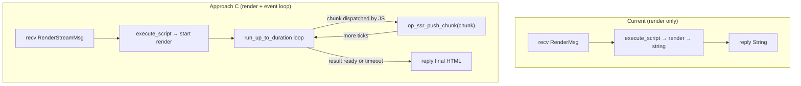

# Event Loop + Streaming SSR (Approach C — Deno-native)

## Problem

Two related limitations of the original `execute_script`-only pipeline:

1. **Macrotask starvation** — `setTimeout`, `setInterval`, `MessagePort`, and
   `fetch` callbacks silently never fire because the V8 event loop never runs.

2. **No streaming SSR** — React 19's `renderToPipeableStream` and
   `renderToReadableStream` use `MessagePort` internally for chunk scheduling
   and require event loop ticks between chunk emissions.

Both stem from the same root: the worker thread's tokio runtime is
underutilized. It currently runs a simple message loop (`recv → render →
reply`) but never drives the V8 event loop through
`MainWorker::run_event_loop` — the standard Deno execution model.

## Why Approach C is the Deno way

Deno's CLI runs all user code by calling `MainWorker::run_event_loop()` and
letting phases 1–6 process timers, I/O, and macrotasks until the program
exits. Our worker thread already has a tokio runtime and `LocalSet`
(in `worker_thread_main`), which means we already have the async
infrastructure.



## Architecture

### Key insight: poll loop with timeout

The streaming render uses `run_up_to_duration` in a tick-by-tick loop with
a deadline. Each tick advances the V8 event loop (processing macrotasks,
promises, timers). The JS render function stores its result in
`globalThis.__ssr_stream_result` when done, or sets
`globalThis.__ssr_stream_error` on rejection. A single `poll_stream_state`
call per tick checks both via a tagged-string protocol (`E:msg`, `R:json`,
or `null` for pending).

```
execute_script(start render) → tick loop
  → run_up_to_duration(50ms) → poll_stream_state → null (pending)
  → run_up_to_duration(50ms) → poll_stream_state → null (pending)
  → run_up_to_duration(50ms) → poll_stream_state → "R:{html}"
  → return Ok(html)
```

### WorkerMsg variant

```rust
RenderStream {
    bundle_id: String,
    args_json: String,
    render_timeout_ms: u64,
    chunk_tx: tokio::sync::mpsc::Sender<String>,
    reply: tokio::sync::oneshot::Sender<Result<String, SSRDenoError>>,
},
```

The `chunk_tx` is placed in `OpState` so `op_ssr_push_chunk` can access it.
Currently chunks are silently dropped (only the final result matters) — true
chunked HTTP streaming is a Phase 2 concern.

### The `op_ssr_push_chunk` op

```rust
#[op2(fast)]
pub fn op_ssr_push_chunk(#[string] chunk: String, state: &mut OpState) -> Result<(), CoreError> {
    let tx = state.borrow::<mpsc::Sender<String>>();
    let _ = tx.try_send(chunk);
    Ok(())
}
```

### Ruby side

The streaming path is exposed as `Bundle#render_stream`, which delegates to
`render(data, event_loop: true)`. This calls `native_render_stream` on the
Rust side, which dispatches to the tick-loop implementation. The return value
is a `String` (the final HTML), not an enumerator — true chunked streaming
to the HTTP response is Phase 2.

```ruby
def render_stream(data = nil, raw_input: false, raw_output: false)
  render(data, raw_input: raw_input, raw_output: raw_output, event_loop: true)
end
```

## Non-streaming macrotask support (setTimeout)

Sync renders that use `setTimeout(fn, 0)` for debouncing can opt into
`render(data, event_loop: true)` (or equivalently `render_stream`) to get
macrotask support without needing true chunked streaming.

## Implementation phases

### [x] Phase 1: Event-loop render with final result

| File | Change |
|---|---|
| `ext/ssr_deno/src/deno_runtime_wrapper/mod.rs` | `RenderStream` variant in `WorkerMsg`, handler, Extension registration |
| `ext/ssr_deno/src/deno_runtime_wrapper/render_stream.rs` | `render_streaming` + `op_ssr_push_chunk` + `poll_stream_state` |
| `ext/ssr_deno/src/lib.rs` | `native_render_stream` Ruby method |
| `lib/ssr/deno/bundle.rb` | `Bundle#render_stream` + `event_loop:` param on `#render` |
| `sig/ssr/deno.rbs` | `render_stream`, `native_render_stream` signatures |
| `test/ssr/test_deno_render_stream.rb` | Streaming render + promise rejection tests |
| `test/ssr/test_deno_macrotasks.rb` | setTimeout, setInterval, MessagePort tests |

### [ ] Phase 2: True chunked HTTP streaming (Rails ActionController::Live)

Wire `chunk_tx` through to Ruby as a real streaming enumerator so chunks are
flushed to the HTTP response as they arrive, rather than buffering the full
HTML in memory before replying.

```ruby
# Future API sketch:
def show
  stream = @bundle.render_stream_chunks({ data: @page })
  self.response_body = stream  # Rack streaming via each
end
```

This requires:
- Changing `op_ssr_push_chunk` from `try_send` (fire-and-forget) to
  `send().await` (backpressure)
- Exposing the `mpsc::Receiver` to the Ruby side as an `Enumerator`
- Integrating with Rails `ActionController::Live` or Rack hijack
