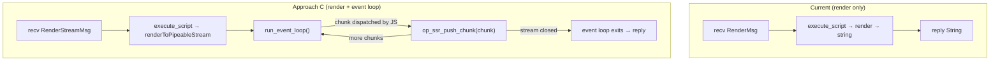

# Event Loop + Streaming SSR (Approach C — Deno-native)

## Problem

Two related limitations of the current `execute_script`-only pipeline:

1. **Macrotask starvation** — `setTimeout`, `setInterval`, `MessagePort`, and
   `fetch` callbacks silently never fire because the V8 event loop never runs.

2. **No streaming SSR** — React 19's `renderToPipeableStream` and
   `renderToReadableStream` use `MessagePort` internally for chunk scheduling
   and require event loop ticks between chunk emissions.

Both stem from the same root: the worker thread's tokio runtime is
underutilized. It currently runs a simple message loop (`recv → render →
reply`) but never drives the V8 event loop through
`MainWorker::run_event_loop` — the standard Deno execution model.

## Why Approach C is the Deno way

Deno's CLI runs all user code by calling `MainWorker::run_event_loop()` and
letting phases 1–6 process timers, I/O, and macrotasks until the program
exits. Our worker thread already has a tokio runtime and `LocalSet`
(in `worker_thread_main`), which means we already have the async
infrastructure.



## Architecture

### Key insight: no polling needed

Instead of Rust checking a completion flag in a loop, let the JS side signal
completion **through** the event loop. When React's stream closes and all
work is done, `run_event_loop` returns naturally — same as a normal
`deno run` invocation:

```
execute_script(start stream) → run_event_loop
  → Phase 2 dispatch MessagePort → React emits chunk → push chunk to Ruby
  → Phase 2 dispatch MessagePort → React emits chunk → push chunk to Ruby
  → ... repeats ...
  → Stream closes, no more refed ops/timers
  → run_event_loop → Ok(())
  → return to Ruby
```

### New message type

```rust
enum WorkerMsg {
    // ... existing ...
    RenderStream {
        bundle_id: String,
        args_json: String,
        render_timeout_ms: u64,
        chunk_tx: tokio::sync::mpsc::Sender<String>,
        reply: std::sync::mpsc::SyncSender<Result<(), DenoError>>,
    },
}
```

### The `__ssr_push_chunk` op

A new Rust op registered in the worker's extensions:

```rust
#[op2(fast)]
fn op_ssr_push_chunk(#[string] chunk: String, state: &mut OpState) -> Result<(), AnyError> {
    let tx = state.borrow::<tokio::sync::mpsc::Sender<String>>();
    tx.try_send(chunk).ok();
    Ok(())
}
```

### JS streaming setup

The JS side that React 19 pipes to:

```js
// Injected via execute_script before calling the render function
globalThis.__ssr_push_chunk = (chunk) => Deno.core.op_ssr_push_chunk(chunk);

const { pipe, abort } = renderToPipeableStream(element, {
    onShellReady() {
        const writable = new Writable({
            write(chunk, encoding, callback) {
                __ssr_push_chunk(chunk);
                callback();
            },
            final(callback) {
                __ssr_push_chunk('');  // empty string = end signal
                callback();
            }
        });
        pipe(writable);
    },
    onError(err) { /* ... */ }
});
```

### Worker message handler

```rust
WorkerMsg::RenderStream { bundle_id, args_json, render_timeout_ms, chunk_tx, reply } => {
    // Register chunk_tx in op_state so op_ssr_push_chunk can find it
    worker.js_runtime.op_state().borrow_mut().put(chunk_tx);

    // Start the stream
    worker.execute_script("<ssr-deno:stream>",
        format!("__ssr_render_stream({args_json})").into()
    )?;

    // Run event loop until stream completes
    let result = tokio::time::timeout(
        Duration::from_millis(render_timeout_ms),
        worker.run_event_loop(false),
    ).await;

    let _ = reply.send(match result {
        Ok(Ok(())) => Ok(()),
        Ok(Err(e)) => Err(/* map CoreError */),
        Err(_) => Err(DenoError::Render("Streaming render timed out")),
    });
}
```

### Ruby side

```ruby
# Bundle#render_stream
def render_stream(data)
  chunk_rx = native_render_stream(@bundle_id, JSON.generate(data))

  Enumerator.new do |yielder|
    while (chunk = chunk_rx.recv)
      break if chunk.empty?  # empty = end signal
      yielder << chunk
    end
  end
end
```

## Non-streaming macrotask support (setTimeout)

For sync renders where a component uses `setTimeout(fn, 0)` for debouncing
during render, the cleaner approach is to offer `render_stream` as the
general solution for any render that needs macrotasks. Sync renders that
don't need them stay on the fast path.

Alternatively, after the sync render completes, drain one event-loop tick:

```rust
if drain_timeout_ms > 0 {
    let deadline = tokio::time::Instant::now() + Duration::from_millis(drain_timeout_ms);
    while tokio::time::Instant::now() < deadline {
        // Process one event-loop tick to fire setTimeout(0) callbacks
    }
}
```

## Implementation phases

### [x] Phase 1: Streaming render prototype (6 files)

| File | Change |
|---|---|
| `ext/ssr_deno/src/deno_runtime_wrapper/mod.rs` | Add `RenderStream` to `WorkerMsg`, handler, Extension |
| `ext/ssr_deno/src/deno_runtime_wrapper/render_stream.rs` | New: `render_streaming` + `op_ssr_push_chunk` |
| `ext/ssr_deno/src/lib.rs` | Add `native_render_stream` Ruby method |
| `lib/ssr/deno/bundle.rb` | Add `Bundle#render_stream(raw_input:)` |
| `test/ssr/test_deno_render_stream.rb` | New: streaming render test |

### [ ] Phase 2: Rails integration (ActionController::Live)

```ruby
def show
  stream = @bundle.render_stream({ data: @page })
  self.response_body = stream.each  # Rack streaming
end
```

## Files NOT Changed

| File | Reason |
|---|---|
| `call_render.rs` | Sync path unchanged |
| `ssr_deno_core/` | No new types |
| `sig/ssr/deno.rbs` | Phase 1 is prototype — RBS deferred |
