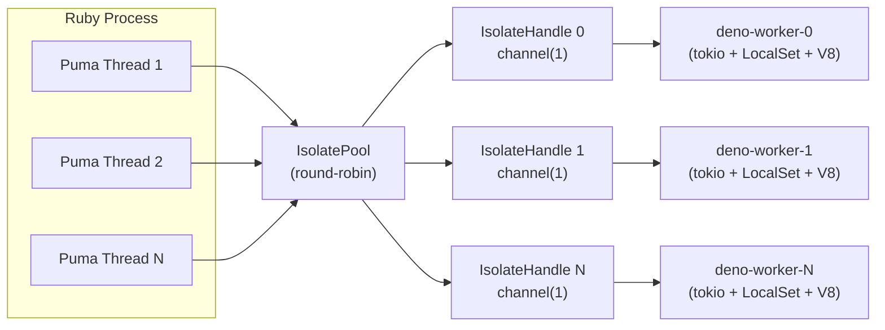
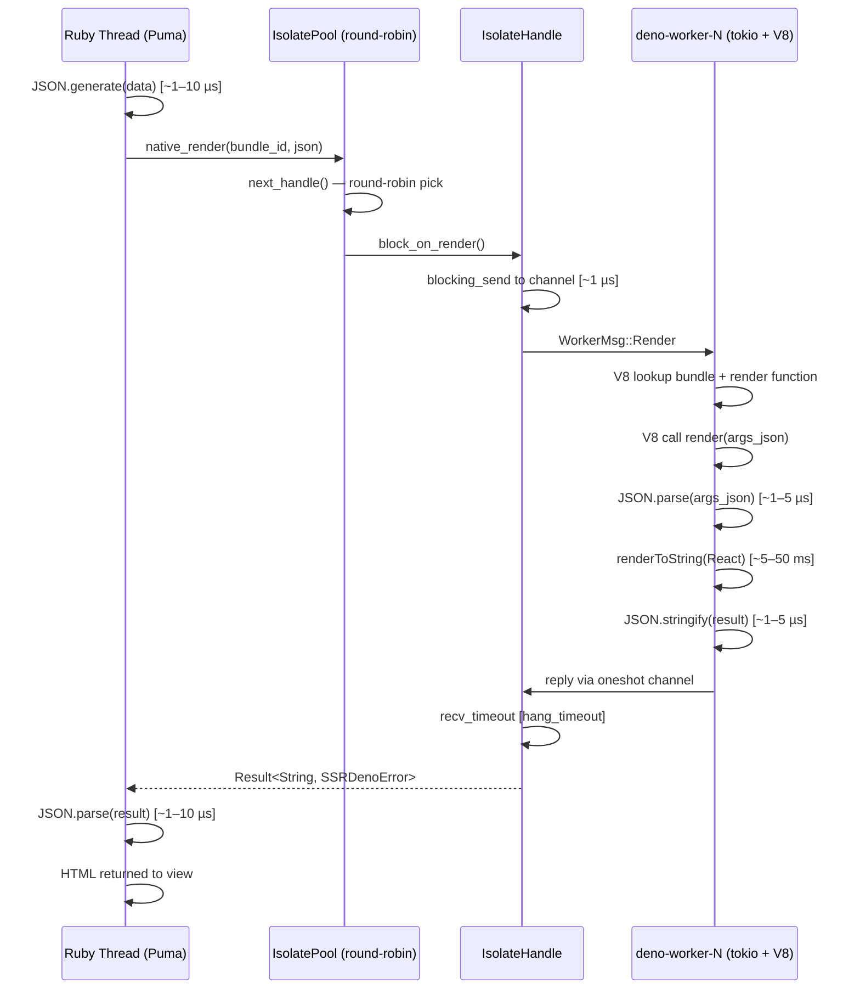
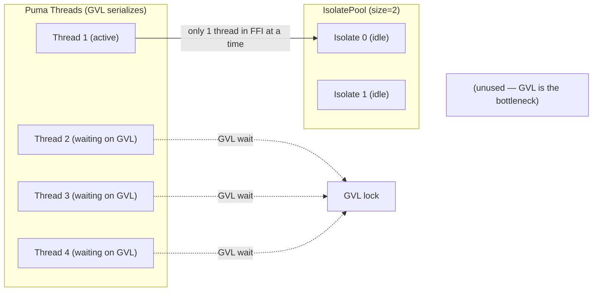
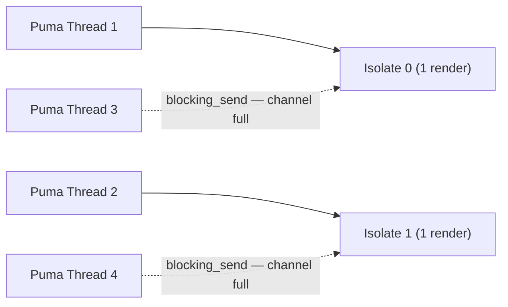

# SSR Memory & Performance Analysis (Multi-Isolate Pool)

> Analysis of the [`ssr-deno`](../lib/ssr/deno.rb:1) gem's SSR architecture when integrated into a Rails application via [`lib/ssr/deno/rails.rb`](../lib/ssr/deno/rails.rb:1).
> Replaces the [v1 analysis](archived/memory-performance-analysis-v1.md) which assumed a single V8 isolate.

---

## 1. Architecture Overview

The SSR pipeline uses an isolate pool with round-robin dispatch:



- **IsolatePool** ([`mod.rs:216`](../ext/ssr_deno/src/deno_runtime_wrapper/mod.rs:216)): owns N `IsolateHandle`s, dispatches renders via round-robin (`next_handle`, [`mod.rs:256`](../ext/ssr_deno/src/deno_runtime_wrapper/mod.rs:256)). Initialized lazily on first [`Bundle.new`](../lib/ssr/deno/bundle.rb:16).
- **Pool size**: default `1`, configurable up to `8` ([`resolve_pool_size`](../ext/ssr_deno/crates/ssr_deno_core/src/lib.rs)). Multiple isolates only benefit Ractor-based concurrency. Configurable via `SSR::Deno.isolate_pool_size=` or `SSR_DENO_ISOLATE_POOL_SIZE`.
- **Per-isolate worker** ([`IsolateHandle::spawn`](../ext/ssr_deno/src/deno_runtime_wrapper/mod.rs:106)): dedicated OS thread `deno-worker-{index}` with its own tokio runtime, `LocalSet`, and V8 isolate. No `MainWorker` leaves its thread — no `unsafe` needed.
- **Per-isolate channel**: `tokio::sync::mpsc::channel(1)` — buffer depth of 1 per handle.
- **Bundle loading broadcasts** to all isolates ([`IsolatePool::load_bundle`](../ext/ssr_deno/src/deno_runtime_wrapper/mod.rs:284)). Path resolution and code reading are done once; all isolates receive the same `Arc<str>` (zero-copy broadcast).
- **Multiple bundles** coexist in each V8 context under `globalThis.__ssr_bundles[bundle_id]`.
- **Ractor-safe** — the Rust extension declares `rb_ext_ractor_safe(true)`.

### 1.1 Per-Isolate Configuration

Each isolate is created with these parameters, fixed at pool init:

| Parameter | Default | Constraint | Ruby Setter |
|---|---|---|---|
| `max_heap_size_mb` | 64 MB | 0 = unlimited, up to ~3.8 TB | `SSR::Deno.max_heap_size_mb=` |
| `render_timeout_ms` | 500 ms | 100–300,000 ms | `SSR::Deno.render_timeout_ms=` |

Defaults defined at [`ssr_deno_core/src/lib.rs:78-84`](../ext/ssr_deno/crates/ssr_deno_core/src/lib.rs:78).

`max_heap_size_mb` is a **per-isolate** V8 `CreateParams` constraint — it is NOT a total process budget. Each isolate independently gets the configured limit, regardless of pool size.

---

## 2. Memory Analysis

### 2.1 Single Isolate Baseline

Memory footprint of one idle V8 isolate with Deno Web API extensions:

| Component | Estimated Size | Notes |
|---|---|---|
| V8 heap (empty isolate) | ~4–8 MB | Default young + old space |
| Deno runtime Web APIs | ~8–12 MB | `fetch`, `setTimeout`, `URL`, `TextEncoder`, etc. |
| Tokio runtime + thread stack | ~2–4 MB | 2 MB default thread stack + tokio heap |
| Rust FFI glue + magnus | ~1–2 MB | Ruby↔Rust bridge (shared across isolates) |
| **Per-isolate idle RSS** | **~15–30 MB** | Actual resident, heap limit is higher (64 MB) |

### 2.2 Bundle Code in V8 Heap

Each loaded bundle adds JavaScript code to the V8 heap. Because `load_bundle` broadcasts to all isolates, the code is compiled independently in each one:

| Component | Estimated Size | Notes |
|---|---|---|
| React 19 (minified, bundled by Vite) | ~130–450 KB | `react` + `react-dom/server` + scheduler |
| Application code + dependencies | ~50 KB–3 MB | Components, routes, stores, UI libs (MUI, Emotion, etc.) |
| Vite polyfills/wrappers | ~20–50 KB | Module wrapping, import shims |
| **Per bundle (parsed+compiled)** | **~2–15 MB** | V8 compiled bytecode + internalized strings |
| **Per bundle (source text)** | **~50 KB–3 MB** | Raw JS source retained for stack traces |

**Key insight:** V8 compiles JS to internal bytecode ~10–20x larger than source. A 200 KB bundle becomes ~2–4 MB in V8 heap after parsing; a 3 MB dashboard bundle can reach ~15 MB. **With N isolates, this cost is N × per-bundle.**

### 2.3 Multiple Bundles

Multiple bundles share the same V8 isolate. React is bundled independently per Vite build:

- **2 bundles** (e.g., `:application` + `:admin`): ~4–30 MB additional per isolate (React duplicated in each bundle's compiled code)
- **No deduplication** — Vite bundles are self-contained; React's `renderToString` is compiled twice

### 2.4 Render-Time Memory

During `renderToString`, per concurrent render:

| Component | Estimated Size | Notes |
|---|---|---|
| VDOM tree (intermediate) | ~0.5–5 MB | Proportional to component tree depth |
| Output HTML string | ~10–100 KB | Final rendered HTML |
| JSON serialization buffer | ~1–10 KB | `JSON.stringify` of result |
| **Per render (peak)** | **~0.5–5 MB** | Freed by V8 GC after call completes |

When all isolates are rendering concurrently, peak memory = `pool_size × per-render peak` (e.g., 4 isolates × 5 MB = 20 MB transient VDOM across the process).

### 2.5 Total Memory Budget

Memory grows linearly with pool size:

| Scenario | Formula | Example (pool_size=4) |
|---|---|---|
| Rails baseline | — | ~100–200 MB |
| Idle V8 isolates | pool_size × ~20 MB | ~80 MB |
| Bundle code (1 small bundle) | pool_size × ~3 MB | ~12 MB |
| Bundle code (1 large bundle, e.g. MUI dashboard) | pool_size × ~15 MB | ~60 MB |
| Bundle code (2 bundles) | pool_size × ~6–30 MB | ~24–120 MB |
| Peak render (all busy) | pool_size × ~5 MB | ~20 MB (transient) |
| **Total (1 small bundle, idle)** | — | **~180–280 MB** |
| **Total (1 large bundle, idle)** | — | **~240–340 MB** |
| **Total (1 small bundle, peak)** | — | **~200–300 MB** |
| **Total (1 large bundle, peak)** | — | **~260–360 MB** |

**Note:** With default `pool_size = 1`, each Puma worker uses ~20 MB idle V8 overhead. Increasing `pool_size` for Ractor-based concurrency multiplies this cost. The `max_heap_size_mb=64` per isolate is a *cap*, not the actual RSS — idle isolates use less.

### 2.6 Memory Concerns

- **Pool size × everything.** The dominant concern: total memory = `pool_size × (isolate_idle + bundles_compiled)`. Default pool size of `1` keeps memory predictable; increase only for Ractor-based concurrency.

- **No per-request isolation within an isolate.** All renders sharing a given isolate share the same V8 context. A memory-leaking component (accumulating event listeners, growing caches) affects all renders targeting that isolate until V8 GC runs. Other isolates are unaffected.

- **Bundle code is never unloaded.** Once loaded via [`load_bundle_in_worker`](../ext/ssr_deno/src/deno_runtime_wrapper/mod.rs:513), the code stays in V8 heap for the process lifetime — across all isolates. Only `reload` replaces it.

- **`intern_script_name` leaks script names.** At [`mod.rs:46`](../ext/ssr_deno/src/deno_runtime_wrapper/mod.rs:46), each unique bundle filename is leaked once via `Box::leak` and cached in a `Mutex<HashMap>`. Shared across all isolates and reloads. At ~50 bytes per unique filename, this is negligible (~500 bytes for 10 distinct bundles).

- **V8 GC pressure.** V8's GC runs independently per isolate. A GC pause in one isolate does NOT block renders in other isolates. However, under high throughput on a single isolate, V8 may accumulate garbage between renders, causing periodic latency spikes.

- **max_heap_size_mb is per-isolate, not total.** Setting `max_heap_size_mb = 64` with `pool_size = 8` means V8 may allocate up to 8 × 64 = 512 MB combined. Users with tight memory budgets should reduce the per-isolate limit or the pool size.

---

## 3. Performance Analysis

### 3.1 Request Lifecycle



### 3.2 Latency Breakdown

| Phase | Duration | Notes |
|---|---|---|
| **Ruby serialization** (JSON.generate) | ~1–10 µs | Negligible |
| **Round-robin select** (next_handle) | ~1 µs | Atomic increment + modulo |
| **Channel send** (blocking_send) | ~1 µs | If channel not full; otherwise blocks |
| **V8 function lookup** | ~1–5 µs | Property access on `__ssr_bundles` |
| **JS JSON.parse** | ~1–5 µs | Input data deserialization |
| **React renderToString** | **~5–50 ms** | **Dominant cost** — proportional to component tree |
| **V8 JSON.stringify** | ~1–5 µs | Output serialization |
| **Channel receive** (recv_timeout) | ~1 µs | Oneshot channel, fast path when reply ready |
| **Ruby JSON.parse** | ~1–10 µs | Result deserialization |
| **Total (typical)** | **~5–50 ms** | Per request |

Latency is unchanged from the single-isolate model — the round-robin dispatch adds negligible overhead.

### 3.3 Throughput with N Isolates

The pool dispatches to N isolates via round-robin. Throughput scales with pool
size **only for Ractor-based concurrency** (separate GVL). For thread-based
concurrency, the GVL serializes FFI access — only one render in-flight at a
time regardless of pool size. See [benchmark](performance-report.md) for
actual measurements.



| Concurrency Model | Max Throughput | Notes |
|---|---|---|
| 1 thread (1 isolate) | ~9,300 ops/sec minimal, ~700 ops/sec React SSR | Benchmarked with minimal bundle (0.1ms) and React 19 SSR (1.0ms). See [performance-report.md](performance-report.md) |
| N threads, pool_size=N | Same as single-thread | GVL serializes FFI. Threads provide no parallelism benefit ([benchmark](performance-report.md#analysis)) |
| N Ractors, pool_size=N | N × single-ractor throughput (up to MAX_ISOLATES=8) | Ractors bypass GVL. Pool=4 + 4 Ractors = 3.4x with React SSR |
| N Ractors, pool_size < N | pool_size × single-ractor throughput | Extra Ractors contend on isolate channels |
| Multi-process (Puma workers) | workers × per-process throughput | Each worker has its own pool |

**Key insight:** Despite having pool_size isolates, Puma threads DO NOT achieve
parallelism. Ruby's Global VM Lock (GVL) serializes all FFI entry points —
only one thread can be inside `native_render` at a time. The round-robin
dispatch distributes load across isolates but threads queue at the GVL boundary
rather than running concurrently. See [benchmark](performance-report.md#1-gvl-serializes-threads).

With `pool_size = 2` and 4 Puma threads hitting SSR simultaneously:

1. **Thread A** → acquires GVL → round-robin picks isolate 0 → `blocking_send` → channel free → message sent → blocks on `recv_timeout` — **holds GVL while blocking**
2. **Thread B** → **waiting on GVL** (cannot enter `native_render`)
3. **Thread C** → **waiting on GVL**
4. **Thread D** → **waiting on GVL**
5. Isolate 0 finishes → Thread A unblocks → releases GVL
6. **Thread B** → acquires GVL → round-robin picks isolate 1 → sends message → blocks on `recv_timeout`
7. ... serial loop

The GVL serializes all FFI entry regardless of how many isolates are available.
Ractor-based concurrency avoids this entirely (separate GVL per Ractor).

In contrast, Ractors would run in parallel:
1. **Ractor A** → round-robin picks isolate 0 → blocks on `recv_timeout` (no GVL held)
2. **Ractor B** → round-robin picks isolate 1 → blocks on `recv_timeout` (no GVL held)
3. Both renders run concurrently on different isolates

### 3.6 Ractor Performance

Ractors provide true parallelism (separate GVL, separate Ruby VM state). Each
Ractor blocks on `blocking_recv()` during FFI — but since Ractors don't share
a GVL, multiple can be blocked on different isolates simultaneously.

**Benchmarked scaling (minimal bundle, see [performance-report.md](performance-report.md#saturation-analysis-ractors--isolates)):**

| Ractors | pool=2 | pool=4 | pool=8 |
|---------|--------|--------|--------|
| 1 | 9,722 | 9,167 | 8,100 |
| 2 | 19,382 | 17,655 | 16,500 |
| 4 | 23,009 | **32,061** | 30,500 |
| 8 | 19,083 | 30,958 | **47,926** |

Key findings:

- **pool=2 + R=2 gives near-perfect linear scaling** (1.99x). 2 Ractors × 2
  isolates = no contention. Best ratio for 2-CPU machines.
- **pool=8 + R=8 is fastest overall** (5.9x baseline). Oversubscribing 2 CPUs
  with 8 threads works for fast renders (~0.1ms) because each Ractor gets its
  own isolate — no channel contention.
- **pool=4 + R=4 with React SSR gives 3.4x** (vs 2.9x minimal). Ractor scaling
  _improves_ with realistic bundles because more time in V8 execution means
  less dispatch contention.

**Design constraint:** Ractors can't share mutable Ruby objects. Each Ractor
creates its own `Bundle` instance. `Bundle.new` calls `native_load_bundle`,
which broadcasts code to ALL isolates. With N Ractors, this broadcast happens
N times — harmless with ssr-deno (idempotent replace), but some bundles with
module-level singletons (e.g., MUI X Charts) may fail.

**Recommendation:** For Ractor-based SSR, set `pool_size` explicitly. The
auto-detect formula (`Etc.nprocessors - 1`) yields 1 on 2-CPU machines —
worst case for Ractor parallelism. On 8+ CPU machines, pool=8 with 8 Ractors
can achieve ~6-8x single-thread throughput.

---

## 4. Rough Calculations

**Note on throughput:** The per-isolate throughput estimates below assume
thread-based concurrency (Puma). As the [benchmark](performance-report.md)
confirms, threads serialize on GVL — pool_size > 1 provides no throughput
benefit for threads. The numbers below are per-isolate estimates. For true
parallelism, use Ractors (see §3.6).

### 4.1 Scenario: Typical Rails E-Commerce (Medium Traffic)

**Assumptions:**
- 4 Puma workers, 3 threads each
- 1 SSR bundle (`:application`), ~50 components + UI library, 25 ms render
- 50% of requests use SSR, 50% are API/static
- `pool_size = 1` (default)
- Bundle source ~500 KB (React + app + UI lib) → ~8 MB compiled per isolate

| Metric | Per Worker | Total (4 workers) |
|---|---|---|
| V8 isolates (1, idle ~20 MB each) | ~20 MB | ~80 MB |
| Bundle code (1 × 8 MB) | ~8 MB | ~32 MB |
| **SSR memory overhead** | **~84 MB** | **~336 MB** |
| Rails baseline RSS | ~150 MB | ~600 MB |
| **Total RSS with SSR** | **~234 MB** | **~936 MB** |
| SSR throughput (3 isolates × 40 req/s) | ~120 req/s | ~480 req/s |
| SSR P95 latency | ~35 ms | ~35 ms |

For comparison, `pool_size = 1` (explicit override) would give: ~28 MB overhead, ~40 req/s per worker.

### 4.2 Scenario: High-Traffic SaaS (Lightweight Bundles)

**Assumptions:**
- 8 Puma workers, 5 threads each
- 2 SSR bundles (`:application`, `:admin`), ~15 components each, no heavy UI lib, 10 ms render
- 70% of requests use SSR
- `pool_size = 4` (explicit for Ractor-based concurrency)
- Bundle source ~200 KB each → ~4 MB compiled per isolate, ~8 MB total for 2 bundles

| Metric | Per Worker | Total (8 workers) |
|---|---|---|
| V8 isolates (4, idle ~20 MB each) | ~80 MB | ~640 MB |
| Bundle code (4 × 8 MB for 2 bundles) | ~32 MB | ~256 MB |
| **SSR memory overhead** | **~112 MB** | **~896 MB** |
| Rails baseline RSS | ~200 MB | ~1.6 GB |
| **Total RSS with SSR** | **~312 MB** | **~2.5 GB** |
| SSR throughput (4 isolates × 100 req/s) | ~400 req/s | ~3,200 req/s |
| SSR P95 latency | ~15 ms | ~15 ms |

For a more memory-efficient deployment, `pool_size = 1` (default) would give: ~28 MB overhead, ~100 req/s per worker.

### 4.3 Scenario: Content Site (Blog/Docs)

**Assumptions:**
- 2 Puma workers, 2 threads each
- 1 SSR bundle, ~100 components (MDX), 40 ms render
- 90% of requests use SSR
- `pool_size = 1` (default)

| Metric | Per Worker | Total (2 workers) |
|---|---|---|
| V8 isolate (1, idle ~20 MB) | ~20 MB | ~40 MB |
| Bundle code (1 × 4 MB) | ~4 MB | ~8 MB |
| **SSR memory overhead** | **~24 MB** | **~48 MB** |
| Rails baseline RSS | ~120 MB | ~240 MB |
| **Total RSS with SSR** | **~144 MB** | **~288 MB** |
| SSR throughput (1 isolate × 25 req/s) | ~25 req/s | ~50 req/s |
| SSR P95 latency | ~55 ms | ~55 ms |

Same as the single-isolate baseline — default `pool_size = 1`.

### 4.4 Cost Comparison: SSR vs CSR

| Factor | SSR (ssr-deno) | CSR (no SSR) |
|---|---|---|
| Server memory (4 workers, pool=3) | +336 MB | 0 |
| Server CPU per request | +25 ms V8 work | 0 |
| Client TTFB (HTML shell) | ~35 ms (dynamic, rendered by V8) | ~5–30 ms (static shell from CDN) |
| Client FCP (meaningful content visible) | ~50 ms (pre-rendered HTML in first response) | ~400–800 ms (download JS + execute + render) |
| Client TTI (interactive) | ~400–800 ms (download JS + hydration) | ~500–1000 ms (download JS + render + data fetch) |
| SEO | Full HTML in first response | Requires crawler JS support or pre-rendering |
| Social preview (Open Graph) | Full HTML | Requires pre-rendering service |

---

## 5. Bottlenecks & Risks

### 5.1 Isolate Saturation

When the number of concurrent SSR requests exceeds `pool_size`, additional callers block on `blocking_send` (channel full, no timeout). This is the limiting factor for throughput per process.



**Impact:** SSR throughput per process is capped at `pool_size / render_time`. For a 25 ms render and pool_size=4, max ~160 req/s. Threads beyond pool_size become a queue, not a parallelism resource.

**Mitigation options:**
- Increase `isolate_pool_size` (up to 8) for more parallelism within each process — at the cost of memory
- Scale Puma workers (processes) — each gets its own pool
- Match `Puma threads` to `pool_size` — extra threads beyond pool_size only add contention without throughput benefit

### 5.2 `blocking_send` Has No Timeout

The `IsolateHandle::block_on_render` method ([`mod.rs:138`](../ext/ssr_deno/src/deno_runtime_wrapper/mod.rs:138)) calls `self.tx.blocking_send()` at line 143 with NO timeout. If the isolate's channel is full (busy render), the calling Ruby thread blocks there indefinitely.

The `render_timeout_ms` only applies to the reply channel (`recv_timeout` at line 151 with `hang_timeout = render_timeout_ms + 100ms`), which runs *after* the message has been sent and the worker has accepted it. The effective wall-clock blocking time can be:

```
total_block = wait_for_free_channel (unbounded) + max(render_timeout_ms, actual_render_time)
```

**Impact:** A hung render that blocks an isolate for longer than `render_timeout_ms` will be caught by the hang timeout. But saturation (all isolates legitimately busy) causes unbounded blocking on `blocking_send` with no timeout.

**Mitigation options (future):**
- Add a `try_send` + backoff loop with a configurable overall timeout wrapping `blocking_send`
- Use `tokio::sync::mpsc::Sender::try_send` with a bounded retry + timeout

### 5.3 V8 GC Pauses

V8's garbage collector runs on each isolate's thread independently. A full GC (mark-sweep) can pause for 10–100 ms, blocking renders only on that specific isolate.

**Multiple isolates mitigate this:** a GC pause in isolate 0 does not block renders dispatched to isolates 1–N. In the single-isolate model, a GC pause blocked all SSR requests.

**Heap stats limitation:** `SSR::Deno.heap_stats` ([`mod.rs:277`](../ext/ssr_deno/src/deno_runtime_wrapper/mod.rs:277)) uses `next_handle()` to query a single isolate via round-robin — it does NOT aggregate stats across all isolates. The `heap_stats_sample_rate` (default: 100 renders) may miss GC pressure on isolates that aren't sampled. For comprehensive monitoring, sample at a higher rate or query specific isolates directly (future work).

**Additional mitigation:** V8 heap size limits via `max_heap_size_mb=` (default 64 MB per isolate) constrain heap growth and reduce GC pause duration.

### 5.4 Bundle Size Bloat (per-Isolate)

Each Vite SSR bundle includes its own copy of React. With multiple bundles AND multiple isolates, React is duplicated `bundles × isolates` times in V8 heap:

```
2 bundles, 4 isolates = 8 copies of React compiled bytecode
Bundle A → {React + App A} × 4 isolates → ~12–60 MB (depending on app size)
Bundle B → {React + App B} × 4 isolates → ~12–60 MB
                                          ────────────
                                          ~24–120 MB total
```

**Mitigation:** If multiple bundles share the same framework, consider a shared runtime bundle that loads first, then app-specific bundles (requires Vite federation or code splitting). Alternatively, reduce `isolate_pool_size` to control the multiplier.

---

## 6. Recommendations

### 6.1 Implemented (Previously "Immediate")

✅ **Render timeout** — `SSR::Deno.render_timeout_ms=` (default 500ms). Configurable via `SSR_DENO_RENDER_TIMEOUT_MS`.

✅ **Threading model documented** — [Configuration section](../README.md#configuration).

✅ **V8 heap metrics** — `SSR::Deno.heap_stats` (13 counters) + sampled `heap_stats.ssr_deno` event. Configurable via `config.ssr_deno.heap_stats_sample_rate` (default 100). Note: samples a single isolate per query via round-robin (see §5.3).

✅ **V8 heap size limit** — `SSR::Deno.max_heap_size_mb=` (default 64 MB per isolate). Per-isolate `max_old_generation_size_in_bytes` cap.

✅ **Multiple V8 isolates** — `IsolatePool` with round-robin dispatch (`pool_size` default: 1, max 8). Configurable via `SSR::Deno.isolate_pool_size=` or `SSR_DENO_ISOLATE_POOL_SIZE`.

✅ **V8 OOM protection** — `near_heap_limit_callback` + `terminate_execution` prevents fatal SIGTRAP when a user SSR component exceeds `max_heap_size_mb`. OOM raises `SSR::Deno::JsRuntimeOutOfMemoryError` (dedicated exception class, sibling of `RenderError`). See [`plans/archived/v8-oom-protection.md`](archived/v8-oom-protection.md).

### 6.2 Medium Term

- **Add `blocking_send` timeout.** The current `block_on_render` has no timeout on the channel send path. A hung render or saturated pool can block a Ruby thread indefinitely before the `render_timeout_ms` even starts. Add a configurable overall dispatch timeout wrapping both `blocking_send` and `recv_timeout`.

- **Aggregate heap stats across all isolates.** `SSR::Deno.heap_stats` currently queries a single isolate (round-robin). Add an `SSR::Deno.heap_stats_all` that aggregates counters across all isolates, or report per-isolate stats with a label.

- **Streaming SSR implemented** (React 19's `renderToPipeableStream`). Buffered render — `Bundle#render` drives macrotasks via `run_up_to_duration` tick loop (event loop always active). Chunked HTTP streaming — `Bundle#render_chunks` delivers HTML fragments incrementally via poll-based `globalThis.__ssr_push_chunk()` + `mpsc` channel. Returns an `Enumerator` compatible with Rack 3. See [`plans/archived/chunked-http-streaming.md`](archived/chunked-http-streaming.md).

- **Evaluate dedicated SSR process pool.** Separate Ruby processes (or sidecar) handling only SSR, fronted by a load balancer. Isolates SSR failures from the main Rails app. The in-process `IsolatePool` already provides parallelism; a process pool would add fault isolation. See [`plans/archived/ssr-process-pool.md`](archived/ssr-process-pool.md).

### 6.3 Long Term

- [x] **Pool size tuning guide** — See [performance-report.md](performance-report.md) for benchmarked pool size recommendations per concurrency model:

  | Concurrency | Pool Size | Rationale |
  |---|---|---|
  | Thread-based (Puma) | 1 | GVL serializes FFI; more isolates don't help throughput. Default is correct. |
  | Mixed Threads + Ractors | CPU count or MAX_ISOLATES (8) | Ractors bypass GVL. Set explicitly — auto-detect (`Etc.nprocessors - 1`) is too conservative on low-CPU machines. |
  | Heavy bundles (MUI, 200ms render) | 1 | Pool > 1 increases p99 latency without throughput benefit. Ractors may not work (singleton issues). |

- **Per-isolate heap monitoring.** Expose per-isolate heap stats with an isolate index label so operators can detect uneven load or isolate-specific memory leaks.

- **Consider a shared framework bundle** (Vite federation or manual code splitting) to avoid compiling React N × M times (N bundles, M isolates). The MUI dashboard benchmark (3.2 MB bundle, ~15 MB compiled per isolate) showed this is critical for memory: 4 isolates × 15 MB = 60 MB just for one bundle.

---

## 7. Summary

| Aspect | Verdict |
|---|---|
| **Memory overhead** | pool_size × (~20 MB idle + ~3–15 MB per bundle compiled) per Puma worker. Default pool size of 1 keeps memory predictable (~20 MB idle + bundle code per worker) |
| **Per-render latency** | ~5–50 ms — competitive with Node.js SSR. Round-robin dispatch adds negligible overhead |
| **Throughput** | pool_size × 20–200 req/s per worker. Puma threads CAN benefit up to pool_size |
| **Scaling strategy** | Scale Puma threads up to pool_size for parallelism; scale workers (processes) for linear throughput |
| **Risk: isolate saturation** | When threads > pool_size, callers block on `blocking_send` with no timeout |
| **Risk: `blocking_send` timeout gap** | No timeout on channel send — hung/saturated isolates block callers before `render_timeout_ms` even starts |
| **Risk: GC pauses** | Mitigated by multiple isolates — GC in one isolate doesn't block others |
| **Risk: heap stats blind spots** | `heap_stats` samples one isolate at a time — GC pressure in other isolates may go undetected |
| **Risk: memory leaks** | A leaky component affects all renders on its isolate; other isolates are unaffected |
