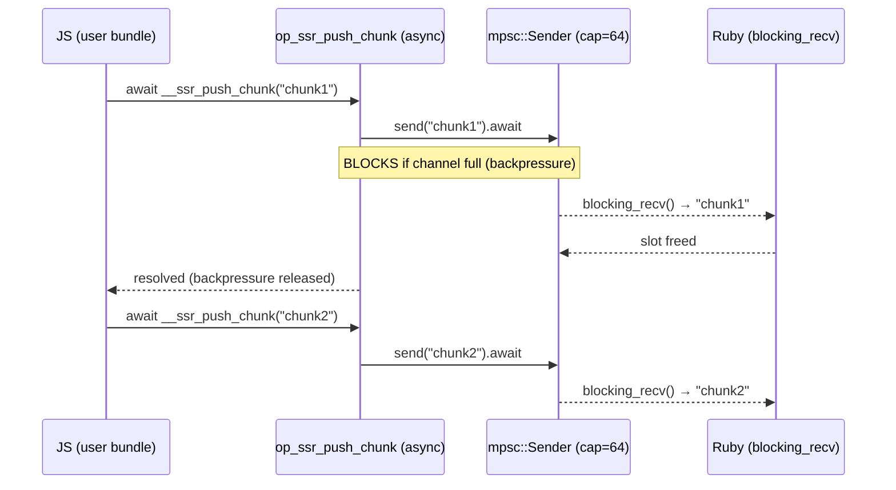

# Op-Based Chunked Streaming (Alternative to Poll-Based)

Status: Evaluated — poll-based confirmed as default

**PoC branch:** `poc/op-based-chunked-streaming` (commit `57e5839`)

## Context

`render_chunked.rs` uses a **poll-based** design: JS pushes chunks to a
`globalThis.__ssr_chunks` array, Rust drains it each event-loop tick via
`execute_script`. This avoids needing `Deno.core.ops` (hidden post-bootstrap in
deno_runtime 0.254+).

This plan evaluates the **op-based alternative**: wiring the existing
`op_ssr_push_chunk` async op through an extension JS file that captures the op
binding during bootstrap (before `Deno.core` becomes inaccessible).

## How `Deno.core.ops` Becomes Inaccessible

In `deno_runtime-0.254.0/js/99_main.js`, the bootstrap finalizer builds
`finalDenoNs` from `denoNs` — `core` is placed only on the internal symbol
(`Deno[Deno.internal]`), never on the public `Deno` object. User scripts
(`execute_script` post-bootstrap) cannot reach `core.ops`.

However, extension JS files (the `js_files` / `esm_files` field on `Extension`)
run **during** bootstrap. They can `import { core } from "ext:core/mod.js"` and
capture op references before the finalizer runs.

## Op-Based Design



### Implementation sketch

Extension registration (in `mod.rs`):

```rust
deno_runtime::deno_core::Extension {
    name: "ssr_stream",
    ops: Cow::Owned(vec![render::op_ssr_push_chunk()]),
    js_files: Cow::Owned(vec![
        deno_core::ExtensionFileSource {
            specifier: "ext:ssr_stream/init.js",
            code: deno_core::ExtensionFileSourceCode::IncludedInBinary(
                include_str!("js/ssr_stream_init.js")
            ),
        },
    ]),
    ..Default::default()
}
```

Extension JS (runs during bootstrap):

```js
// ext/ssr_deno/src/js/ssr_stream_init.js
import { core } from "ext:core/mod.js";
const { op_ssr_push_chunk } = core.ops;

globalThis.__ssr_push_chunk = (chunk) => op_ssr_push_chunk(chunk);
```

User bundle contract changes from synchronous to async:

```js
// Before (poll-based) — synchronous, fire-and-forget
globalThis.__ssr_push_chunk(chunk);

// After (op-based) — async, must be awaited
await globalThis.__ssr_push_chunk(chunk);
```

### Rust changes

Minimal — `op_ssr_push_chunk` already exists as an async op with
`send().await` for backpressure. The only change is:

- Remove `drain_chunks` and the `globalThis.__ssr_chunks` array setup from
  `render_chunked.rs`
- Register `chunk_tx` in `OpState` (same pattern the buffered render uses)
- Keep the event-loop tick for the render promise to resolve, but chunks flow
  through the op instead of array polling

## Tradeoff Matrix

| Aspect | Poll-Based (current) | Op-Based (alternative) |
|--------|---------------------|----------------------|
| **Backpressure** | None — chunks accumulate in JS array until next tick drains. If Ruby is slow, array grows unbounded within a tick. | True async — `await` suspends JS when channel full. Bounded at 64 in-flight chunks. |
| **Chunk latency** | 0–50ms (batches until next drain tick) | Near-zero — each chunk hits channel immediately on op dispatch. |
| **Throughput (burst)** | Higher — batch drain + single JSON.stringify amortizes per-chunk overhead. | Lower for bursts — each chunk is a separate async op (V8 promise machinery + OpState borrow). |
| **Memory bound** | Unbounded within tick — synchronous burst of N chunks → N entries in array until drain. | Bounded at channel capacity (64). JS suspends after 64 pending chunks. |
| **User contract** | Synchronous: `__ssr_push_chunk(s)` — simple, impossible to misuse. | Async: `await __ssr_push_chunk(s)` — forgotten `await` → unobserved rejection, silent chunk loss. |
| **Deno coupling** | None — pure `execute_script` + globals. Survives any internal Deno refactor. | Coupled to `ext:core/mod.js` import path + `js_files` Extension field. Breaking if deno_core changes ESM loading. |
| **Debugging** | Easy — inspect `__ssr_chunks.length` at any time. | Harder — chunks in-flight inside V8 promise + Rust channel. |
| **Correctness risk** | Low — deterministic drain at tick boundaries. | Medium — async op lifetime must align with render lifecycle. Channel drop during `await` must not panic (already handled via `JsErrorBox`). |
| **Code complexity** | `drain_chunks` (30 LOC) + scope management for JSON parsing. Self-contained. | Extension JS wiring + ESM build system awareness. Less Rust code but more cross-layer coordination. |

## SSR Workload Characteristics

React's `renderToPipeableStream` emits chunks via macrotask scheduling:

- **Shell chunk** (1): everything outside `<Suspense>` — emitted on `onShellReady`
- **Boundary chunks** (2–20): each resolved Suspense fallback replacement
- **Final flush** (1): closing tags after all boundaries resolve

Each emission yields to the event loop (`MessageChannel` → macrotask). Chunks
**never accumulate >1–2 per tick** in practice. A realistic page produces 5–25
chunks total, each 1–100KB.

Consequence: the poll-based 50ms tick ceiling adds 0–50ms latency (avg ~25ms).
For HTTP chunked transfer where network RTT is 20–200ms, this is negligible.
The unbounded-within-tick memory concern is theoretical — a synchronous burst of
>64 chunks in one event-loop turn doesn't happen with real React streaming.

## When Op-Based is Justified

- **Untrusted/adversarial JS bundles** — guaranteed bounded memory prevents a
  malicious bundle from OOMing via infinite synchronous push
- **Sub-millisecond chunk latency** — WebSocket push or Server-Sent Events where
  25ms average latency matters
- **Flow-control awareness in JS** — the bundle needs to know when a chunk was
  consumed (e.g., adaptive quality or priority scheduling)
- **Very large documents** — a single render producing thousands of chunks where
  unbounded array growth could spike memory

## When Poll-Based is Preferred

- **Standard SSR** — React/Vue/Svelte streaming with bounded chunk counts
- **Simpler user contract** — synchronous push, no `await` footgun
- **Deno version resilience** — no coupling to internal module system
- **Higher burst throughput** — batch drain is faster than per-chunk op dispatch

## Recommendation

Keep poll-based as default. Consider op-based as an opt-in mode (e.g.,
`render_stream_chunks(data, backpressure: true)`) if a concrete use case
emerges — likely untrusted bundles or sub-ms latency requirements.

If implemented, both modes share the same Ruby API (`Enumerator` / block yield).
The difference is purely internal: which Rust function the `RenderChunked`
worker message dispatches to.

## Dependencies

- [x] Verify `js_files` field works with manual `Extension` struct (not macro)
- [x] Verify `import { core } from "ext:core/mod.js"` is available in extension
  JS for deno_core 0.400 — **Not needed.** `Deno.core.ops` is accessible directly
  in classic `js_files` scripts (no ESM import required).
- [x] Test that captured op binding survives bootstrap finalization
- [x] Benchmark: op dispatch latency vs. batch drain for 10/100/1000 chunks

## PoC Benchmark Results

Branch `poc/op-based-chunked-streaming` implements both paths with identical Ruby
API. Benchmark (`test/bench_chunked_streaming.rb`):

| Chunks | Poll p50 (ms) | Op p50 (ms) | Ratio (op/poll) |
|--------|--------------|------------|-----------------|
| 10 | 0.18 | 0.18 | 1.00x |
| 25 | 0.22 | 0.24 | 1.09x |
| 50 | 0.27 | 0.34 | 1.28x |
| 100 | 0.34 | 0.60 | 1.74x |
| 250 | 0.79 | 1.22 | 1.54x |
| 500 | 0.96 | 1.82 | 1.89x |
| 1000 | 1.58 | 3.13 | 1.98x |

**Conclusion:** Op-based is ~1.5-2x slower at scale due to per-chunk V8 promise
machinery + OpState borrow overhead. Poll-based batch drain amortizes the
V8-to-Rust crossing cost. At real SSR chunk counts (5-25), difference is
negligible — but poll-based wins on simplicity, coupling, and throughput.

Op-based path remains available on the PoC branch if a backpressure use case
emerges (untrusted bundles, very large documents, sub-ms latency requirements).
