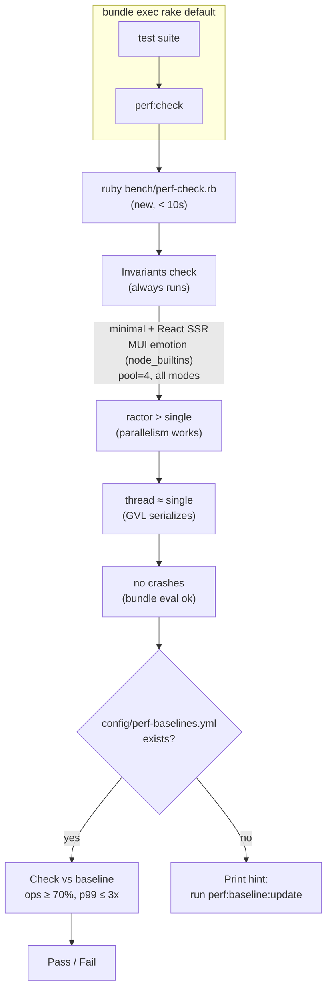
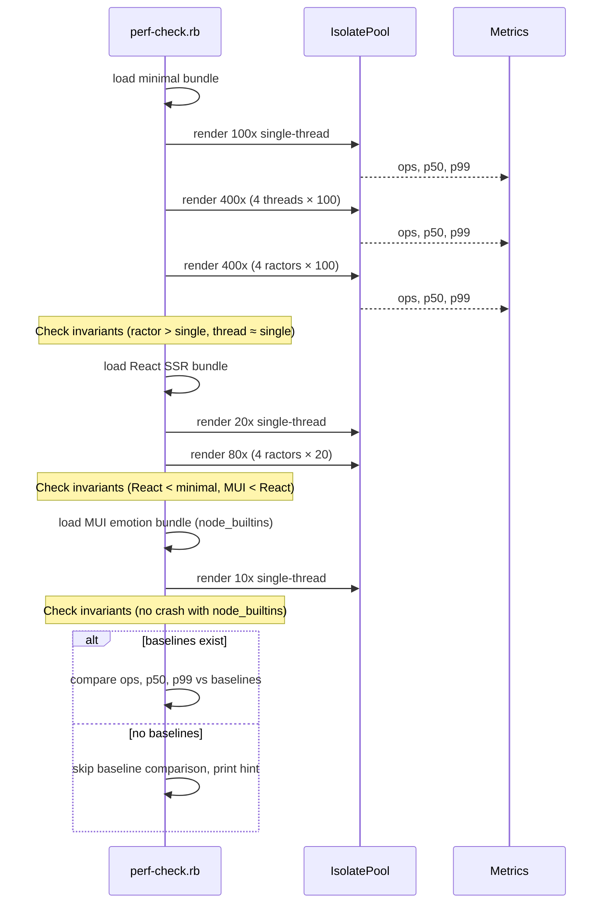

# Performance Regression Tests

Prevent throughput/latency regressions across releases. Two-tier: **invariants**
(machine-independent, always checked in CI) + **baselines** (machine-specific,
optional, updated on demand).

---

## Requirements

- Benchmark runs must be **fast** (< 10s) so they fit in `bundle exec rake`.
- **Invariants** catch architectural regressions (e.g., ractor parallelism
  breaks, GVL serialization changes, bundle evaluation crashes).
- **Baselines** catch gradual drift (e.g., throughput drops 40% from last
  known-good). Stored per-machine in the repo.
- Baselines are optional in CI. If missing, only invariants run.
- No subprocess overhead for CI — run inline with a single pool_size.
- Bundles tested: **minimal**, **React SSR**, **MUI emotion** (node_builtins).

## Architecture



## Invariants (always checked)

Architecture-level truths that should never break:

| Invariant | Check | Why |
|-----------|-------|-----|
| `ractors_pool4_ops` > `single_pool1_ops` | ≥ 1.5x | Ractor parallelism must work |
| `threads_pool4_ops` ≈ `single_pool1_ops` | within 30% | GVL serializes FFI — threads can't parallelize |
| `react_single_ops` < `minimal_single_ops` | pass | React is heavier than minimal (always true) |
| No exceptions during benchmark | pass | All bundle types load and render without error |

Invariants require no baseline — they hold on any machine regardless of CPU count.

## Baselines (optional, machine-specific)

Stored in `config/perf-baselines.yml`. Example:

```yaml
# Generated: 2026-05-06
# Ruby: 4.0.3 | CPU: 2 | OS: Linux x86_64
# Update: rake perf:baseline:update
baselines:
  minimal_single_opts:
    ops: 9341
    p50_ms: 0.1
    p99_ms: 0.2
  minimal_ractor_opts:
    ops: 25264
    p50_ms: 0.1
    p99_ms: 0.2
  react_single_opts:
    ops: 701
    p50_ms: 1.0
    p99_ms: 4.7
  react_ractor_opts:
    ops: 1557
    p50_ms: 1.7
    p99_ms: 8.8
```

Only **minimal**, **React SSR**, and **MUI emotion** bundles are baseline-checked.
MUI dashboard is too slow for CI — run on demand via `ruby bench/performance.rb --bundle mui-dashboard ...`.

## Thresholds

| Metric | vs Baseline | Rationale |
|--------|-------------|-----------|
| ops | ≥ 70% | Generous for CI noise |
| p50 | ≤ 3x | Catch GC regressions |
| p99 | ≤ 5x | Tail latency has higher variance |

Defined in `config/perf-baselines.yml` alongside values, adjustable.

## CI Integration — `rakelib/perf.rake`

```ruby
task 'perf:check' do
  success = system('ruby', 'bench/perf-check.rb')
  abort 'Performance regression detected!' unless success
end

task 'perf:baseline:update' do
  success = system('ruby', 'bench/perf-check.rb', '--update-baseline')
  abort 'Baseline update failed' unless success
  puts "Baseline written to config/perf-baselines.yml"
end
```

`perf:check` wired into `default` task, runs after tests.

## bench/perf-check.rb (new script)

Separate from `bench/performance.rb` (which is for human exploration). Simpler:

- No subprocess overhead (single pool_size, run inline)
- Tests minimal + React SSR + MUI emotion (node_builtins) only
- Pool_size = 4 (max isolates on any machine that matters)
- 100 iterations, 20 warmup (minimal); 20 iterations, 10 warmup (React);
  10 iterations, 5 warmup (MUI emotion)
- Writes JSON results
- Checks invariants (structural)
- If baselines exist, checks against them
- Exits 0 on pass, 1 on fail



## Rakefile changes

- In `Rakefile`, add line: `load 'rakelib/perf.rake' if File.exist?('rakelib/perf.rake')`
- In `rakelib/perf.rake`:
  ```ruby
  desc 'Check performance regression'
  task 'perf:check' do ... end
  
  desc 'Update performance baselines'
  task 'perf:baseline:update' do ... end
  
  task default: :'perf:check'
  ```

## Tasks

- [ ] Write `bench/perf-check.rb` — invariants + baseline comparison
- [ ] Create `config/perf-baselines.yml` from current benchmark data
- [ ] Add `rakelib/perf.rake` with `perf:check` and `perf:baseline:update`
- [ ] Wire `perf:check` into `default` task
- [ ] Remove MUI dashboard from CI checks (too slow, manual only)
- [ ] Run `perf:baseline:update` to seed initial baselines
- [ ] Run full `bundle exec rake` to verify CI gate works

## Non-goals

- **No MUI dashboard perf check in CI** — too slow (~30s). MUI emotion (855 KB)
  is included instead (~0.15s for 10 iterations). Run dashboard manually.
- **No memory regression check** — heap deltas are too noisy for CI. Memory
  leak detection stays in manual/stability tests.
- **No chunked render perf check** — different code path, future work.
- **No per-machine baseline auto-detection** — user runs `perf:baseline:update`
  once per machine. Baselines are machine-specific.
