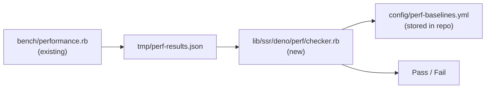

# Performance Regression Tests

Prevent throughput/latency/memory regressions across ssr-deno releases.

---

## Requirements

- Benchmark runs must be **fast** (< 30s) so they fit in `bundle exec rake`.
- Measure 3 workloads: **minimal** (0.1ms/render), **React SSR** (1ms/render), **MUI dashboard** (~183ms/render).
- Compare against **stored baselines** per bundle × mode × pool_size.
- Fail CI if any metric degrades beyond threshold.
- Baselines update only on explicit `rake perf:baseline:update`.

## Architecture



Benchmark script writes structured JSON. Checker compares against YAML baselines.

## Baselines

Stored in `config/perf-baselines.yml`. Example:

```yaml
# Generated: 2026-05-06
# Ruby: 4.0.3 | CPU: 2 | OS: Linux x86_64
baselines:
  minimal_pool1_single:
    ops_per_sec: 9652
    p50_ms: 0.1
    p99_ms: 0.2
    memory_delta_kb: 927
  minimal_pool4_ractors:
    ops_per_sec: 29874
    p50_ms: 0.1
    p99_ms: 0.2
    memory_delta_kb: 2253
  react_pool4_ractors:
    ops_per_sec: 9793
    p50_ms: 0.4
    p99_ms: 3.9
    memory_delta_kb: 393
  mui_pool4_ractors:
    ops_per_sec: 22
    p50_ms: 186.8
    p99_ms: 407.2
    memory_delta_kb: 32563
```

## Thresholds

| Metric | Threshold | Rationale |
|--------|-----------|----------|
| ops_per_sec | ≥ 90% of baseline | Minor env variance allowed |
| p50_ms | ≤ 2x of baseline | Latency spikes catch GC regressions |
| p99_ms | ≤ 3x of baseline | Tail latency more sensitive to noise |
| memory_delta_kb | ≤ 150% of baseline | Heap growth indicates leaks |

Thresholds defined in config alongside baselines, adjustable per metric.

## CI Integration

Add to `rakelib/perf.rake`:

```ruby
task 'perf:check' do
  # Run benchmark (reduced iterations for speed)
  system('ruby bench/performance.rb --check',
         '--iterations', '100',
         '--warmup', '10')
end
```

`--check` flag: writes JSON instead of human output, exits non-zero on regression.

Covered bundles:

| Bundle | Iterations | Est. time |
|--------|-----------|-----------|
| minimal | 100 | ~1s |
| React SSR | 20 | ~1s |
| MUI dashboard | 3 | ~10s |
| **Total** | | **~15s** |

Fits in `bundle exec rake` (< 30s target).

## Tasks

- [ ] Add `--check` flag to `bench/performance.rb` (JSON output + comparison)
- [ ] Create `config/perf-baselines.yml` with current benchmark data
- [ ] Add `rakelib/perf.rake` with `perf:check` and `perf:baseline:update`
- [ ] Wire `perf:check` into `default` task (after tests)
- [ ] Document baseline update workflow in README

## Future

- CI matrix across Ruby versions vs baselines
- Chunked render perf checks
- Large payload perf checks
- Grafana dashboard for historical perf data
