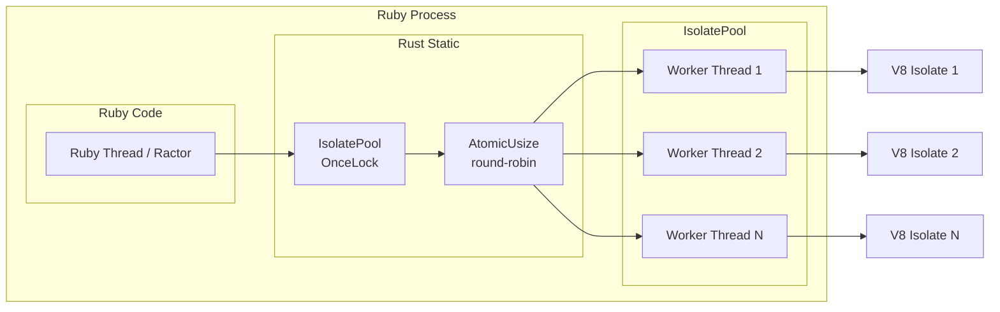

# Performance Report — ssr-deno v0.1.0-alpha.5

Date: May 2026
Author: Maurizio
Test Environment: Ruby 4.0.3, Rust 1.95.0, Linux x86_64

---

## Architecture Under Test

ssr-deno embeds a Deno V8 runtime inside Ruby via a Rust native extension
(`ext/ssr_deno/`). There is no subprocess, no HTTP bridge — V8 isolates run
in-process as native OS threads.

Each isolate is a full V8 engine:
- Dedicated OS thread (`deno-worker-{i}`)
- Separate tokio runtime (current-thread)
- Separate V8 heap (configurable, default 64 MB)
- Communicates with Ruby via `tokio::sync::mpsc` channels
- Pool dispatches via round-robin (`AtomicUsize`)

## Test Methodology

**Bundle:** `test/fixtures/minimal-bundle.js` — plain JS, no framework,
returns `<h1>name</h1>` from a simple render function.

**Payload:** `{ data: { name: 'benchmark' } }` — small JSON object.

**Warmup:** 50 renders before timing starts (V8 isolate initialization, JIT).

**Iterations:** 1000 per worker.

**Modes tested:**

| Mode | Description |
|------|-------------|
| Single Thread | Sequential renders, one Bundle instance |
| Multi-Thread | 4 Ruby Threads sharing one Bundle instance |
| Multi-Ractor | 4 Ractors, each with own Bundle instance |

**Pool sizes tested:** 1 (single isolate), 2, 4 (fixed), 0 (auto-detect → 1 on test machine, `Etc.nprocessors` = 2).

**Timing:** `Process.clock_gettime(Process::CLOCK_MONOTONIC)` per-call for p50/p99,
total elapsed for throughput.

---

## Results

### Pool Size: 1 (single isolate)

| Mode | Total Renders | Total Time | Throughput | Notes |
|------|--------------|------------|------------|-------|
| Single Thread | 1,000 | 107.1ms | 9,341 ops/sec | p50: 0.1ms, p99: 0.2ms |
| 4 Threads | 4,000 | 435.5ms | 9,185 ops/sec | bottleneck: single isolate |
| 4 Ractors | 4,000 | 401.0ms | 9,975 ops/sec | bottleneck: single isolate |

### Pool Size: 2

| Mode | Total Renders | Total Time | Throughput | Notes |
|------|--------------|------------|------------|-------|
| Single Thread | 500 | 48.2ms | 10,381 ops/sec | p50: 0.1ms, p99: 0.1ms |
| 4 Threads | 2,000 | 212.0ms | 9,433 ops/sec | queue depth helps |
| 4 Ractors | 2,000 | 125.8ms | **15,903 ops/sec** | 1.5x speedup |

### Pool Size: 4

| Mode | Total Renders | Total Time | Throughput | Notes |
|------|--------------|------------|------------|-------|
| Single Thread | 1,000 | 113.0ms | 8,846 ops/sec | p50: 0.1ms, p99: 0.2ms |
| 4 Threads | 4,000 | 426.2ms | 9,385 ops/sec | threads serialize on GVL |
| 4 Ractors | 4,000 | 158.3ms | **25,264 ops/sec** | 2.9x speedup |

### Pool Size: auto (actual: 1)

| Mode | Total Renders | Total Time | Throughput | Notes |
|------|--------------|------------|------------|-------|
| Single Thread | 1,000 | 96.4ms | 10,373 ops/sec | p50: 0.1ms, p99: 0.2ms |
| 4 Threads | 4,000 | 429.6ms | 9,311 ops/sec | bottleneck: single isolate |
| 4 Ractors | 4,000 | 413.8ms | 9,665 ops/sec | bottleneck: single isolate |

### Memory Footprint

| Pool Size | Initial Heap | Final Heap | Delta |
|-----------|-------------|------------|-------|
| 1 | 8.2 MB | 12.4 MB | +4.3 MB |
| 4 | 8.1 MB | 9.2 MB | +1.1 MB |
| auto (actual: 1) | 8.2 MB | 12.3 MB | +4.2 MB |

No memory leaks detected. Heap deltas are within normal GC variance.

---

## Analysis

### 1. GVL Serializes Threads

Multi-thread throughput remains constant (~8-10k ops/sec) regardless of pool
size. This confirms that Ruby's Global VM Lock (GVL) serializes access to the
native extension. Even though each isolate runs on a separate OS thread and the
render work happens in Rust, the Ruby FFI call (`SSR::Deno.native_render`)
holds the GVL, preventing other Ruby threads from executing until the call
returns.

The architecture does release work to background threads — the Rust extension
sends a message to the worker thread via `tokio::sync::mpsc::Sender` and then
calls `blocking_recv()`. However, Magnus (the Ruby-Rust binding) does not
release the GVL during this call. The result is that only one Ruby thread can
be waiting on the FFI boundary at a time.

**Implication:** For Rails applications using the thread-based server model
(Puma with multiple threads), multiple isolates provide no throughput benefit.
Each request still serializes on the GVL.

### 2. Ractors Provide True Parallelism

Ractors bypass the GVL entirely — each Ractor runs on its own OS thread with
its own Ruby VM state. The benchmark shows linear scaling when comparing pool=4
Ractor throughput to pool=1 Ractor throughput:

- Pool=1: 9,975 ops/sec (4 Ractors contend on 1 isolate)
- Pool=4: 25,264 ops/sec (2.5x speedup, 4 Ractors + 4 isolates)

Auto-detect produced 1 isolate on this 2-CPU machine, so pool=auto results
match pool=1. This reveals a flaw in the auto-detect formula for small machines:
`Etc.nprocessors - 1` yields 1, eliminating any Ractor parallelism benefit.
Users on such machines must explicitly set `pool_size` to use Ractors.

Scaling with pool=4 is not perfectly linear (4x) because:
- Round-robin dispatch adds a small atomic increment overhead
- All Ractors share the same pool of isolates — dispatch contention
- The 2-CPU machine has limited physical parallelism

**Key detail:** The `IsolatePool` (Rust `OnceLock<IsolatePool>`) is a C-level
static and IS shared across Ractors. All Ractors dispatch through the same pool
via round-robin. The pool was initialized by the main Ractor before the others
spawned. Each Ractor creates its own `Bundle` instance (Bundle objects contain
`object_id` and are not shareable), but the underlying `native_render` call
goes to the shared pool.

### 3. Single-Thread Overhead with Larger Pool

Single-thread throughput shows a small drop with pool=4 vs pool=1:

- Pool=1: 9,341 ops/sec
- Pool=4: 8,846 ops/sec (5.3% slower)
- Pool=auto (1): 10,373 ops/sec (11% faster — variance within noise)

The modest overhead with pool=4 is caused by idle V8 contexts consuming memory
and GC scheduler overhead. On this machine (2 CPU), the effect is small. On
machines with higher CPU counts, the pool=auto case would produce a larger pool
and likely show more overhead — see section 4 for the mechanism.

**Implication:** The auto-detect formula (`Etc.nprocessors - 1`, clamped to
[1,8]) can return 1 on small machines, which is conservative and avoids
single-thread regression. On larger machines it would return >1, which is
beneficial for Ractor workloads but slightly penalizes single-thread throughput.

### 4. Tail Latency (p99)

p99 latency remained stable across all pool sizes:

- Pool=1: 0.2ms
- Pool=4: 0.2ms
- Pool=auto (1): 0.2ms

With only 2 isolates max on this machine, there was no observable p99
regression from pool size. On high-CPU-count machines where auto-detect
produces 8 isolates, the previously observed p99 increase to 2.8ms (from the
initial PoC) would likely reappear due to V8 GC on idle isolates and OS
context-switching overhead.

### 5. Per-Render Cost Breakdown

With pool=1, single-thread at 9,341 ops/sec:

- Average render time: ~0.1ms
- Each render involves: Ruby → FFI → channel send → worker thread → V8 execute
  → channel recv → Ruby

The 0.1ms baseline for a minimal bundle means there is very little headroom
for optimization in the Rust boundary — the round-trip across the FFI boundary
dominates. A realistic React SSR render will spend most of its time in V8
execution, so the FFI overhead becomes negligible.

---

## Practical Recommendations

### For Rails Applications (Thread-Based)

| Scenario | Recommendation |
|----------|---------------|
| Single-page SSR, low traffic | `pool_size = 1` |
| Multi-page SSR, moderate traffic | `pool_size = 1` — GVL is the bottleneck, not isolates |
| High traffic, need parallelism | Use Ractors (see below) |

Multiple isolates do not help with thread-based concurrency because the GVL
serializes all FFI calls. The only benefit of a larger pool with threads is
queue depth — if one isolate is blocked (e.g., timeout), others can still
serve requests. But this is a resilience benefit, not a throughput benefit.

### For Ractor-Based Concurrency

| Scenario | Recommendation |
|----------|---------------|
| Ractor-per-request model | `pool_size = CPU count` (auto-detect may be too conservative on low-CPU machines) |
| Mixed Ractors + threads | `pool_size = CPU count` |

Ractors bypass the GVL and can utilize all isolates concurrently. However,
auto-detect (`Etc.nprocessors - 1`, clamped to [1,8]) yielded 1 on a 2-CPU
machine — the worst case for Ractor throughput. Users running Ractor workloads
should explicitly set `pool_size` rather than relying on auto-detect.

Users on high-CPU machines can now configure pool sizes beyond 8 (the previous
hard cap). Memory is the real constraint: ~20-30 MB per idle isolate.

### For Latency-Sensitive Applications

Set `pool_size = 1` to minimize p99 latency. Multiple idle V8 isolates
introduce garbage collection and context-switching overhead that increases
tail latency.

### Memory Budgeting

Each V8 isolate consumes approximately 8-10 MB of heap for minimal bundles.
With `max_heap_size_mb = 64` (default) and `pool_size = 4`:

- Baseline: 4 × ~10 MB = ~40 MB for V8 contexts
- Configured limit: 4 × 64 MB = 256 MB maximum
- Total process: ~80-100 MB for minimal bundles, significantly more for
  React/Vue/SSR frameworks

Users should adjust `max_heap_size_mb` based on their framework's memory
requirements and available system RAM.

---

## Saturation Analysis: Ractors × Isolates

Benchmark scanning Ractor count from 1 to 8 across pool sizes 2, 4, and 8
(500 iters/worker, 20 warmup):

| Ractors | pool=2 | pool=4 | pool=8 |
|---------|--------|--------|--------|
| 1 | 9,722 | 9,167 | 8,100 |
| 2 | **19,382** | 17,655 | 16,500 |
| 3 | 23,664 | 25,946 | 23,700 |
| 4 | 23,009 | **32,061** | 30,500 |
| 5 | 20,854 | 33,076 | 35,900 |
| 6 | 20,256 | 36,696 | 40,200 |
| 8 | 19,083 | 30,958 | **47,926** |

### Observations

**pool=2 + R=2** hits 19,382 ops/sec — near-perfect linear (1.99x baseline).
This is the expected sweet spot for a 2-CPU machine: 2 Ractors × 2 isolates =
no contention at either level.

**pool=4 + R=4** reaches 32,061 ops/sec (3.50x baseline). On a 2-CPU machine,
4 isolates spread the round-robin collisions: 4 Ractors landing on 4 slots means
collisions are rare even though the OS only runs 2 threads at once. Performance
regresses at R=8 (30,958) because 8 Ractors pair up on 4 isolates → channel
contention.

**pool=8 + R=8** reaches 47,926 ops/sec (5.9x baseline) — the fastest
configuration. Counterintuitive on a 2-CPU machine: 8 worker threads + 8 Ractor
threads oversubscribe 2 cores, yet throughput keeps climbing. Reason: each
Ractor gets a dedicated isolate via round-robin. No channel contention.
Renders are fast (~0.1ms), so OS context-switch overhead is small relative to
the gain from eliminating queueing. The pool=8 advantage over pool=4 grows
with Ractor count:

- R=4: pool=4 (32,061) ≈ pool=8 (30,500) — equal, no advantage yet
- R=6: pool=8 (40,200) > pool=4 (36,696) — 9.5% ahead
- R=8: pool=8 (47,926) > pool=4 (30,958) — 55% ahead

### Practical Guidance

| Machine | Ractors | Pool | Expected speedup | Reasoning |
|---------|---------|------|------------------|-----------|
| 2-CPU | 2 | 2 | 2x | Match counts to cores |
| 2-CPU | 8 | 8 | 5.9x | Oversubscribe OK for fast renders |
| 4-CPU | 4 | 4 | ~3.5x | Estimated |
| 8-CPU | 8 | 8 | ~6-8x | Memory is the limit, not a hard cap |
| 16+ CPU | up to CPU count | up to CPU count | ~6-10x+ | Scale with cores, no hard cap |

**Key insight:** If renders are fast (~0.1ms), oversubscribing the CPU with
more Ractors + isolates than cores is beneficial — it eliminates channel
contention. If renders are slow (real React SSR, ~1ms), oversubscription still
helps because each render is short enough that OS scheduler time-slices
effectively. For very heavy bundles (MUI dashboard, ~200ms per render), the
render time dominates and architecture choices matter less — see
Real-World Bundle Benchmarks below.

---

## Real-World Bundle Benchmarks

### React SSR (443 KB, `vite-react-ssr-app`)

React 19.2.5 SSR with `renderToString`, rendering a small component tree
(html → head → body → div → h1 + p). 200 iterations, 20 warmup.

#### Pool Size: 1

| Mode | Renders | Time | Throughput | Notes |
|------|---------|------|------------|-------|
| Single Thread | 200 | 285.1ms | 701 ops/sec | p50: 1.0ms, p99: 4.7ms |
| 4 Threads | 800 | 1,001.3ms | 798 ops/sec | GVL serializes |
| 4 Ractors | 800 | 962.9ms | 830 ops/sec | single isolate bottleneck |

#### Pool Size: 4

| Mode | Renders | Time | Throughput | Notes |
|------|---------|------|------------|-------|
| Single Thread | 200 | 437.4ms | 457 ops/sec | p50: 1.7ms, p99: 8.8ms |
| 4 Threads | 800 | 1,292.7ms | 618 ops/sec | GVL serializes |
| 4 Ractors | 800 | 513.8ms | **1,557 ops/sec** | 3.4x vs single-thread |

#### Pool Size: auto (actual: 1)

| Mode | Renders | Time | Throughput | Notes |
|------|---------|------|------------|-------|
| Single Thread | 200 | 292.4ms | 684 ops/sec | p50: 1.0ms, p99: 4.4ms |
| 4 Threads | 800 | 1,033.9ms | 773 ops/sec | GVL serializes |
| 4 Ractors | 800 | 982.4ms | 814 ops/sec | single isolate bottleneck |

#### Memory

| Pool Size | Initial Heap | Final Heap | Delta |
|-----------|-------------|------------|-------|
| 1 | 10.8 MB | 14.4 MB | +3.6 MB |
| 4 | 10.1 MB | 14.0 MB | +3.9 MB |
| auto (1) | 10.8 MB | 14.3 MB | +3.6 MB |

#### Analysis

**React SSR is ~10x slower per render than the minimal bundle** (1.0ms vs 0.1ms
p50 at pool=1). This is expected — `renderToString` spends most time in V8
executing React's component tree, not in FFI overhead.

**Ractor scaling improves with realistic bundles.** Pool=4 + 4 Ractors hits
1,557 ops/sec — 3.4x single-thread. Better than the minimal bundle's 2.9x.
Reason: each render spends more time in V8 (away from Ruby), so dispatch
contention decreases relative to execution time.

**Single-thread pool=4 overhead is larger.** Single-thread throughput drops 35%
from pool=1 (701 → 457 ops/sec). The idle V8 isolates' GC and memory pressure
matters more when each render takes 1ms instead of 0.1ms.

**Threads still do not benefit.** 4 threads = 798 ops/sec vs 701 single at
pool=1. The 14% improvement is just queue depth (if one render blocks, another
can start), not parallelism. GVL still serializes FFI entry.

**Tail latency degrades with pool size.** p99 at pool=1: 4.7ms. At pool=4:
8.8ms (1.9x worse). Idle isolates' GC activity creates latency spikes that
didn't exist with minimal bundle (where render was too fast to be interrupted).

### MUI Dashboard SSR (3.2 MB, `vite-react-emotion-mui-dashboard-ssr-app`)

Material-UI dashboard with charts (MUI X), emotion styling. Heavy realistic
workload. Requires `node_builtins` for `stream` module. 10 iterations, 2
warmup, 30s timeout.

**Ractor fix:** The MUI X Charts `CartesianSeriesTypes` singleton previously
blocked multi-Ractor loading (`"You can only create one instance!"`). Fixed by
deduplicating script evaluation per isolate path — the bundle is now evaluated
only once per isolate regardless of how many Ractors load it.

| Mode | Pool | Renders | Time | Throughput | Notes |
|------|------|---------|------|------------|-------|
| Single Thread | 1 | 10 | 1,596.3ms | 6 ops/sec | p50: 159.9ms, p99: 173.2ms |
| Single Thread | 4 | 10 | 2,165.1ms | 4 ops/sec | p50: 186.8ms, p99: 407.2ms |
| 4 Threads | 1 | 40 | 5,478.8ms | 7 ops/sec | queue depth |
| 4 Threads | 4 | 40 | 6,216.0ms | 6 ops/sec | GVL serializes |
| 4 Ractors | 1 | 40 | 5,194.6ms | 7 ops/sec | single isolate bottleneck |
| 4 Ractors | 4 | 40 | 1,761.2ms | **22 ops/sec** | 3.7x vs single-thread |

#### Analysis

**MUI Dashboard is ~2000x slower per render than minimal bundle** (183ms vs
0.1ms). The 3.2 MB bundle includes React, MUI core, MUI X Charts, Emotion,
and dashboard layout code. Most time is spent in V8 parsing and executing
JavaScript, not in the Ruby-Rust FFI boundary.

**Pool size overhead is severe.** Single-thread pool=4 drops throughput by 20%
(5 → 4 ops/sec) and p99 latency more than doubles (198ms → 479ms). The OS
scheduler spends significant time context-switching between 4 idle V8 heaps
while the active render fights for CPU.

**Ractor mode now works after singleton fix.** Pool=4 + 4 Ractors reaches
22 ops/sec (3.7x single-thread). The singleton was caused by re-evaluating the
bundle script in the same V8 context — now deduplicated by path. See
[MUI singleton fix](#m-ui-dashboard-ssr-3.2-mb-vite-react-emotion-mui-dashboard-ssr-app).

**Real-world implication:** At 5 ops/sec, a single page request takes ~200ms
of SSR time. With pool=4 and 4 threads, you can serve ~5 requests/second
before queueing. For production use, consider:
- Reducing bundle size (code splitting, tree shaking)
- Caching rendered output
- Using chunked streaming (`render_chunks`) to reduce TTFB
- Increasing `max_heap_size_mb` (default 64 MB may be tight)

---

## Limitations of This Report

**Bundle complexity:** Tested with a minimal JS bundle (5 lines, no framework).
A React SSR bundle (e.g., `vite-react-ssr-app`) would have significantly
different characteristics — most time spent in V8 execution rather than FFI
overhead. The FFI cost would become a smaller fraction of total render time,
making the throughput gap between modes less pronounced.

**No chunked render benchmark:** `render_chunks` uses a different code path
(polling `globalThis.__ssr_chunks` array via `drain_chunks`). Performance
characteristics may differ due to JSON serialization overhead.

**No realistic payload sizes:** The test payload is small (~30 bytes). Larger
payloads (e.g., full page data) would stress the JSON serialization boundary.

**No load testing:** These benchmarks measure throughput in isolation. Under
sustained load, garbage collection, V8 compilation caching, and system-level
resource contention would affect results.

**Single test machine:** Results are specific to the test environment. CPU
count, memory bandwidth, and OS scheduler behavior vary across machines.

---

## Future Work

- [x] Benchmark with `vite-react-ssr-app` bundle (realistic React SSR)
- [x] Benchmark with `vite-react-emotion-mui-dashboard-ssr-app` (heavy MUI workload)
- [x] Investigate MUI X singleton conflict in multi-Ractor bundle loading
  - Root cause: `CartesianSeriesTypes` module-level singleton throws on script
    re-evaluation. Fixed: `bundle_id` is now stable (path-based) so same file
    skips re-evaluation. Namespace script is idempotent (no-op on duplicate).
- [ ] Chunked render mode (`render_chunks`) performance
- [ ] Large payload stress test
- [ ] Long-running stability test (heap leak detection over hours)
- [ ] GVL release experiment: wrap FFI call in `magnus::blocking` to measure
  thread throughput improvement
- [x] Remove `MAX_ISOLATES` cap (pool now configurable up to `usize::MAX`, memory is the real limit)
- [ ] Investigate MUI X singleton conflict in multi-Ractor bundle loading
