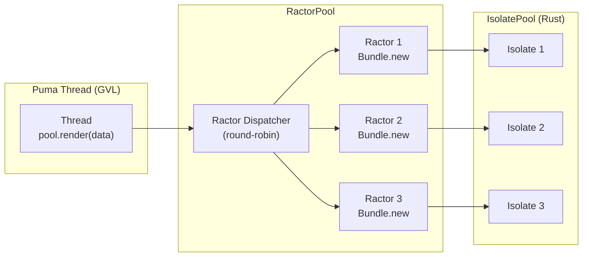

# RactorPool — Managed SSR Ractors for Thread-Based Servers

Puma threads can't parallelize SSR (GVL serializes FFI). Dedicated Ractors give
true parallelism. This plan adds `SSR::Deno::RactorPool` — managed Ractors for
SSR that Puma users can drop in without touching Ractor API.

---

## Changes

### 1. Remove MAX_ISOLATES cap

Extracted to [remove-max-isolates-cap.md](remove-max-isolates-cap.md). Focused
plan, implement first.

### 2. RactorPool class

```ruby
pool = SSR::Deno::RactorPool.new(
  bundle_path: 'path/to/bundle.js',
  size: 4,                          # Ractor count = isolate_pool_size
  node_builtins: false,
  render_timeout_ms: 500,
)

# Synchronous — dispatches to next free Ractor, blocks until done
html = pool.render({ data: { name: 'World' } })

# Chunked — block yields chunks as they arrive
pool.render_chunks(data) { |chunk| response.stream.write(chunk) }
```

Implementation:



**Dispatcher Ractor** receives `{data:, reply_ractor:}` messages, relays to
next Ractor. Reply-ractor pattern avoids busy-wait.

```ruby
class RactorPool
  def initialize(bundle_path:, size: Etc.nprocessors, ...)
    @size = size
    SSR::Deno.isolate_pool_size = size  # must be set before Bundle.new
    @ractors = Array.new(size) do
      Ractor.new(bundle_path) do |path|
        bundle = SSR::Deno::Bundle.new(path)
        loop do
          msg = Ractor.receive
          data, reply_ractor = msg.values_at(:data, :reply_ractor)
          result = bundle.render(data)
          reply_ractor.send(result)
        end
      end
    end
    @counter = Atomic.new(0)
  end

  def render(data)
    reply = Ractor.new {}
    ractor = @ractors[@counter.preincrement % @size]
    ractor.send({ data: data, reply_ractor: reply })
    reply.take  # blocks until render completes
  end
end
```

### 3. Default isolate_pool_size = ractor pool size

If user constructs `RactorPool`, the pool calls `SSR::Deno.isolate_pool_size = size`
before any `Bundle.new` triggers pool init. This ensures isolate count matches
Ractor count. No extra config needed.

### Backward compatibility

- `SSR::Deno.isolate_pool_size` default remains 1 (safe for Puma-only users)
- `Bundle` API unchanged — RactorPool is additive
- Existing thread-based code works identically

### Risks

- **Ractor crashes.** A crashed Ractor must be detected and restarted. Track
  via `Ractor#inspect` status or wrap in supervision.
- **Ractor warning.** "Ractor API is experimental" prints on Ruby 3.x.
  Suppress via `Warning.ignore` if desired.
- **Gemini of chunked render.** `render_chunks` with block → need to stream
  chunks through a pipe/channel, not just a reply Ractor.

## Tasks

- [ ] Remove MAX_ISOLATES cap — see [separate plan](remove-max-isolates-cap.md)
- [ ] Implement `SSR::Deno::RactorPool` in `lib/ssr/deno/ractor_pool.rb`
- [ ] Wire `isolate_pool_size = size` in constructor
- [ ] Add `render` + `render_chunks` delegation
- [ ] Handle Ractor crash (detect + restart, or raise)
- [ ] Suppress "experimental" warning
- [ ] Update `sig/ssr/deno.rbs`
- [ ] Add tests in `test/ssr/test_ractor_pool.rb`
- [ ] Update README with usage example
- [ ] Archive this plan after implementation
