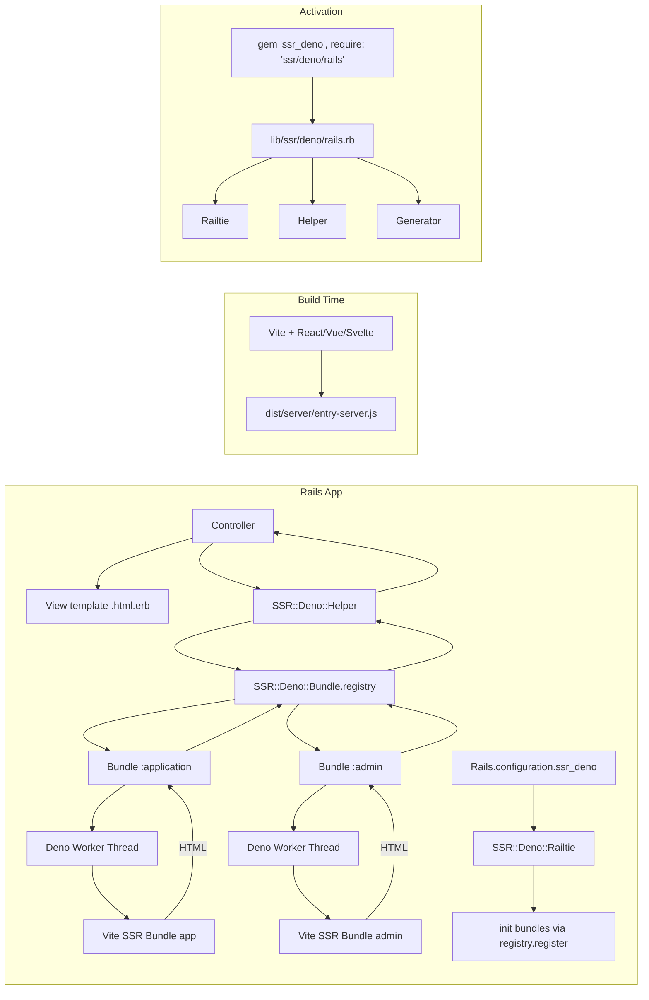
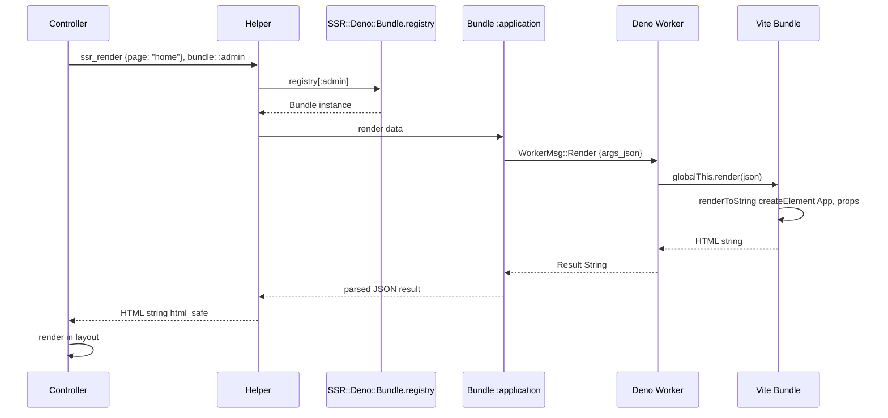

# Rails Integration Plan

## Overview

Add Rails integration to `ssr-deno` gem so Rails apps can render Vite-built SSR bundles (React/Vue/Svelte) via embedded Deno runtime with minimal configuration.

Current gem API:
- [`SSR::Deno::Bundle.new(path)`](lib/ssr/deno/bundle.rb:7) — load bundle, spawn Deno worker thread
- [`bundle.render(data, raw_input:, raw_output:)`](lib/ssr/deno/bundle.rb:22) — render HTML
- Multi-bundle support, thread-safe, Ractor-safe

Goal: Rails app does `gem 'ssr_deno', require: 'ssr/deno/rails'` in Gemfile + `rails generate ssr:deno:install` and gets SSR working.

**Activation pattern:** Rails support is opt-in. The core gem (`require 'ssr/deno'`) remains Rails-free. Users explicitly activate Rails integration by specifying `require: 'ssr/deno/rails'` in their Gemfile. This loads [`lib/ssr/deno/rails.rb`](lib/ssr/deno/rails.rb) which requires the Railtie, Helper, and Generator.

---

## Architecture



## Data Flow



---

## Components

### 0. Bundle Registry — [`lib/ssr/deno/bundle/registry.rb`](lib/ssr/deno/bundle/registry.rb)

Dedicated `SSR::Deno::Bundle::Registry` class. Singleton pattern with thread-safe internal storage. Replaces module-level `SSR::Deno.bundles` / `SSR::Deno.bundle(name)`.

```ruby
module SSR
  module Deno
    class Bundle
      class Registry
        include Enumerable

        def initialize
          @bundles = {}
          @mutex = Mutex.new
        end

        # Lookup a registered bundle by name.
        # @param name [Symbol] bundle name (:application by default)
        # @return [SSR::Deno::Bundle, nil]
        def [](name = :application)
          @mutex.synchronize { @bundles[name] }
        end
        alias bundle []

        # Register a named bundle.
        # @param name [Symbol]
        # @param bundle [SSR::Deno::Bundle]
        # @raise [ArgumentError] if name already registered
        def register(name, bundle)
          @mutex.synchronize do
            raise ArgumentError, "Bundle #{name.inspect} already registered" if @bundles.key?(name)

            @bundles[name] = bundle
          end
        end

        # Replace a registered bundle (for dev reload).
        # @param name [Symbol]
        # @param bundle [SSR::Deno::Bundle]
        def replace(name, bundle)
          @mutex.synchronize { @bundles[name] = bundle }
        end

        # Remove a registered bundle.
        # @param name [Symbol]
        def remove(name)
          @mutex.synchronize { @bundles.delete(name) }
        end

        # Iterate over registered bundles.
        def each(&block)
          @mutex.synchronize { @bundles.each(&block) }
        end

        # Number of registered bundles.
        def size
          @mutex.synchronize { @bundles.size }
        end
      end
    end
  end
end
```

**Convenience accessor on `SSR::Deno::Bundle`:**

```ruby
module SSR
  module Deno
    class Bundle
      class << self
        attr_reader :registry
      end
      @registry = Registry.new
    end
  end
end
```

**Why eager init?** `@registry ||= Registry.new` is not thread-safe — two threads can both see `nil` and create two instances. Eager init at class load time avoids the race entirely. The cost is negligible (empty Hash + Mutex).

Usage:
```ruby
SSR::Deno::Bundle.registry[:application]  # => Bundle instance or nil
SSR::Deno::Bundle.registry.bundle(:admin) # => Bundle instance or nil
SSR::Deno::Bundle.registry.register(:app, bundle)
SSR::Deno::Bundle.registry.each { |name, b| puts "#{name}: #{b}" }
```

### 1. Entry Point — [`lib/ssr/deno/rails.rb`](lib/ssr/deno/rails.rb)

This file is loaded when the user specifies `require: 'ssr/deno/rails'` in their Gemfile. It requires all Rails-specific components:

```ruby
# frozen_string_literal: true

# Rails integration for ssr-deno.
# Activated by: gem 'ssr_deno', require: 'ssr/deno/rails'
require_relative 'rails/railtie'
require_relative 'rails/helper'
require_relative 'rails/generators/ssr/deno/install_generator' if defined?(Rails::Generators)
```

The core gem (`require 'ssr/deno'`) remains unchanged and Rails-free. No auto-detection of Rails — explicit opt-in only.

### 2. Railtie — [`lib/ssr/deno/rails/railtie.rb`](lib/ssr/deno/rails/railtie.rb)

Loaded via the entry point. Responsibilities:

- Register `ssr_deno` config namespace
- Hook into `after_initialize` to init bundles from config
- Hook into `reload_classes_only_on_change` for dev reload
- Add view helper
- Set `auto_reload` on each bundle when `config.ssr_deno.auto_reload` is enabled

```ruby
module SSR
  module Deno
    class Railtie < Rails::Railtie
      config.ssr_deno = ActiveSupport::OrderedOptions.new
      config.ssr_deno.bundles = { application: nil }   # name => path, nil = use default path
      config.ssr_deno.enabled = true
      config.ssr_deno.auto_reload = Rails.env.development?
      config.ssr_deno.raise_on_render_error = !Rails.env.production?

      initializer 'ssr_deno.setup' do |_app|
        ActiveSupport.on_load(:action_view) do
          include SSR::Deno::Helper
        end
      end

      initializer 'ssr_deno.init_bundles', after: :load_config_initializers do |_app|
        next unless config.ssr_deno.enabled

        config.ssr_deno.bundles.each do |name, path|
          path ||= default_bundle_path(name)
          next unless path

          unless File.exist?(path)
            Rails.logger.warn "[ssr-deno] Bundle #{name.inspect} not found at #{path}. Skipping."
            next
          end
          bundle = SSR::Deno::Bundle.new(path)
          bundle.auto_reload = true if config.ssr_deno.auto_reload
          SSR::Deno::Bundle.registry.register(name, bundle)
        rescue ArgumentError
          Rails.logger.warn "[ssr-deno] Bundle #{name.inspect} already registered. Skipping."
        end
      end

      private

      def default_bundle_path(name)
        Rails.root.join("dist/server/#{name}/entry-server.js")
      end
    end
  end
end
```

### 3. Bundle Path Convention

Default paths follow Rails convention:

| Bundle name | Default path |
|---|---|
| `:application` | `dist/server/entry-server.js` |
| `:admin` | `dist/server/admin/entry-server.js` |

Override any bundle path explicitly:

```ruby
# config/initializers/ssr_deno.rb
Rails.application.config.ssr_deno.bundles = {
  application: Rails.root.join('dist/server/entry-server.js'),
  admin: Rails.root.join('dist/server/admin/entry-server.js')
}
```

**Future:** Ship own Vite integration (rake tasks for `vite build`, manifest parsing, dev server management) if demand warrants it. Not in scope for initial release.

### 4. View Helper — [`lib/ssr/deno/rails/helper.rb`](lib/ssr/deno/rails/helper.rb)

Generic SSR render method. Looks up bundle by name from the registry. Bundle lookup is extracted into a private `find_bundle!` method to keep `ssr_render` focused on the render-or-fallback logic.

```ruby
module SSR
  module Deno
    module Helper
      # Render a named SSR bundle with given data.
      # @param data [Hash, String] Data passed to the JS render function.
      #   Automatically JSON-serialized unless +raw_input: true+.
      # @param options [Hash]
      #   @option options [Symbol] :bundle  Bundle name to use
      #     (default: :application).
      #   @option options [Boolean] :raw_input  Skip JSON.generate — data is
      #     already a JSON string.
      #   @option options [Boolean] :raw_output  Skip JSON.parse — return raw
      #     JSON string from JS.
      # @return [String] Rendered output (html_safe). Empty string on SSR
      #   failure when +raise_on_render_error+ is false (CSR fallback).
      # @raise [SSR::Deno::BundleNotFoundError] if bundle name not registered.
      # @raise [SSR::Deno::RenderError, SSR::Deno::JsRuntimeWorkerError]
      #   when +raise_on_render_error+ is true.
      def ssr_render(data = nil, **options)
        bundle_name = options.delete(:bundle) || :application
        bundle = find_bundle!(bundle_name)
        bundle.render(data, **options).html_safe
      rescue SSR::Deno::RenderError, SSR::Deno::JsRuntimeWorkerError => error
        raise if Rails.application.config.ssr_deno.raise_on_render_error

        Rails.logger.error "[ssr-deno] Bundle #{bundle_name.inspect} render failed, " \
                           "falling back to CSR: #{error.message}"
        ''.html_safe
      end

      private

      def find_bundle!(bundle_name)
        bundle = SSR::Deno::Bundle.registry[bundle_name]
        unless bundle
          raise SSR::Deno::BundleNotFoundError,
                "SSR bundle #{bundle_name.inspect} not registered"
        end

        bundle
      end
    end
  end
end
```

Usage in views:
```erb
<%# Default :application bundle %>
<%= ssr_render({ page: "home", user: @user }) %>

<%# Named bundle %>
<%= ssr_render({ posts: @posts }, bundle: :admin) %>
```

### 5. Template Handler — deferred

Not in scope for initial release. Use helper in `.html.erb`:
```erb
<%= ssr_render({ page: "home", user: @user }) %>
```

Template handler (`.ssr` files with YAML frontmatter) can be added later if demand warrants it.

### 6. Streaming SSR — deferred

React 19 supports `renderToPipeableStream` for streaming HTML during SSR, enabling faster TTFB. Future integration could use `ActionController::Live` for chunked responses.

Not in scope for initial release. Requires:
- Bundle entry point that returns a stream instead of a string
- `ActionController::Live` integration in the helper
- Connection lifecycle management (timeout, disconnect)

**Note:** Structured return (CSS-in-JS with `{html:, css:}`) does not play well with streaming — a stream cannot be parsed as JSON. If streaming is added later, the raw output approach or a dedicated streaming protocol would be needed for CSS-in-JS.

### 7. Configuration

```ruby
# config/initializers/ssr_deno.rb
Rails.application.config.ssr_deno.bundles = {
  application: Rails.root.join('dist/server/entry-server.js')
}
Rails.application.config.ssr_deno.enabled = true
Rails.application.config.ssr_deno.auto_reload = Rails.env.development?
Rails.application.config.ssr_deno.raise_on_render_error = !Rails.env.production?
```

Or via generator:
```
rails generate ssr:deno:install
```

Creates:
- `config/initializers/ssr_deno.rb`

### 8. Development Reload

In development, Vite rebuilds on file changes. The SSR bundle file changes on disk. Strategy:

**Built-in mtime check** (simplest): The `Bundle` class has `auto_reload` attribute and `reload_if_changed` private method baked in. No monkey-patching needed.

```ruby
# In Bundle#render:
reload_if_changed if @auto_reload

# In Railtie, auto_reload is set on each bundle:
bundle.auto_reload = true if config.ssr_deno.auto_reload
```

**Alternative:** Use Rails `file_system_updater` or `ActiveSupport::FileUpdateChecker`.

**Recommended:** Start with mtime check. It's simple, correct, and low overhead (stat is cheap).

### 9. Error Handling

Controlled by `Rails.application.config.ssr_deno.raise_on_render_error`:

| Error | `raise_on_render_error: true` | `raise_on_render_error: false` |
|---|---|---|
| `BundleNotFoundError` | Raise (500) | Raise (500) — misconfig, always raise |
| `JsRuntimeInitializationError` | Raise (500) | Raise (500) — must fix, always raise |
| `JsRuntimeNotInitializedError` | Raise (500) | Raise (500) — must fix, always raise |
| `JsRuntimeWorkerError` | Raise (500) | Log + CSR fallback (empty HTML) |
| `RenderError` | Raise (500) | Log + CSR fallback (empty HTML) |

**CSR fallback:** When `raise_on_render_error` is false, `RenderError` and `JsRuntimeWorkerError` are rescued in the helper. Error is logged, empty string returned. The client-side JS bundle hydrates the app and renders normally. No user-visible error.

**Misconfiguration errors** (`BundleNotFound`, `JsRuntimeNotInitialized`, `JsRuntimeInitialization`) always raise regardless of setting — they indicate a deployment or setup issue that must be fixed.

**Default:** `raise_on_render_error = !Rails.env.production?` — raises in dev/test, falls back in production.

### 10. Generator — `lib/ssr/deno/rails/generators/ssr/deno/install_generator.rb`

```
rails generate ssr:deno:install
```

Creates:
- `config/initializers/ssr_deno.rb` — config with defaults

```ruby
module Ssr
  module Deno
    class InstallGenerator < Rails::Generators::Base
      source_root File.expand_path('templates', __dir__)

      def create_initializer
        template 'ssr_deno.rb', 'config/initializers/ssr_deno.rb'
      end
    end
  end
end
```

---

## File Structure (new files)

```
lib/
├── ssr/
│   └── deno/
│       ├── bundle/
│       │   └── registry.rb                   # NEW - Bundle::Registry class
│       ├── rails.rb                          # NEW - Entry point, loaded via require: 'ssr/deno/rails'
│       └── rails/
│           ├── railtie.rb                    # NEW - Railtie
│           ├── helper.rb                     # NEW - View helper
│           └── generators/
│               └── ssr/
│                   └── deno/
│                       ├── install_generator.rb  # NEW - Generator
│                       └── templates/
│                           └── ssr_deno.rb       # NEW - Generator template
```

---

## Implementation Phases

### Phase 1: Core Rails Integration
- [x] Add `railties` as optional dependency in gemspec (`spec.add_dependency 'railties'`)
- [x] Create [`lib/ssr/deno/bundle/registry.rb`](lib/ssr/deno/bundle/registry.rb) — `SSR::Deno::Bundle::Registry` class with `register`, `replace`, `remove`, `[]`, `each`, `size`; thread-safe via `Mutex`
- [x] Add convenience accessor `SSR::Deno::Bundle.registry` to [`lib/ssr/deno/bundle.rb`](lib/ssr/deno/bundle.rb)
- [x] Create entry point [`lib/ssr/deno/rails.rb`](lib/ssr/deno/rails.rb) — requires Railtie, Helper, Generator
- [x] Create [`lib/ssr/deno/rails/railtie.rb`](lib/ssr/deno/rails/railtie.rb) — Railtie with config namespace, init bundles via `SSR::Deno::Bundle.registry.register`
- [x] Create [`lib/ssr/deno/rails/helper.rb`](lib/ssr/deno/rails/helper.rb) — `ssr_render(data, bundle: :application, **options)` view helper using `SSR::Deno::Bundle.registry[name]`
- [x] Add development auto-reload (mtime check)
- [ ] Write tests with a Rails dummy app (using `rails app:template` or `combustion` gem)

### Phase 2: Generator
- [x] Create [`lib/ssr/deno/rails/generators/ssr/deno/install_generator.rb`](lib/ssr/deno/rails/generators/ssr/deno/install_generator.rb)
- [x] Create initializer template at `lib/ssr/deno/rails/generators/ssr/deno/templates/ssr_deno.rb`
- [x] Write generator tests

### Phase 3: Production Hardening
- [ ] Add Content-Security-Policy nonce support (for inline `<script>` tags in SSR output)
- [ ] Add metrics/instrumentation (`ActiveSupport::Notifications`)
- [ ] Document deployment considerations (V8 binary size, memory)

---

## Key Design Decisions

1. **Explicit opt-in, no auto-detection.** Rails support is activated by `gem 'ssr_deno', require: 'ssr/deno/rails'` in the Gemfile. The core gem (`require 'ssr/deno'`) remains Rails-free. No `defined?(Rails)` checks, no auto-requiring. The user explicitly chooses to load Rails integration.

2. **All Rails code under `lib/ssr/deno/rails/`.** Railtie, Helper, and Generator live under a `rails/` subdirectory. The entry point [`lib/ssr/deno/rails.rb`](lib/ssr/deno/rails.rb) requires them. This keeps the core gem clean and makes the Rails integration a clearly separate concern.

3. **`railties` as optional dependency.** The gemspec declares `railties` as a runtime dependency, but it's only loaded when the user opts into Rails integration. Non-Rails apps never pull in Rails dependencies.

4. **Dedicated `SSR::Deno::Bundle::Registry` class.** Not module-level methods on `SSR::Deno`. A proper class with `Mutex`-protected internal state, `Enumerable` interface, and explicit `register`/`replace`/`remove`/`[]` methods. Accessed via `SSR::Deno::Bundle.registry` convenience accessor.

5. **Thread-safe by design.** `Mutex` around all read/write operations. Prevents race conditions when multiple threads access the registry concurrently (e.g., Puma threads).

6. **Explicit bundle paths, no auto-detection.** User sets paths in `config.ssr_deno.bundles` hash. Default convention: `dist/server/<name>/entry-server.js`. Ship own Vite integration later if needed.

7. **Generic helper, no component awareness.** `ssr_render` passes data directly to JS `render` function. Component-specific helpers can be added later.

8. **Helper only, no template handler.** Use `ssr_render` in `.html.erb`. Template handler deferred to future.

9. **Auto-reload via mtime, not file watcher.** Simpler, no extra dependency. Stat is ~microsecond.

10. **No Ractor-specific Rails integration.** Rails isn't Ractor-safe yet. The underlying `Bundle` already supports Ractor via `native_render`, but Rails helpers run on main thread.

---

### 11. CSS-in-JS — already supported

Some frameworks (Emotion, styled-components, Vue) inject critical CSS during SSR. Two approaches work with the current API:

**a. Raw output approach:** JS `render` returns `JSON.stringify({html: "...", css: "..."})`. Rails calls `bundle.render(data, raw_output: true)` and parses the JSON to inject CSS into `<head>` and HTML into `<body>`.

```ruby
def ssr_component(data)
  result = JSON.parse(ssr_render(data, raw_output: true))
  content_for :head, tag.style(result['css'].html_safe)
  result['html'].html_safe
end
```

**b. Structured return approach:** JS `render` returns a plain object `{html: "...", css: "..."}`. Rails calls `bundle.render(data)` (no `raw_output`) and gets a parsed Hash directly.

```ruby
result = ssr_render(data)  # => { "html" => "...", "css" => "..." }
content_for :head, tag.style(result["css"].html_safe)
result["html"].html_safe
```

**Note:** Structured return does not play well with streaming SSR — a stream cannot be parsed as JSON. If streaming is added later, the raw output approach or a dedicated streaming protocol would be needed instead.

