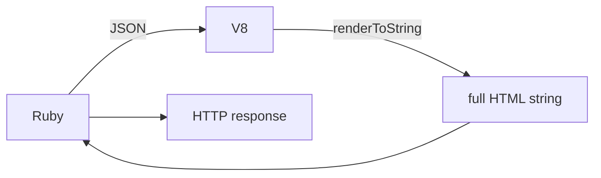
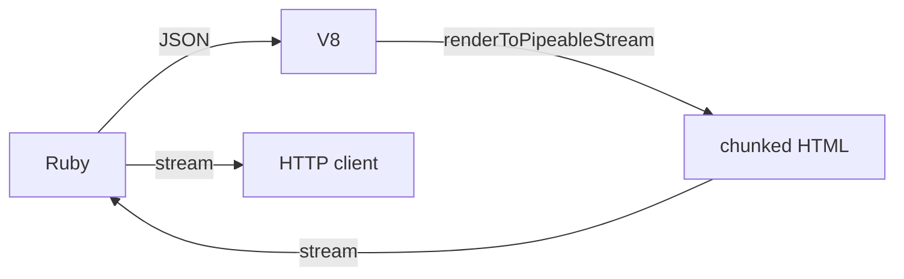
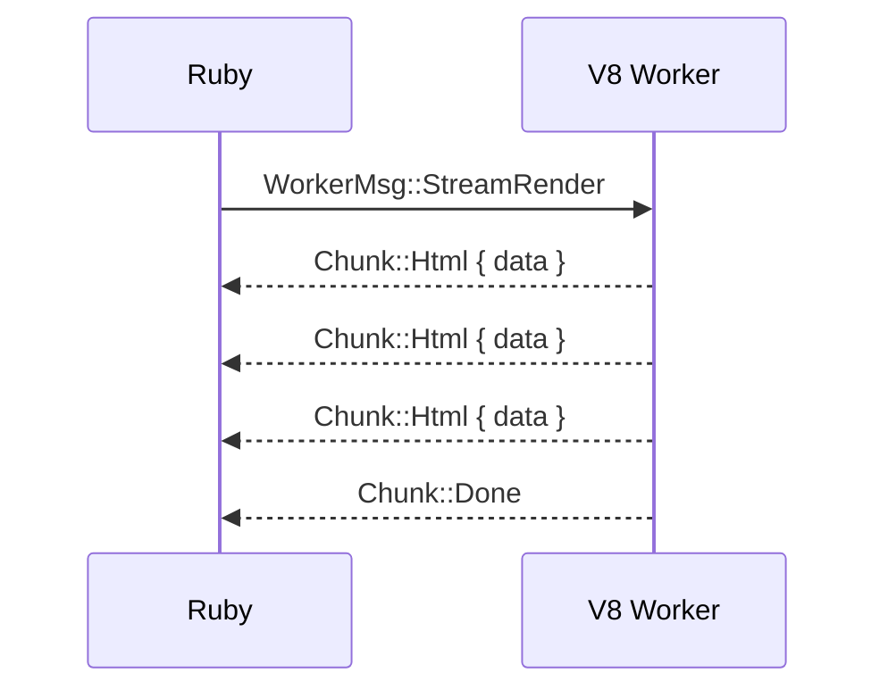

# Streaming SSR

> **Source:** Recommendation #5 from [`memory-performance-analysis.md`](memory-performance-analysis.md)
> **Cross-refs:** [`architecture.md`](architecture.md) (data flow: Ruby → JSON → V8 → HTML), [`helper.rb`](../lib/ssr/deno/rails/helper.rb) (current `ssr_render` returns complete string), [`deno_runtime_wrapper/mod.rs`](../ext/ssr_deno/src/deno_runtime_wrapper/mod.rs) (blocking render call)

---

## Problem

The current SSR pipeline buffers the entire HTML output in memory before returning it to Rails:



This has three drawbacks:

1. **TTFB (Time to First Byte) is equal to total render time** — the client sees nothing until `renderToString` finishes, even though React 19 can produce HTML incrementally via `renderToPipeableStream`.

2. **Memory spike during render** — the full HTML string (~10–100 KB for typical pages) is held in V8 memory, serialized across the channel, deserialized in Ruby, and then buffered by Rack. For large pages, this can be 200–500 KB.

3. **No progressive HTML delivery** — the browser cannot start parsing `<head>` content while the server is still rendering `<body>`.

## Approach

Replace the synchronous `renderToString` call with React 19's streaming API (`renderToPipeableStream`) and pipe the output through Rails' `ActionController::Live` (SSE/streaming response).

### Architecture



The key insight is that the V8 isolate produces HTML in chunks via React's streaming scheduler. Each chunk is sent back to Ruby as it becomes available, and Ruby forwards it immediately to the HTTP response via `ActionController::Live`.

### How React 19 Streaming Works

`renderToPipeableStream` returns a `PipeableStream` object:

```javascript
import { renderToPipeableStream } from 'react-dom/server'

function render(props) {
  return new Promise((resolve, reject) => {
    const stream = renderToPipeableStream(React.createElement(App, props), {
      onShellReady() {
        // The shell (suspense boundaries) is ready to stream
        // We can pipe the stream to the response
        resolve(stream)
      },
      onShellError(err) {
        reject(err)
      },
      onAllReady() {
        // Everything is rendered (for crawlers)
      },
      onError(err) {
        console.error('Streaming error:', err)
      },
    })
  })
}
```

The stream emits:
- **Synchronous chunks** — HTML that's ready immediately (the "shell")
- **Async chunks** — HTML from suspended components as they resolve
- **Completion signal** — when all content has been flushed

### Streaming Protocol (V8 → Ruby)

Instead of a single `oneshot` reply, the render message uses a **multi-message channel** where the worker sends multiple chunks followed by a completion signal:



In Rust, we add a new `WorkerMsg` variant:

```rust
enum WorkerMsg {
    LoadBundle { /* ... */ },
    Render { /* ... existing synchronous render ... */ },
    StreamRender {
        bundle_id: String,
        args_json: String,
        chunk_tx: tokio::sync::mpsc::Sender<Chunk>,
    },
}

enum Chunk {
    Html(String),
    Error(String),
    Done,
}
```

### Worker Thread Handler

The worker thread spawns an async task that calls a streaming JS function and forwards chunks:

```rust
WorkerMsg::StreamRender { bundle_id, args_json, chunk_tx } => {
    let result = call_stream_render(&mut worker, &bundle_id, &args_json, chunk_tx.clone());
    match result {
        Ok(()) => { let _ = chunk_tx.try_send(Chunk::Done); }
        Err(e) => { let _ = chunk_tx.try_send(Chunk::Error(e.to_string())); }
    }
}
```

### JS Bridge for Streaming

The bundle's `render` function returns a `ReadableStream` instead of a string:

```javascript
// In the Vite SSR bundle
globalThis.render = function(argsJson) {
  const props = JSON.parse(argsJson)

  const { pipe, abort } = renderToPipeableStream(
    React.createElement(App, props)
  )

  // Return a ReadableStream that the Rust layer can consume
  return new ReadableStream({
    start(controller) {
      pipe({
        push(chunk) {
          controller.enqueue(chunk)
        },
        destroy() {
          controller.close()
        }
      })
    }
  })
}
```

**Alternative (simpler):** Instead of `ReadableStream` (which requires V8 API changes), use a callback-based approach where the JS function calls a global `__ssr_chunk` function for each chunk:

```javascript
globalThis.render = function(argsJson) {
  const props = JSON.parse(argsJson)
  const stream = renderToPipeableStream(
    React.createElement(App, props)
  )

  return new Promise((resolve) => {
    let html = ''
    stream.pipe({
      push(chunk) {
        globalThis.__ssr_chunk(chunk)  // Called by Rust via V8 function call
      },
      destroy() {
        resolve(html)  // Final result
      }
    })
  })
}
```

### Ruby Side — `ActionController::Live`

The Rails helper returns a streaming response:

```ruby
module SSR
  module Deno
    module Helper
      # Stream SSR output using ActionController::Live.
      # Falls back to buffered render if streaming is not supported.
      def ssr_render_stream(data = nil, **options)
        bundle_name = options.delete(:bundle) || :application
        bundle = find_bundle!(bundle_name)

        if !respond_to?(:response) || !response.respond_to?(:stream)
          # Fallback: buffered render
          return bundle.render(data, **options).html_safe
        end

        response.headers['Content-Type'] = 'text/html'
        response.headers['Cache-Control'] = 'no-cache'

        # If nginx is in front, tell it not to buffer the stream.
        # Without this, nginx would buffer the entire response and defeat
        # the purpose of streaming (client sees nothing until the full
        # HTML arrives). This header is nginx-specific and harmless if
        # nginx is not present — other proxies and clients ignore it.
        response.headers['X-Accel-Buffering'] = 'no'

        response.stream.write('<div id="root">')  # Opening wrapper

        bundle.render_stream(data) do |chunk|
          response.stream.write(chunk)
        end

        response.stream.write('</div>')  # Closing wrapper
      ensure
        response.stream.close
      end
    end
  end
end
```

### Bundle#render_stream

A new method on `Bundle` that yields chunks:

```ruby
class Bundle
  def render_stream(data = nil, raw_input: false)
    json_input = raw_input ? data : JSON.generate(data)

    instrument 'render_stream.ssr_deno', bundle_name: @bundle_id do
      SSR::Deno.native_stream_render(@bundle_id, json_input) do |chunk|
        yield chunk
      end
    end
  end
end
```

### Rust — `native_stream_render`

In [`lib.rs`](../ext/ssr_deno/src/lib.rs), a new function that takes a Ruby block:

```rust
fn native_stream_render(bundle_id: String, args_json: String, rb_block: &magnus::Block) -> Result<(), Error> {
    let runtime = get_runtime()?;
    let (chunk_tx, mut chunk_rx) = tokio::sync::mpsc::channel::<Chunk>(16);

    // Send stream render request
    runtime.block_on_stream_render(&bundle_id, &args_json, chunk_tx)
        .map_err(map_render_error)?;

    // Receive chunks and yield to Ruby block
    while let Some(chunk) = chunk_rx.blocking_recv() {
        match chunk {
            Chunk::Html(data) => {
                rb_block.call::<_, ()>((data,))?;
            }
            Chunk::Error(msg) => {
                return Err(render_error(msg));
            }
            Chunk::Done => {
                break;
            }
        }
    }

    Ok(())
}
```

### Railtie Integration

Add a config option and a new helper method:

```ruby
config.ssr_deno.streaming = {
  enabled: false,  # Default: use buffered render
  chunk_size: 4096, # Not directly applicable — React controls chunk size
}
```

The view helper can auto-detect streaming support:

```erb
<%# In the view template %>
<%= ssr_render @page_data %>
<%# vs %>
<%= ssr_render_stream @page_data %>
```

Or, if `streaming.enabled` is true, `ssr_render` automatically uses streaming when the response supports it.

### Edge Cases

| Scenario | Behavior |
|---|---|
| **Client disconnects mid-stream** | `ActionController::Live` raises `ActionDispatch::Http::Parameters::ParseError` on write. Rescue and call `abort()` on the React stream to stop rendering. |
| **Suspense boundary resolves late** | React streams the chunk when ready. The HTTP response stays open. |
| **Shell error** | `onShellError` fires. Fall back to CSR (empty string) or a static error page. |
| **Stream error after shell** | `onError` fires. Log the error. The response is already partially sent — can't fall back to CSR. |
| **Nginx buffering** | If nginx is in front, it buffers the entire upstream response by default, defeating streaming. Set `X-Accel-Buffering: no` response header to disable. This is an nginx-specific directive — other proxies and clients ignore it harmlessly. Without nginx, no action needed. |
| **Rack middleware buffering** | Some middleware (e.g., `Rack::ETag`) may buffer the response. Disable for streaming routes. |

### Performance Projections

| Metric | Buffered (current) | Streaming |
|---|---|---|
| **TTFB** | ~25 ms (total render time) | ~5 ms (shell ready) |
| **Time to Last Byte** | ~25 ms | ~25 ms (same total work) |
| **Peak V8 memory** | ~5 MB (full HTML string) | ~1 MB (chunk buffer) |
| **Peak Ruby memory** | ~100 KB (full HTML string) | ~4 KB (chunk buffer) |
| **Client FCP** | ~50 ms (after full HTML arrives) | ~30 ms (starts parsing shell immediately) |

**Key insight:** Streaming doesn't reduce total server work — `renderToString` and `renderToPipeableStream` do the same amount of computation. The benefit is **perceived performance**: the browser can start parsing and rendering the shell (headers, navigation, skeleton) while the server finishes rendering the main content.

---

## Changes

### 1. [`ext/ssr_deno/src/deno_runtime_wrapper/mod.rs`](../ext/ssr_deno/src/deno_runtime_wrapper/mod.rs)

- Add `Chunk` enum: `Html(String)`, `Error(String)`, `Done`
- Add `WorkerMsg::StreamRender` variant with `chunk_tx: tokio::sync::mpsc::Sender<Chunk>`
- Add `block_on_stream_render` method to `DenoRuntimeWrapper`
- Add `call_stream_render` function that calls JS and forwards chunks

### 2. [`ext/ssr_deno/src/lib.rs`](../ext/ssr_deno/src/lib.rs)

- Add `native_stream_render(bundle_id, args_json, &block)` function
- Register as `define_singleton_method("native_stream_render", function!(native_stream_render, 2))`

### 3. [`lib/ssr/deno/bundle.rb`](../lib/ssr/deno/bundle.rb)

- Add `render_stream` method that yields chunks

### 4. [`lib/ssr/deno/rails/helper.rb`](../lib/ssr/deno/rails/helper.rb)

- Add `ssr_render_stream` helper method using `ActionController::Live`

### 5. [`lib/ssr/deno/rails/railtie.rb`](../lib/ssr/deno/rails/railtie.rb)

- Add `config.ssr_deno.streaming` options

### 6. [`sig/ssr/deno.rbs`](../sig/ssr/deno.rbs)

- Add type signatures for new methods

---

## Testing

### Rust unit test

```rust
#[test]
fn test_stream_render_returns_chunks() {
    let wrapper = DenoRuntimeWrapper::new().unwrap();
    let (chunk_tx, mut chunk_rx) = tokio::sync::mpsc::channel(16);

    wrapper.block_on_stream_render("test_bundle", "{}", chunk_tx).unwrap();

    let mut chunks = Vec::new();
    while let Some(chunk) = chunk_rx.blocking_recv() {
        match chunk {
            Chunk::Html(data) => chunks.push(data),
            Chunk::Done => break,
            Chunk::Error(msg) => panic!("Stream error: {}", msg),
        }
    }

    assert!(!chunks.is_empty());
    assert!(chunks.iter().any(|c| c.contains("<div")));
}
```

### Ruby unit test — [`test/ssr/test_deno_bundle.rb`](../test/ssr/test_deno_bundle.rb)

```ruby
def test_render_stream_yields_chunks
  bundle = SSR::Deno::Bundle.new(BUNDLE_PATH)
  chunks = []

  bundle.render_stream({ data: { message: 'Hello' } }) do |chunk|
    chunks << chunk
  end

  refute_empty chunks
  assert chunks.any? { |c| c.include?('<') }
end
```

### Rails integration test — [`test/ssr/integration_deno_rails.rb`](../test/ssr/integration_deno_rails.rb)

```ruby
def test_streaming_render
  # Use a controller test with ActionController::Live
  # Verify response is streamed
end
```

### Manual test

```bash
curl -N http://localhost:3000/some_page
# -N disables buffering, shows chunks as they arrive
```

---

## Implementation Order

1. Add `Chunk` enum and `WorkerMsg::StreamRender` variant in [`deno_runtime_wrapper/mod.rs`](../ext/ssr_deno/src/deno_runtime_wrapper/mod.rs)
2. Add `call_stream_render` function (JS bridge for streaming)
3. Add `block_on_stream_render` method to `DenoRuntimeWrapper`
4. Add `native_stream_render` in [`lib.rs`](../ext/ssr_deno/src/lib.rs)
5. Add `Bundle#render_stream` in [`bundle.rb`](../lib/ssr/deno/bundle.rb)
6. Add `ssr_render_stream` helper in [`helper.rb`](../lib/ssr/deno/rails/helper.rb)
7. Add config in [`railtie.rb`](../lib/ssr/deno/rails/railtie.rb)
8. Add tests
9. Update RBS signatures
10. Run `bundle exec rake` to verify full pipeline

---

## Open Questions

1. **Callback vs ReadableStream approach?** The callback approach (`globalThis.__ssr_chunk`) is simpler to implement in Rust — we just call a V8 function for each chunk. The `ReadableStream` approach is more idiomatic JS but requires V8 stream consumption APIs. **Recommendation:** Start with the callback approach.

2. **Should streaming be opt-in or automatic?** Opt-in (`ssr_render_stream` helper) is safer — streaming requires `ActionController::Live`, which has implications for middleware, load balancers, and reverse proxies. Automatic detection could be added later.

3. **How to handle the `abort()` signal on client disconnect?** Rails' `ActionController::Live` provides `response.stream` which raises an exception on write after disconnect. We need to catch this and call `abort()` on the React stream. This requires storing the abort function in a global JS variable.

4. **Should we support `renderToReadableStream` instead?** React 19 also provides `renderToReadableStream` which returns a `ReadableStream` directly. This is more natural for the Deno/V8 environment (no Node.js `pipe` API needed). However, `renderToPipeableStream` is more widely documented and tested. Both APIs produce the same output.
