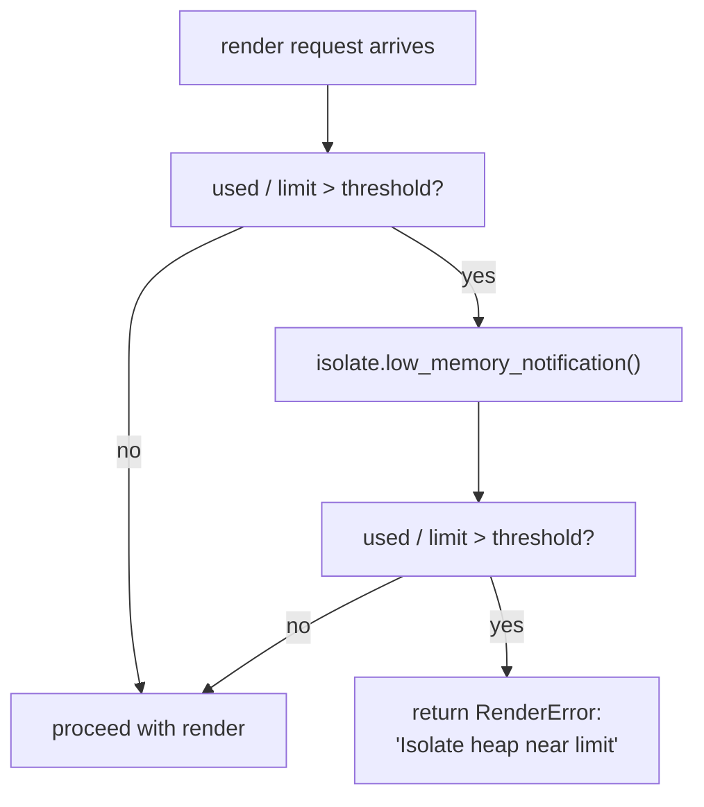
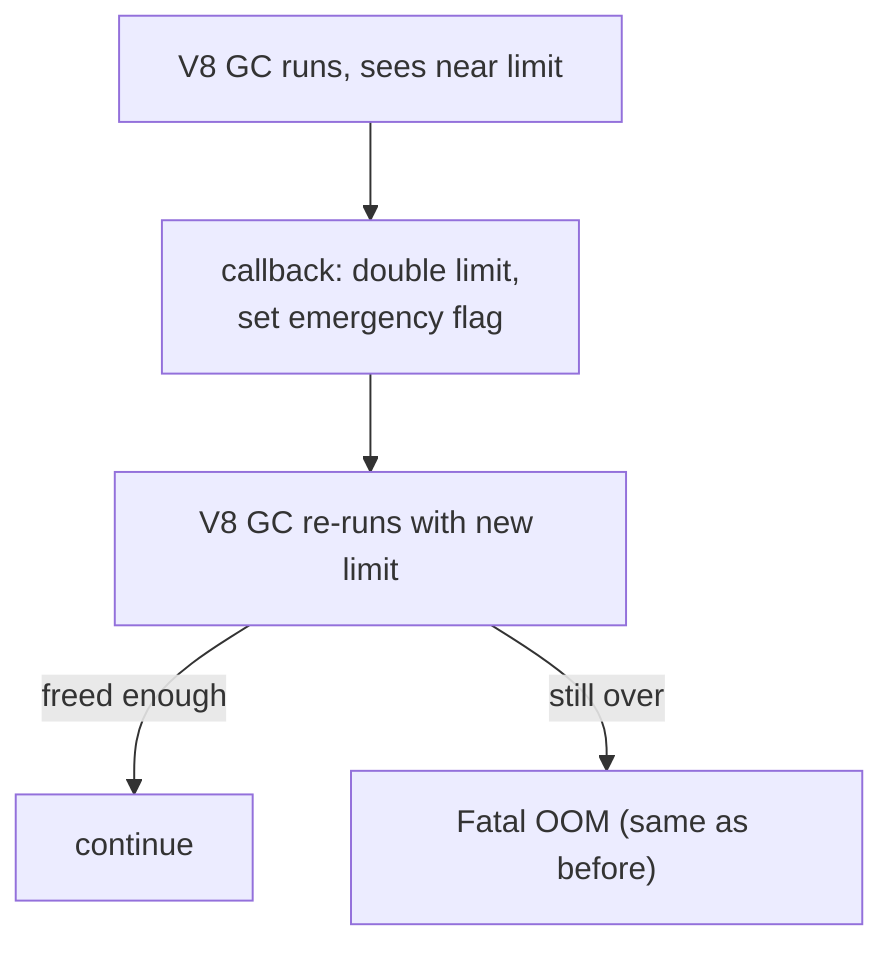
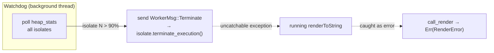

# V8 OOM Protection

## Problem

When a user's SSR component leaks memory across renders, V8's heap eventually
hits the `max_heap_size_mb` limit. At that point, V8 does NOT throw a catchable
JS exception — it calls `V8::FatalError("Reached heap limit")` and `abort()`s
the entire Ruby process.

Reproduction script: [`tmp/reproduce_v8_oom.rb`](../tmp/reproduce_v8_oom.rb)

Output from a run with `max_heap_size_mb = 16` and a 500 KB leak per render:

```
<--- Last few GCs --->
Mark-Compact (reduce) 15.3 (16.1) -> 15.3 (16.1) MB, last resort; GC in old space requested
Mark-Compact (reduce) 15.3 (16.1) -> 15.3 (16.1) MB, last resort; GC in old space requested

#
# Fatal JavaScript out of memory: Reached heap limit
#
==== C stack trace ===============================
[... V8 internals ...]
EXIT CODE: 133  (128 + SIGTRAP)
```

V8 runs desperate last-resort GCs at ~15.3/16.1 MB, fails to free the leaky
array, and aborts. No JS exception, no Rust `Result`, no Ruby `rescue`. Just
`SIGTRAP` + core dump.

## Why a Ruby-side watchdog can't work

| Obstacle | Detail |
|---|---|
| **No abort API** | `native_render` is a synchronous blocking call through `blocking_send → worker → V8.execute_script → renderToString`. Nothing outside that call chain can interrupt it. |
| **Heap stats blind** | `SSR::Deno.heap_stats` samples a single isolate via round-robin (`next_handle`). The isolate about to OOM may not be the one sampled. No per-isolate heap stats exposed yet. |
| **Race** | Between "detect 90% heap usage" and "try to do something", V8's allocator already tripped. The render call is mid-execution — the heap limit is hit inside `execute_script`. |

## Three levels of Rust-side defense

### Level 1: Pre-render heap threshold (low effort, high value)

Before dispatching a render, check the target isolate's `used_heap_size / heap_size_limit`. If the ratio exceeds a configurable threshold (e.g., 85%):

1. Call `isolate.low_memory_notification()` — triggers V8's aggressive GC
2. Re-check the ratio
3. If still above threshold, refuse the render with a `RenderError` (not a crash)



**What it prevents:** Starting a render when the heap is already critical. A
render that allocates moderately on a healthy heap won't tip over. One that
allocates heavily on an already-near-limit heap will be rejected before it can
trigger the fatal OOM.

**What it does NOT prevent:** A single render that allocates ~10 MB in one
shot on a heap at 50% usage (50% → 100% within one `renderToString`). The
threshold check passes, but the render itself can still hit the limit. Mitigated
by: configure `max_heap_size_mb` with enough headroom for the heaviest single
render.

**Implementation:**
- New `SSR::Deno.oom_threshold=` config (default `0.0` = disabled, range `0.0–1.0`)
- Passed to worker as a new field in `WorkerMsg::Render` (or as a worker-level field set at spawn)
- Pre-render check in `call_render` at `ext/ssr_deno/src/deno_runtime_wrapper/call_render.rs:16`, before scope chain is entered
- `heap_size_limit` typically equals `max_heap_size_mb * 1024 * 1024` (the configured cap)

### Level 2: Near-heap-limit callback (medium effort, partial value)

V8 exposes `Isolate::AddNearHeapLimitCallback`. This fires *during* a GC when
V8 realizes it's about to hit the limit. The callback receives:

- Current heap limit (bytes)
- Current heap size (bytes)

The callback can return a **new heap limit** to extend the runway. A
well-chosen callback can:

1. Double the limit once (buy one extra GC cycle)
2. Log loudly: `[ssr-deno] Isolate {idx}: near heap limit ({used}/{limit} MB)`
3. Set a flag that the next pre-render check will reject



**Limitation:** The callback can extend the limit but cannot *prevent* the
fatal OOM outright. If memory is still above the (doubled) limit after GC,
V8 aborts. This buys one extra GC cycle but doesn't change the endgame.

### Level 3: `terminate_execution` + isolate watchdog (high effort, full defense)

Expose `v8::Isolate::terminate_execution()` via a new `WorkerMsg::Terminate`.
A background thread polls heap stats on all isolates periodically. If any
isolate exceeds a critical threshold, it sends `Terminate`.

`terminate_execution` makes `execute_script` (the currently running JS) throw an
uncatchable termination exception. V8 unwinds the stack, `call_render` gets the
result as an error, and maps it to `RenderError` — no crash.



**Challenges:**
- Races with V8's allocator — the watchdog's poll interval must be tight
- Each isolate has its own `v8::Isolate&` — `terminate_execution` requires access to the exact isolate handle, which lives on the worker thread
- Thread-safe access to per-isolate heap stats — currently `heap_stats` goes through the mpsc channel (requires the worker to respond). A faster path would bypass the channel for the watchdog
- Overhead: watchdog polling itself consumes CPU

## What's NOT affected

- **Renders on other isolates** — an OOM crash in isolate-3 does NOT affect isolates 0,1,2 (separate V8 isolates, separate heaps). Only the process dies, taking all isolates with it.
- **Non-render operations** — `load_bundle_in_worker` (bundle load) and `collect_heap_stats` (heap query) don't allocate significant JS objects and won't trigger OOM.

## Implementation plan (Level 1 only)

### [ ] Step 1: Add `oom_threshold` config to `ssr_deno_core`

**File:** `ext/ssr_deno/crates/ssr_deno_core/src/lib.rs`

```rust
pub struct Config {
    // ... existing fields ...
    pub oom_threshold: f64,
}

impl Default for Config {
    fn default() -> Self {
        Self {
            // ... existing defaults ...
            oom_threshold: 0.0, // disabled
        }
    }
}

pub fn validate_oom_threshold(t: f64) -> Result<(), String> {
    if t < 0.0 || t > 1.0 {
        return Err(format!("oom_threshold must be 0.0–1.0, got {t}"));
    }
    Ok(())
}
```

### [ ] Step 2: Pass `oom_threshold` to worker

**File:** `ext/ssr_deno/src/deno_runtime_wrapper/mod.rs`

- Add `oom_threshold: f64` to `WorkerMsg::Render`
- Add `oom_threshold: f64` to `IsolateHandle`
- Pass on spawn; `IsolatePool::new` receives it from `Config`

### [ ] Step 3: Pre-render check in `call_render`

**File:** `ext/ssr_deno/src/deno_runtime_wrapper/call_render.rs`

Before Phase 1 (scope chain entry):

```rust
if oom_threshold > 0.0 {
    let stats = isolate.get_heap_statistics();
    let used = stats.used_heap_size();
    let limit = stats.heap_size_limit();
    if used as f64 / limit as f64 > oom_threshold {
        isolate.low_memory_notification();
        let stats2 = isolate.get_heap_statistics();
        let used2 = stats2.used_heap_size();
        if used2 as f64 / limit as f64 > oom_threshold {
            return Err(DenoError::Render(format!(
                "Isolate heap near limit: {:.1}/{:.1} MB (threshold: {:.0}%)",
                used2 as f64 / 1_048_576.0,
                limit as f64 / 1_048_576.0,
                oom_threshold * 100.0,
            )));
        }
    }
}
```

### [ ] Step 4: Wire Ruby API

**File:** `lib/ssr/deno.rb`

```ruby
def oom_threshold=(threshold)
  native_set_oom_threshold(threshold.to_f)
end
```

**File:** `ext/ssr_deno/src/lib.rs`

- Add `native_set_oom_threshold` / `native_get_oom_threshold`
- Validate via `validate_oom_threshold`

### [ ] Step 5: env var + Rails config

**File:** `lib/ssr/deno.rb` — add `SSR_DENO_OOM_THRESHOLD` env var

**File:** `lib/ssr/deno/rails/railtie.rb` — add `config.ssr_deno.oom_threshold = nil` (nil = disabled)

### [ ] Step 6: Update RBS

**File:** `sig/ssr/deno.rbs` — add `oom_threshold=` / `oom_threshold` signatures

### [ ] Step 7: Tests

- Unit: `validate_oom_threshold` rejects out-of-range values (in `ssr_deno_core` tests)
- Unit: `validate_oom_threshold` accepts valid values
- Integration: pre-render threshold rejects render near OOM (subprocess test with `oom_threshold = 0.01` and a bundle that pre-fills the heap)

### [ ] Step 8: Verify

`bundle exec rake` passes — compile, cargo test, sample builds, all Ruby suites, RuboCop, 100% coverage.

## Files Changed

| File | Change |
|---|---|
| `ext/ssr_deno/crates/ssr_deno_core/src/lib.rs` | Add `oom_threshold: f64` to `Config` + `validate_oom_threshold` |
| `ext/ssr_deno/src/deno_runtime_wrapper/mod.rs` | Add `oom_threshold` to `IsolateHandle`, `WorkerMsg::Render`, `IsolatePool::new` |
| `ext/ssr_deno/src/deno_runtime_wrapper/call_render.rs` | Pre-render heap check + `low_memory_notification` |
| `ext/ssr_deno/src/lib.rs` | `native_set_oom_threshold` / `native_get_oom_threshold` FFI methods |
| `lib/ssr/deno.rb` | `oom_threshold=` / `oom_threshold` accessors + env var |
| `lib/ssr/deno/rails/railtie.rb` | Rails config entry |
| `sig/ssr/deno.rbs` | Type signatures |

## Files NOT Changed

| File | Reason |
|---|---|
| `lib/ssr/deno/bundle.rb` | No API changes to Bundle |
| `README.md` | Deferred until feature lands and is documented |
| `CHANGELOG.md` | Deferred until feature lands |

## Future (Levels 2 & 3)

Level 2 (near-heap-limit callback) and Level 3 (`terminate_execution` watchdog)
are documented above for reference but NOT planned for implementation now. Level
1 gives practical protection for the common case (leaking component, repeated
renders). The callback and termination approaches can be added later if needed
without architectural changes.
