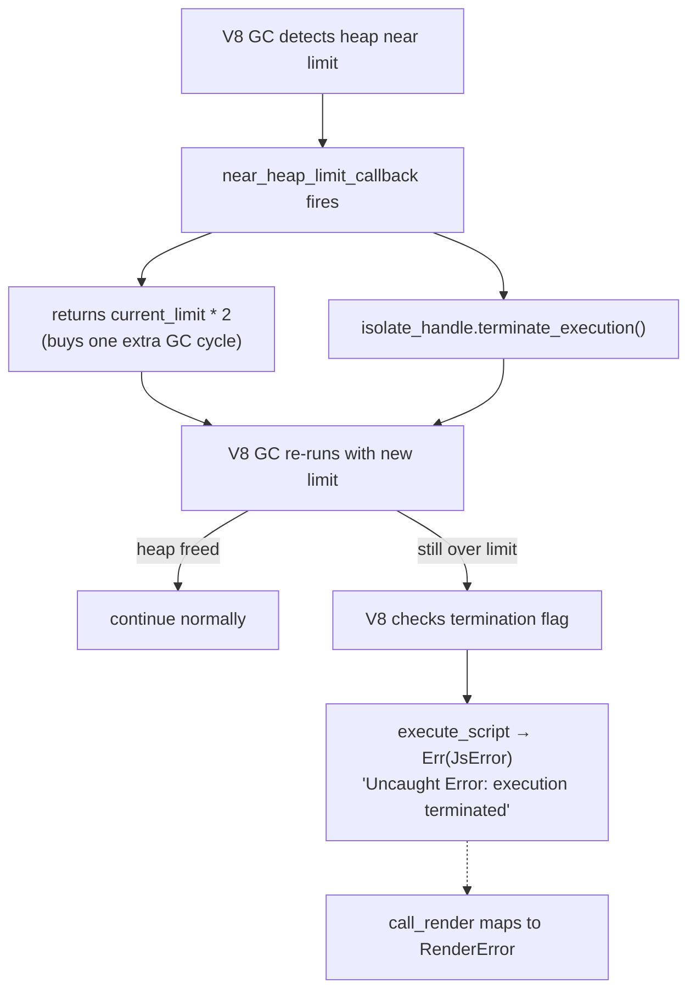
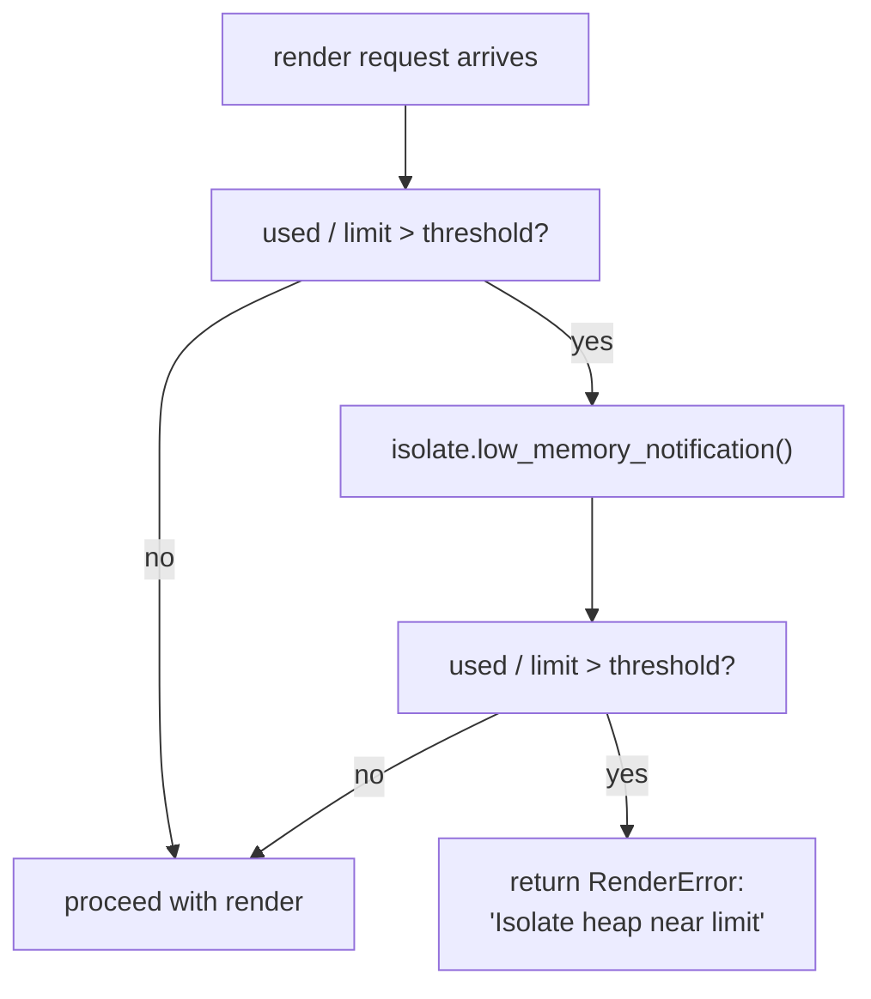
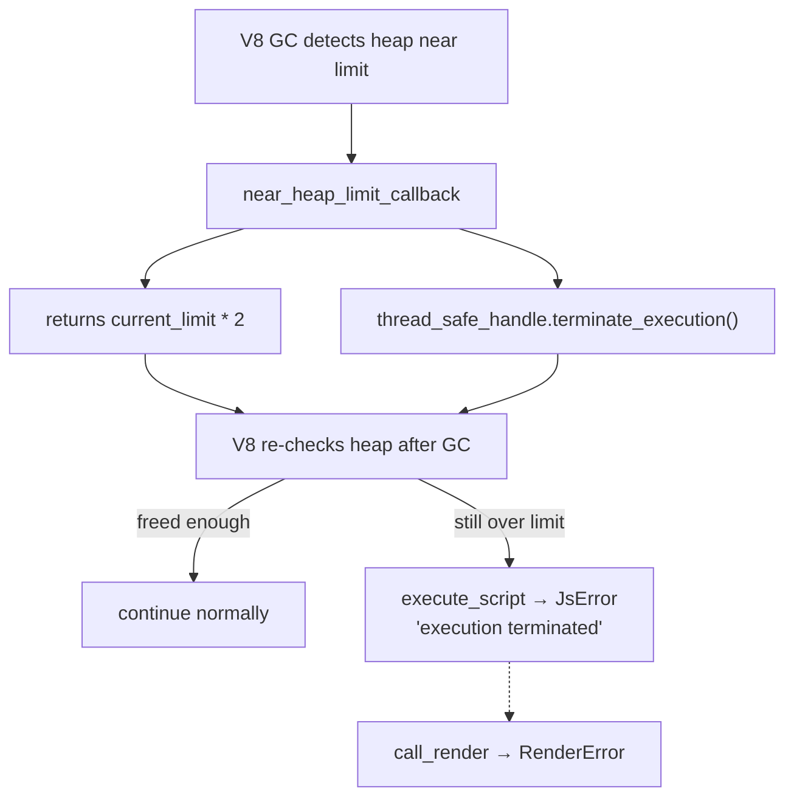

# V8 OOM Protection

## Problem

When a user's SSR component leaks memory across renders, V8's heap eventually
hits the `max_heap_size_mb` limit. At that point, V8 does NOT throw a catchable
JS exception — it calls `V8::FatalError("Reached heap limit")` and `abort()`s
the entire Ruby process.

Reproduction script: [`attachments/reproduce_v8_oom.rb`](attachments/reproduce_v8_oom.rb)

Output from a run with `max_heap_size_mb = 16` and a 500 KB leak per render:

```
<--- Last few GCs --->
Mark-Compact (reduce) 15.3 (16.1) -> 15.3 (16.1) MB, last resort; GC in old space requested
Mark-Compact (reduce) 15.3 (16.1) -> 15.3 (16.1) MB, last resort; GC in old space requested

#
# Fatal JavaScript out of memory: Reached heap limit
#
==== C stack trace ===============================
[... V8 internals ...]
EXIT CODE: 133  (128 + SIGTRAP)
```

V8 runs desperate last-resort GCs at ~15.3/16.1 MB, fails to free the leaky
array, and aborts. No JS exception, no Rust `Result`, no Ruby `rescue`. Just
`SIGTRAP` + core dump.

## Why a Ruby-side watchdog can't work

| Obstacle | Detail |
|---|---|
| **No abort API** | `native_render` is a synchronous blocking call through `blocking_send → worker → V8.execute_script → renderToString`. Nothing outside that call chain can interrupt it. |
| **Heap stats blind** | `SSR::Deno.heap_stats` samples a single isolate via round-robin (`next_handle`). The isolate about to OOM may not be the one sampled. No per-isolate heap stats exposed yet. |
| **Race** | Between "detect 90% heap usage" and "try to do something", V8's allocator already tripped. The render call is mid-execution — the heap limit is hit inside `execute_script`. |

## How Deno itself handles this

Deno uses a combination of `add_near_heap_limit_callback` + `terminate_execution`
to prevent the fatal OOM. This approach is already implemented in `deno_core`
(the crate we depend on):

```rust
// From deno_core-0.399.0/runtime/tests/misc.rs (test_heap_limits)
let cb_handle = runtime.v8_isolate().thread_safe_handle();

runtime.add_near_heap_limit_callback(move |current_limit, _initial_limit| {
    inner_invoke_count.fetch_add(1, Ordering::SeqCst);
    cb_handle.terminate_execution();
    current_limit * 2  // double the limit to buy one more GC cycle
});

let js_err = runtime
    .execute_script("script name", r#"let s = ""; while(true) { s += "Hello"; }"#)
    .expect_err("script should fail");

assert_eq!(
    "Uncaught Error: execution terminated",
    js_err.exception_message
);
```

**How it works:**



**Key insight:** The callback does two things:
1. **Doubles the limit** — prevents the immediate fatal OOM long enough for V8 to check the termination flag
2. **Terminates execution** — stops the running JS code, turning a crash into a catchable error

Deno's `web_worker.rs` also tracks whether the callback fired via an
`oom_triggered: Arc<AtomicBool>` flag, so it can report a specific
`ERR_WORKER_OUT_OF_MEMORY` error instead of the generic "execution terminated".

### Deno CLI's approach (found in source)

The Deno CLI source at `cli/lib/worker.rs` confirms the pattern is
**identical** to ours:

- **MainWorker** (`create_custom_worker`): no near-heap-limit callback
  registered → would SIGTRAP on OOM, same as pre-Step-1

- **WebWorker** (created via JS `new Worker(...)`): callback registered **only
  when `args.resource_limits.is_some()`** — i.e., when the user specifies
  `resourceLimits` option in the Worker constructor. The exact code:

  ```rust
  if has_resource_limits {
      let ts_handle = worker.js_runtime.v8_isolate().thread_safe_handle();
      let oom_flag = worker.oom_triggered.clone();
      worker.js_runtime.add_near_heap_limit_callback(
          move |current_limit, _initial_limit| {
              oom_flag.store(true, std::sync::atomic::Ordering::SeqCst);
              ts_handle.terminate_execution();
              current_limit * 2
          },
      );
  }
  ```

  This is the exact same `oom_triggered + terminate_execution + limit * 2`
  pattern. The `oom_flag` is later checked in `web_worker.rs` to emit
  `ERR_WORKER_OUT_OF_MEMORY`.

**What this means:** Our Step 1 registers the callback **unconditionally** for
all isolates (including the main one), which is strictly more protective than
the Deno CLI's own behavior. We're ahead of Deno's MainWorker, which gets no
protection.

The libraries (`deno_core`, `deno_runtime`) only expose the API — the
embedder (Deno CLI or us) is responsible for wiring it up.

## Three levels of Rust-side defense

### Level 1: Pre-render heap threshold (low effort, high value)

Before dispatching a render, check the target isolate's `used_heap_size / heap_size_limit`. If the ratio exceeds a configurable threshold (e.g., 85%):

1. Call `isolate.low_memory_notification()` — triggers V8's aggressive GC
2. Re-check the ratio
3. If still above threshold, refuse the render with a `RenderError` (not a crash)



**What it prevents:** Starting a render when the heap is already critical. A
render that allocates moderately on a healthy heap won't tip over. One that
allocates heavily on an already-near-limit heap will be rejected before it can
trigger the fatal OOM.

**What it does NOT prevent:** A single render that allocates ~10 MB in one
shot on a heap at 50% usage (50% → 100% within one `renderToString`). The
threshold check passes, but the render itself can still hit the limit. Mitigated
by: configure `max_heap_size_mb` with enough headroom for the heaviest single
render.

**Implementation:**
- New `SSR::Deno.oom_threshold=` config (default `0.0` = disabled, range `0.0–1.0`)
- Passed to worker as a new field in `WorkerMsg::Render` (or as a worker-level field set at spawn)
- Pre-render check in `call_render` at `ext/ssr_deno/src/deno_runtime_wrapper/call_render.rs:16`, before scope chain is entered
- `heap_size_limit` typically equals `max_heap_size_mb * 1024 * 1024` (the configured cap)

### Level 2: Near-heap-limit callback + `terminate_execution` (medium effort, Deno-proven)

This is the approach Deno's own `test_heap_limits` test uses, and `deno_core`
exposes it as a public API (`JsRuntime::add_near_heap_limit_callback`).
It prevents the fatal OOM by combining two V8 primitives in a single callback:



The callback:
1. **Doubles the heap limit** — buys one more GC cycle, preventing the
   immediate fatal `SIGTRAP`
2. **Terminates execution** via `isolate.thread_safe_handle().terminate_execution()`
   — makes V8 throw "Uncaught Error: execution terminated" instead of aborting

The termination error propagates through `call_render` as a normal JS exception
and maps to `DenoError::Render → SSR::Deno::RenderError` at the Ruby level —
same error path as a JS `throw`.

**Integration into `build_worker`:**
- After creating the `MainWorker`, call `worker.js_runtime.add_near_heap_limit_callback(...)`
- The callback captures `worker.js_runtime.v8_isolate().thread_safe_handle()`
- `MainWorker.js_runtime` is public — no architectural changes needed

**Optional improvement — `oom_triggered` flag:**
Deno's `web_worker.rs` tracks whether the callback fired via an `AtomicBool`,
so the error message can say "heap memory limit exceeded" instead of the
generic "execution terminated". We can add the same flag to `call_render`.

**What it catches:** Any render that triggers near-heap-limit, including a
single heavy render that quickly fills the heap. No pre-render threshold needed.

**What it costs:** One callback registration per isolate at `build_worker` time.
Negligible runtime overhead until GC runs near the limit.

### Level 3: `set_oom_error_handler` (low value, exploratory)

V8 also exposes `Isolate::set_oom_error_handler()`, which fires right before
the fatal OOM abort. Unlike `near_heap_limit_callback`, it cannot prevent the
abort — it only logs context. Deno does not use it. Not planned for
implementation.

## Recommended approach: Level 2 (Deno-proven)

Level 2 gives full OOM protection with minimal code, using primitives already
available in our dependency chain (`deno_core::JsRuntime::add_near_heap_limit_callback`
+ `rusty_v8::IsolateHandle::terminate_execution`). Deno's own test suite
validates this exact pattern. No need for the pre-render threshold (Level 1)
when Level 2 catches the same cases and more.

## What's NOT affected

- **Renders on other isolates** — an OOM crash in isolate-3 does NOT affect isolates 0,1,2 (separate V8 isolates, separate heaps). Only the process dies, taking all isolates with it.
- **Non-render operations** — `load_bundle_in_worker` (bundle load) and `collect_heap_stats` (heap query) don't allocate significant JS objects and won't trigger OOM.

## Implementation plan (Level 2)

### [x] Step 1: Register near-heap-limit callback in `build_worker`

**File:** `ext/ssr_deno/src/deno_runtime_wrapper/mod.rs`

After `MainWorker::bootstrap_from_options` and before returning, register the
callback on the worker's `JsRuntime`:

```rust
let thread_safe_handle = worker.js_runtime.v8_isolate().thread_safe_handle();

worker.js_runtime.add_near_heap_limit_callback(
    move |current_limit, _initial_limit| {
        // Suppress the fatal OOM: double the limit to buy one more GC
        // cycle, then terminate execution to turn the crash into a
        // catchable error.
        let _ = thread_safe_handle.terminate_execution();
        current_limit * 2
    },
);
```

The `terminate_execution()` call makes V8 throw `"Uncaught Error: execution terminated"`
instead of aborting. This error propagates through `call_render` as a normal
JS exception and maps to `DenoError::Render`.

The `current_limit * 2` return value gives V8 one more GC cycle to try to
free memory. If still over after GC, the termination flag is already set and
`execute_script` returns the error.

### [ ] Step 2: Add `oom_triggered` flag and custom `JsRuntimeOutOfMemoryError`

Currently the OOM termination error propagates as a generic `DenoError::Render`
with message "`render` function threw an exception" — confusing for users who
are not hitting a render bug. This step adds a dedicated `DenoError::OutOfMemory`
variant and a custom Ruby exception `SSR::Deno::JsRuntimeOutOfMemoryError`.

**Error hierarchy (after this step):**

```
SSR::Deno::Error
├── JsRuntimeInitializationError
├── JsRuntimeNotInitializedError
├── JsRuntimeWorkerError
├── BundleNotFoundError
├── RenderError
└── JsRuntimeOutOfMemoryError  ← NEW (sibling, not subclass)
```

`JsRuntimeOutOfMemoryError` is a sibling of `RenderError` (not a subclass),
because OOM is V8 resource exhaustion, not a JS error. User code may want to
handle it separately (e.g., reduce payload, flush caches) rather than treating
it the same as a thrown exception.

#### Step 2A: Add `DenoError::OutOfMemory` variant

**File:** `ext/ssr_deno/crates/ssr_deno_core/src/lib.rs`

```rust
pub enum DenoError {
    BundleLoad(String),
    WorkerInit(String),
    WorkerDied(String),
    BundleNotFound(String),
    Render(String),
    OutOfMemory(String),   // NEW
}
```

Update `Display` impl and all match arms on `DenoError`.

#### Step 2B: Wire `oom_triggered: Arc<AtomicBool>` through the call chain

The flag must be:
- Set by the near-heap-limit callback (runs on V8's GC thread within the isolate)
- Read by `call_render` after `execute_script` returns the termination error

**Approach:** Create `Arc<AtomicBool>` in `worker_thread_main`, pass clone to
`build_worker` for the callback, pass reference to `call_render`.

**File:** `ext/ssr_deno/src/deno_runtime_wrapper/mod.rs`

In `worker_thread_main` (before `build_worker` call):
```rust
let oom_triggered = Arc::new(AtomicBool::new(false));
let mut worker = match build_worker(
    &main_module_url,
    max_heap_size_mb,
    node_builtins,
    oom_triggered.clone(),  // clone for the callback
) {
    Ok(w) => w,
    Err(e) => { ... }
};
```

In `build_worker` signature (new param):
```rust
fn build_worker(
    main_module: &Url,
    max_heap_size_mb: usize,
    node_builtins: bool,
    oom_triggered: Arc<AtomicBool>,
) -> Result<MainWorker, String> {
```

In the callback inside `build_worker`:
```rust
worker.js_runtime.add_near_heap_limit_callback(
    move |current_limit, _initial_limit| {
        oom_triggered.store(true, Ordering::SeqCst);  // mark OOM
        let _ = isolate_handle.terminate_execution();
        current_limit * 2
    },
);
```

In the message loop handler (pass to `call_render`):
```rust
WorkerMsg::Render { bundle_id, args_json, render_timeout_ms, reply } => {
    let result = call_render(
        &mut worker, &bundle_id, &args_json, render_timeout_ms, &oom_triggered,
    );
    let _ = reply.send(result);
}
```

#### Step 2C: Check `oom_triggered` in `call_render`

**File:** `ext/ssr_deno/src/deno_runtime_wrapper/call_render.rs`

Add new param `oom_triggered: &AtomicBool` to `call_render`.

After the existing error detection (when `render_fn.call` returns `None` or
promise polling fails), insert before the generic `DenoError::Render` return:

```rust
if oom_triggered.load(Ordering::SeqCst) {
    return Err(DenoError::OutOfMemory(
        "JS heap out of memory — the isolate reached its configured heap limit".into(),
    ));
}
```

This runs BEFORE the generic error return, so OOM takes priority over the
generic "execution terminated" message.

#### Step 2D: Map to custom Ruby exception

**File:** `ext/ssr_deno/src/lib.rs`

Add error helper:
```rust
fn js_runtime_out_of_memory_error(msg: impl Into<String>) -> Error {
    Error::new(deno_exception_class("JsRuntimeOutOfMemoryError"), msg.into())
}
```

Update `map_render_error`:
```rust
fn map_render_error(e: DenoError) -> Error {
    match e {
        DenoError::WorkerDied(msg) => js_runtime_worker_error(msg),
        DenoError::BundleNotFound(msg) => bundle_not_found_error(msg),
        DenoError::Render(msg) => render_error(msg),
        DenoError::OutOfMemory(msg) => js_runtime_out_of_memory_error(msg),
        DenoError::BundleLoad(msg) => js_runtime_initialization_error(msg),
        DenoError::WorkerInit(msg) => js_runtime_initialization_error(msg),
    }
}
```

Register in `init`:
```rust
deno_module.define_error("JsRuntimeOutOfMemoryError", base_error)?;
```

#### Step 2E: Update RBS

**File:** `sig/ssr/deno.rbs`

```rbs
class JsRuntimeOutOfMemoryError < Error
end
```

#### Step 2F: Update Rails helper

**File:** `lib/ssr/deno/rails/helper.rb`

Update the rescue clause (line 27) to also rescue `JsRuntimeOutOfMemoryError`:
```ruby
rescue SSR::Deno::RenderError, SSR::Deno::JsRuntimeWorkerError,
       SSR::Deno::JsRuntimeOutOfMemoryError => error
```

#### Step 2G: Update OOM test

**File:** `test/ssr/test_deno_stability.rb`

Change the OOM test to expect `JsRuntimeOutOfMemoryError` instead of `RenderError`.

#### Step 2H: Update architecture docs

**File:** `docs/architecture.md`

Add `JsRuntimeOutOfMemoryError` to the error hierarchy description (if any).

#### Step 2I: Verify

`bundle exec rake` passes (compile, cargo test, sample builds, all Ruby suites,
RuboCop, 100% coverage, RBS valid).

### [x] Step 3: Verify

`bundle exec rake` passes — compile, cargo test, sample builds, all Ruby suites,
RuboCop, 100% coverage.

Rerun `attachments/reproduce_v8_oom.rb` — verify it now produces a Ruby error
(`SSR::Deno::RenderError`) instead of `SIGTRAP` + core dump.

## Files Changed

| File | Change |
|---|---|
| `ext/ssr_deno/crates/ssr_deno_core/src/lib.rs` | Add `OutOfMemory(String)` variant to `DenoError` |
| `ext/ssr_deno/src/deno_runtime_wrapper/mod.rs` | `Arc<AtomicBool>` in `worker_thread_main`, `build_worker` param, callback stores `true`, pass to `call_render` |
| `ext/ssr_deno/src/deno_runtime_wrapper/call_render.rs` | New param `oom_triggered`, check before returning generic error |
| `ext/ssr_deno/src/lib.rs` | New `js_runtime_out_of_memory_error`, `define_error("JsRuntimeOutOfMemoryError")` in init |
| `sig/ssr/deno.rbs` | New `JsRuntimeOutOfMemoryError < Error` class |
| `lib/ssr/deno/rails/helper.rb` | Rescue `JsRuntimeOutOfMemoryError` alongside `RenderError` |
| `test/ssr/test_deno_stability.rb` | Expect `JsRuntimeOutOfMemoryError` instead of `RenderError` in OOM test |
| `docs/architecture.md` | Update error hierarchy table |

## Files NOT Changed

| File | Reason |
|---|---|
| `lib/ssr/deno.rb` | New error class is defined in Rust via magnus, not in Ruby |
| `lib/ssr/deno/rails/railtie.rb` | No Rails config needed |
| `README.md` / `CHANGELOG.md` | Deferred until feature lands |

## Verification

- `bundle exec rake` exits 0 (compile, cargo test, sample builds, all Ruby suites, RuboCop, 100% coverage, RBS valid)
- `attachments/reproduce_v8_oom.rb` produces `SSR::Deno::JsRuntimeOutOfMemoryError` instead of SIGTRAP
- Existing tests continue to pass (termination callback only fires on near-OOM)
- OOM test expects the new exception class
